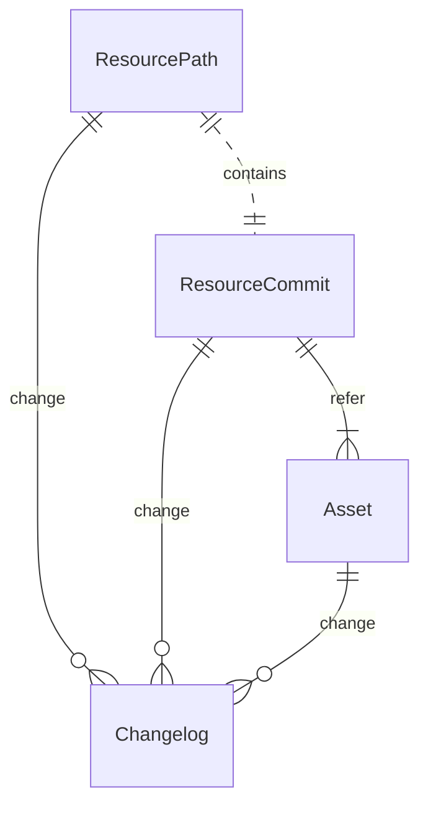
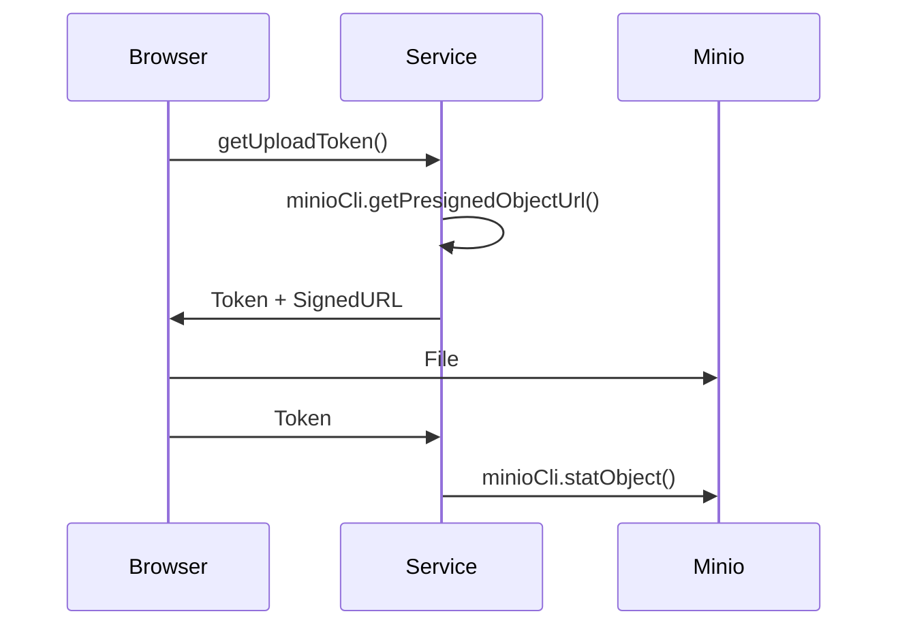

Recently, I was developing a simple multi-version file management system. 
However, this project was abandoned due to some reasons. 
Then, I decided to share how this system be developed, hoping to help others in need.

This article mainly introduces how to implement multi-version file storage based on Minio and MySQL.

[comment]:summary


## Basic Concepts

### OSS

 Object Storage Service (OSS) is a type of file storage service provided by cloud providers for storing large amounts of unstructured data, such as images, videos, and compressed files.

Common OSS application scenarios include:

- Static website hosting
- Content Delivery Networks (CDNs)
- Data lake storage layers
- Data backup

Minio is a popular open-source object storage service that is compatible with Amazon S3 and provides a variety of features, including:

- Fully compatible with S3 interface standards
- Supports multiple private deployment options (IDC, VPC, K8s)
- High reliability (multiple copies, erasure coding)
- High security (access control, object encryption)
- Rich features (event monitoring, space quotas, multi-version control, hot-cold data separation)

In my case, the only downside of Minio is its complex operation and maintenance and high learning curve.

### CTE

Due to the limitations of the data model, RDBMS is not good at retrieving tree-structured data. 
When you have to do this, there are usually two solutions:

- Initiate multiple SQL queries, each time querying only one layer of data.
- Use a varchar-type field to store the path and perform prefix matching when querying.

However, the former requires multiple queries and has poor performance. 
The latter is difficult to maintain consistency: updating the parent node's path will affect the all its child nodes.

Luckly, now we got CTE (Common Table Expressions).
CTE are a feature of SQL that allows you to define temporary named result sets.

```sql
WITH cte_name (column1, column2, ...) AS (
    -- CTE query definition
    SELECT column1, column2, ...
    FROM your_table
    WHERE conditions
)
-- Main query that can reference the CTE
SELECT * FROM cte_name;
```

CTE's advantages:

- Good SQL readability, easy to maintain
- Named result sets in CTE can be accessed repeatedly
- Easier to generate higher-performance query plans
- Support recursive queries

MySQL 8 introduced support for CTEs, which includes a recursive function that greatly simplifies SQL queries for tree-structured data.


## System Modeling

Core features:
- Multi-tenant isolation and file sharing
- Searching and authorizing by file path
- Version merging and rollback operations
- Recording change logs



### Change Log

Due to the requirement of security audit, every operation needs to record change logs.
We create a global `changelog` table with JSON fields to ensure its versatility.

This table adopts the design of composite primary keys:

- Change time: records the time when the operation occurs and ensures sequential insertion.
- Change ID: a long integer ID pre-generated by the application side, used to ensure uniqueness.

The considerations of this design:

- Generating IDs in the application can achieve asynchronous log recording, reducing transaction time.
- Convenient to implement a one-to-one relationship between data versions and change logs.


```sql
CREATE TABLE IF NOT EXISTS `changelog` (
  `op_time` timestamp NOT NULL COMMENT 'PK',
  `op_code` bigint NOT NULL COMMENT 'PK',
  `op_type` tinyint unsigned NOT NULL COMMENT 'Change event type',
  `op_json` json NOT NULL DEFAULT (JSON_OBJECT()) COMMENT 'Change event json',
   PRIMARY KEY (`op_time`,`op_code`)
) ENGINE=InnoDB COMMENT='Changelog for data modification.'
PARTITION BY KEY(`op_time`) PARTITIONS 5;
```

### File Deduplication

  Due to the need to support file sharing, the system may have a large number of identical files.
  To reduce the storage pressure of Minio, files need to be deduplicated and reused.
  An `asset` table is set up to record file metadata, and maintained file lifecycle with reference counting.

```sql
CREATE TABLE IF NOT EXISTS `asset` (
  `id` bigint unsigned NOT NULL AUTO_INCREMENT PRIMARY KEY COMMENT 'PK',
  `bucket` varchar(50) NOT NULL COMMENT 'Bucket name',
  `checksum` varchar(255) COLLATE utf8mb4_bin NOT NULL COMMENT 'Hash and MD5 summary of the whole file',
  `file_size` int unsigned NOT NULL COMMENT 'File size (unit: byte)',
  `file_url` varchar(255) NOT NULL COMMENT 'Cloud file storage path',
  `mime_type` varchar(255) NOT NULL DEFAULT '' COMMENT 'MimeType',
  `extension_name` varchar(255) NOT NULL DEFAULT '' COMMENT 'File extension',
  `preview` varchar(255) NOT NULL DEFAULT '' COMMENT 'Preview Token',
  `ref_count` int unsigned NOT NULL DEFAULT 0 COMMENT 'Reference counting',
  `is_deleted` tinyint unsigned NOT NULL DEFAULT 0 COMMENT 'Delete tag(0:No,1:Yes)',
  `create_by` bigint NOT NULL COMMENT 'Create Code',
  `update_by` bigint NOT NULL COMMENT 'Last Update Code',
  `create_at` timestamp NOT NULL COMMENT 'Create Time',
  `update_at` timestamp NOT NULL COMMENT 'Update Time',
  UNIQUE KEY `uniq_bucket_checksum` (`bucket`,`checksum`),
  KEY `idx_file_url` (`file_url`(20))
) ENGINE=InnoDB COMMENT='Basic information of objects stored in OSS.';
```

  
### Version Control

  To support merging and reverting between version on broswer page,
  the backend needs to maintain the dependency relationship between different versions. 
  
  Each commit version may point to one or more parent nodes, and the change history can be displayed in the form of a DAG (Directed Acyclic Graph). 
  Each version corresponds to a unique file asset, and the reference relationship is maintained by recording the parent version record ID.

```sql
CREATE TABLE IF NOT EXISTS `resource_commit` (
  `id` bigint unsigned NOT NULL AUTO_INCREMENT PRIMARY KEY COMMENT 'PK',
  `asset_id` bigint unsigned NOT NULL COMMENT 'Asset ID',
  `asset_meta` json NOT NULL DEFAULT (JSON_OBJECT()) COMMENT 'Asset Meta',
  `commit_path` bigint unsigned NOT NULL COMMENT 'Resource path associated with this commit',
  `commit_root` bigint unsigned NOT NULL COMMENT 'Root resource of associated resource',
  `commit_msg` varchar(50) NOT NULL COMMENT 'Commit message',
  `main_parent` bigint unsigned NOT NULL COMMENT 'Main parent commit', -- root commit point to zero
  `sub_parent` bigint unsigned NOT NULL COMMENT 'Sub parent commit resulting from merging',
  `ref_count` int unsigned NOT NULL DEFAULT 0 COMMENT 'Reference counting',
  `is_deleted` tinyint unsigned NOT NULL DEFAULT 0 COMMENT 'Delete Tag(0: No, 1: Yes)',
  `create_by` bigint NOT NULL COMMENT 'Create Code',
  `update_by` bigint NOT NULL COMMENT 'Last Update Code',
  `create_at` timestamp NOT NULL COMMENT 'Create Time',
  `update_at` timestamp NOT NULL COMMENT 'Update Time',
   KEY `idx_commit_path` (`commit_path`),
   KEY `idx_main_parent` (`main_parent`)
) ENGINE=InnoDB COMMENT='Relationship between resource versions.';

```

### Directory Structure

  All file entries are stored in directory tree. 
  To isolate resources of different users, we assign individual tree root nodes to each user. 

  Instead of MySQL auto-increment IDs, we uses UUIDs to facilitate subsequent PBAC authentication. 
  
  The records in the table are divided into directories and files. 
  File records have a HEAD pointer that points to the latest version record.

  To accelerate querying by file path, this table sets a unique index on the node name. 
  When logically deleting, it is necessary to rename the top-level node to avoid the name being unavailable in the future. 
  After that all its child nodes will become invisible when querying with path.
  
```sql
CREATE TABLE IF NOT EXISTS `resource_path` (
  `id` bigint unsigned NOT NULL AUTO_INCREMENT PRIMARY KEY COMMENT 'PK',
  `space_id` varchar(50) COLLATE utf8mb4_bin NOT NULL COMMENT 'Space ID',
  `node_id` varchar(50) COLLATE utf8mb4_bin NOT NULL COMMENT 'Node ID',
  `parent_id` varchar(50) COLLATE utf8mb4_bin NOT NULL COMMENT 'Parent ID', -- root path point to itself
  `node_name` varchar(50) NOT NULL COMMENT 'Node Name',
  `node_index` double NOT NULL DEFAULT 0 COMMENT 'Sort',
  `node_type` tinyint unsigned NOT NULL COMMENT 'Type (0:Dir,1:File)',
  `fork_root` bigint unsigned NOT NULL COMMENT 'Fork Parent ID (maybe from other space)',
  `fork_parent` bigint unsigned NOT NULL COMMENT 'Fork Root ID (maybe from other space)',
  `commit_init` bigint unsigned NOT NULL COMMENT 'Initial commit', -- never change after init
  `commit_head` bigint unsigned NOT NULL COMMENT 'Commit head',
  `version_num` int unsigned NOT NULL DEFAULT 0 COMMENT 'Total number of commits',
  `is_deleted` tinyint unsigned NOT NULL DEFAULT 0 COMMENT 'Delete tag(0:No,1:Yes)',
  `is_rubbish` tinyint unsigned NOT NULL DEFAULT 0 COMMENT 'Recycle Bin Tag (0: No, 1: Yes)',
  `create_by` bigint NOT NULL COMMENT 'Create Code',
  `update_by` bigint NOT NULL COMMENT 'Last Update Code',
  `create_at` timestamp NOT NULL COMMENT 'Create Time',
  `update_at` timestamp NOT NULL COMMENT 'Update Time',
  UNIQUE KEY `uniq_node_id` (`node_id`),
  UNIQUE KEY `uniq_node_name` (`parent_id`,`node_name`), -- The uniqueness of parent_id is guaranteed by uniq_node_id
  KEY `idx_space_id` (`space_id`)
) ENGINE=InnoDB COMMENT='Path of a resource tree node.';
```

## Implementation Details

### CTE Queries

With a given `{nodeId}`, all child nodes can be queried with following statement:
```sql
WITH RECURSIVE path_view AS (
    SELECT *, {maxDepth} lv FROM resource_path WHERE parent_id = {nodeId} AND is_deleted = 0
    UNION ALL
    SELECT p.*, lv - 1 FROM path_view pv INNER JOIN resource_path p ON p.parent_id = pv.node_id
    WHERE lv > 0 AND p.id > {rootPk} AND p.is_deleted = 0
)
SELECT * FROM path_view ORDER BY lv DESC
```
- To avoid performance issues, we limits the maximum depth of the directory tree to `{maxDepth}`.
- Since the root node is inserted before all child nodes, we use the auto-increment ID of the root node `{rootPk}` to limit the query range.

With a give file path, first convert it into a list of node names `{pathNames}`, and then use the following statement to query all child nodes:
```sql
WITH RECURSIVE path_view AS (
    SELECT *, 0 lv FROM resource_path WHERE id = {rootPk}
    UNION ALL
    SELECT p.*, lv + 1 FROM path_view pv INNER JOIN resource_path p ON p.parent_id = pv.node_id
    WHERE lv < {pathNames.size} AND (p.node_name, lv) IN (({pathNames[1]},1), ({pathNames[2]},2), ...)
)
SELECT * FROM path_view
```

- Use the auto-increment ID of the root node `{rootPk}` to specify the starting point of the query.
- Reduce SQL complexity using the multi-value matching feature of the IN statement.

### Version Updates

  File version update operations draw on the concept of Git:

  - Commit: Create a new version and move the HEAD reference (optimistic locking an be achieved with it).

```java
@Data
public class CommitOp {

    private Long dataId; // The asset pk refered by this commit
    private String dataHash; // The expect hash checksum of asset
    private String dataMeta; // The json metadata for this commit (optional)

    private String message; // Commit message
    private Long expectHead; // Optimistic locking with head (optional)
    private Long mergeCommit; // Specify sub_parent for merge op (optional)

}
```

  - Revert: Rollback to an old version and move the HEAD reference (versions that are no longer referenced can be deleted).

```java
@Data
public class RevertOp {

    private Long checkoutCommit; // Set the path head to specific commit
    private Long deleteCommit; // Delete specific commit (optional)

}
```

  - Fork: Create a new version based on a specific submission.

```java
@Data
public class ForkOp {

    private Long commitId;
    private String commitMsg;

}
```

### Pre-signed URLs

  We use the pre-signed mechanism provided by Minio to accelerate file upload and download, allowing the frontend to interact directly with it. 
  
  Taking file upload as an example, the overall process is as follows:

- Pre-generate a SignedURL based on the bucket and key.
- Generate a unique token to cache the bucket and key corresponding to this SignedURL.
- The frontend uses the SignedURL to upload files to Minio.
- Check the upload status using the token and delete duplicate files.

