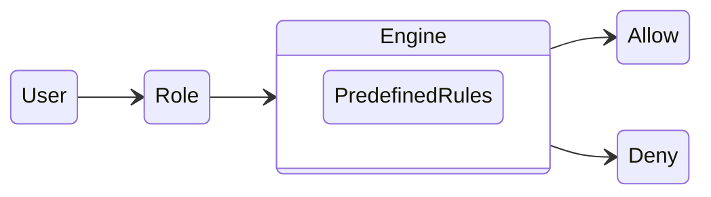
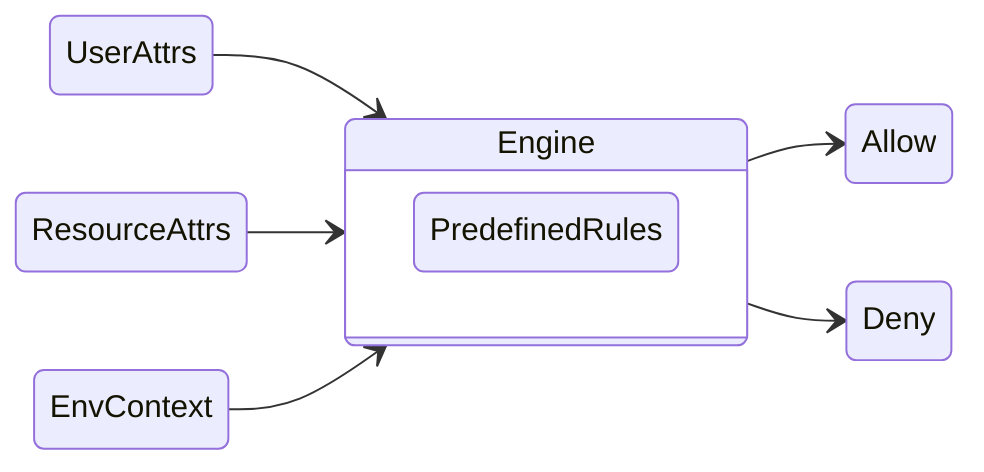
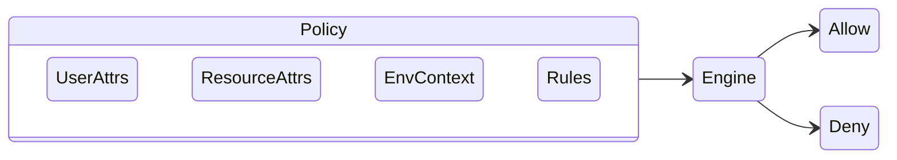
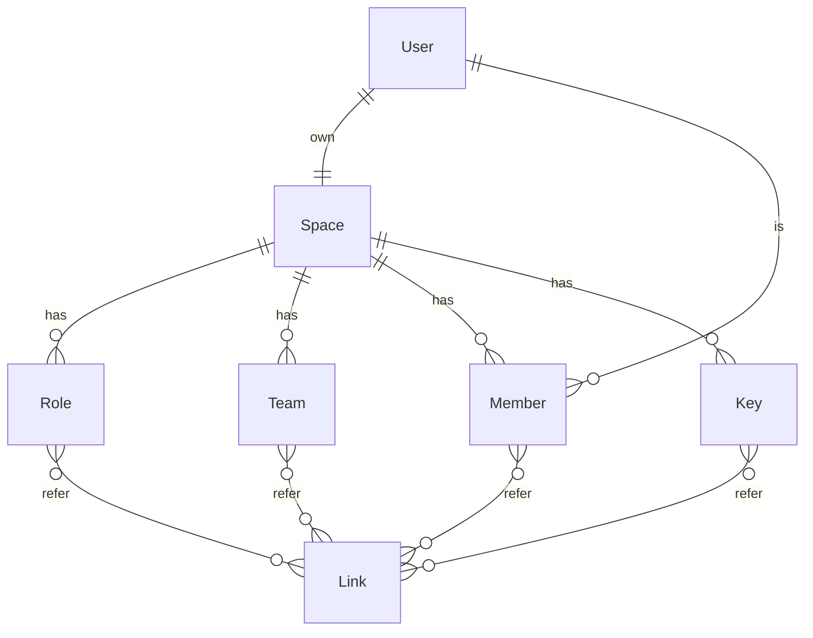
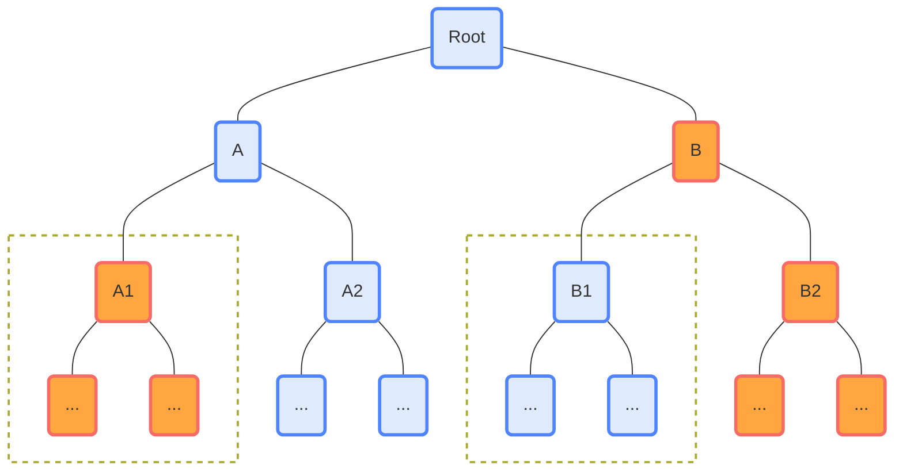
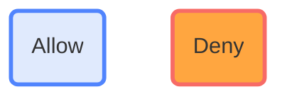

After completing the design of the [resource directory](/en/posts/backend-dev/file-versioning-with-minio-and-mysql), 
the next step is to implement the multi-tenancy feature.


[comment]:summary


## Basic Concepts

### Organizational Structure

  A clear organizational structure is a prerequisite for efficient collaboration.
  By defining the responsibilities and power scopes of each team, confusion and conflicts can be avoided, thereby increasing overall work efficiency.

  Organization typical consists of two types of entities: teams and members.
  - Team: Based on the relationship of responsibilities and duties, different teams can be nested within each other, forming a tree or DAG (Directed Acyclic Graph).
  - Member: Each member can belong to one or more teams.


### Access Control Model

Permission control is the cornerstone of ensuring organizational data security. Currently, there are three common authentication models:


#### Role-Based Access Control (RBAC)



Authorization steps:
- Grant permissions to pre-defined roles
- Associate teams or members in the organization with specific roles

Authentication steps:
- Get the list of roles owned by the visitor
- Determine whether the role has permission to access the resource

Its advantages are clear and easy to understand, and the authorization process is simple and efficient.

The disadvantages are that it is granular and may lead to a combination explosion.

#### Attribute-Based Access Control (ABAC)


Authorization steps:
- Predefine the required attributes for authorization
  - User attributes (role, department ...)
  - Resource attributes (type, owner ...)
  - Environment context (time, location, device ...)

- Implement an authorization engine around predefined attributes
- Maintain authorization rules in the authorization engine as needed


Authentication steps:
- Get user attributes, resource attributes and environment context
- The authorization engine finds the relevant authorization rules based on the attributes
- Determine whether the user has access permissions


Its advantages are that the authorization granularity is fine, and flexible authorization strategies can be implemented.

The disadvantages are that the system is complex and difficult to understand, and the maintenance cost is high.

#### Policy-Based Access Control (PBAC)


PBAC is very similar to ABAC, with the only difference being that the responsibility for maintaining authorization rules is transferred to the authorizer:

- The authorization engine provides a language (usually JSON) for describing authorization rules
- The authorizer implements authorization by writing rules

This design avoids the coupling between the authorization engine and the specific rules while retaining the advantages of ABAC, and reduces the system maintenance cost.

## System Modeling

Core features:
- Each user has their own storage space
  - They can invite other users to join the current space as members, and a user has different member identities in different spaces
  - Space administrators can create teams and roles within the space and assign specific responsibilities to members
  - Space administrators can create Keys (AccessKey + SecretKey) to achieve login-free access

- Implement flexible authorization strategies
  - Administrators can allocate roles to teams, teams, members, and Keys independently
  - Teams and Keys can inherit access permissions from roles
  - Members can inherit access permissions from teams
  - The expiration date of permissions can be specified



### Basic Information

  `user` and `space` are the most basic entities of the entire multi-tenancy module, and they cannot be changed once created.

```sql
CREATE TABLE IF NOT EXISTS `user` (
  `id` bigint unsigned NOT NULL AUTO_INCREMENT PRIMARY KEY COMMENT 'PK',
  `uuid` varchar(32) COLLATE utf8mb4_bin NOT NULL COMMENT 'User ID',
  `name` varchar(50) NOT NULL COMMENT 'Nick Name',
  `mobile` varchar(50) NOT NULL DEFAULT '' COMMENT 'Phone Number',
  `email` varchar(100) NOT NULL DEFAULT '' COMMENT 'Email',
  ...
  UNIQUE KEY `uniq_uuid` (`uuid`),
  KEY `idx_email` (`email`)
) ENGINE=InnoDB COMMENT='Basic user information.';

CREATE TABLE IF NOT EXISTS `space` (
  `id` bigint unsigned NOT NULL AUTO_INCREMENT PRIMARY KEY COMMENT 'PK',
  `space_id` varchar(50) COLLATE utf8mb4_bin NOT NULL COMMENT 'Space unique identifier character',
  `name` varchar(50) NOT NULL COMMENT 'Space Name',
  `bucket` varchar(50) NOT NULL COMMENT 'Space Bucket',
  `props` json NOT NULL DEFAULT (JSON_OBJECT()) COMMENT 'Space properties',
  ...
  UNIQUE KEY `uniq_space_id` (`space_id`)
) ENGINE=InnoDB COMMENT='Workspace for resource isolation.';

```

### Organizational Structure

  Principals that may exist within a space: `unit_role`, `unit_team`, `unit_member`, `unit_key`.
  There are 4 types of permission propagation relationships which can be represented by `unit_link`:

  - Team -> Member
  - Role -> Team
  - Role -> Member
  - Role -> Key

```sql
CREATE TABLE IF NOT EXISTS `unit_role` (
  `id` bigint unsigned NOT NULL AUTO_INCREMENT PRIMARY KEY COMMENT 'PK',
  `space_id` varchar(50) COLLATE utf8mb4_bin NOT NULL COMMENT 'Space ID',
  `role_id` varchar(50) COLLATE utf8mb4_bin NOT NULL COMMENT 'Role ID',
  `role_name` varchar(100) NOT NULL COMMENT 'Role Name',
  `role_index` double NOT NULL DEFAULT 0 COMMENT 'Sort',
  ...
  UNIQUE KEY `uniq_role_id` (`role_id`),
  KEY `idx_space_id` (`space_id`)
) ENGINE=InnoDB COMMENT='Authorized roles in a certain workspace.';

CREATE TABLE IF NOT EXISTS `unit_team` (
  `id` bigint unsigned NOT NULL AUTO_INCREMENT PRIMARY KEY COMMENT 'PK',
  `space_id` varchar(50) COLLATE utf8mb4_bin NOT NULL COMMENT 'Space ID',
  `team_id` varchar(50) COLLATE utf8mb4_bin NOT NULL COMMENT 'Team ID',
  `parent_id` varchar(50) COLLATE utf8mb4_bin NOT NULL COMMENT 'Team ID',
  `team_name` varchar(50) NOT NULL COMMENT 'Department Name',
  `team_index` double NOT NULL DEFAULT 0 COMMENT 'Sort',
  ...
  UNIQUE KEY `uniq_team_id` (`team_id`),
  UNIQUE KEY `uniq_team_name` (`parent_id`,`team_name`), -- The uniqueness of parent_id is guaranteed by uniq_node_id
  KEY `idx_space_id` (`space_id`)
) ENGINE=InnoDB COMMENT='Organization information in a certain workspace.';

CREATE TABLE IF NOT EXISTS `unit_member` (
  `id` bigint unsigned NOT NULL AUTO_INCREMENT PRIMARY KEY COMMENT 'PK',
  `user_id` varchar(50) COLLATE utf8mb4_bin NOT NULL COMMENT 'User UUID',
  `space_id` varchar(50) COLLATE utf8mb4_bin NOT NULL COMMENT 'Space ID',
  `member_id` varchar(50) COLLATE utf8mb4_bin NOT NULL COMMENT 'Member ID',
  `member_name` varchar(255) NOT NULL COMMENT 'Member Name',
  `member_index` double NOT NULL DEFAULT 0 COMMENT 'Sort',
  `job_number` varchar(60) NOT NULL DEFAULT '' COMMENT 'Job Number',
  `position` varchar(255) NOT NULL DEFAULT '' COMMENT 'Position',
  ...
  UNIQUE KEY `uniq_member_id` (`member_id`),
  KEY `idx_user_id` (`user_id`),
  KEY `idx_mobile` (`mobile`),
  KEY `idx_email` (`email`)
) ENGINE=InnoDB COMMENT='Member information in a certain workspace.';

CREATE TABLE IF NOT EXISTS `unit_key` (
  `id` bigint unsigned NOT NULL AUTO_INCREMENT PRIMARY KEY COMMENT 'PK',
  `space_id` varchar(50) COLLATE utf8mb4_bin NOT NULL COMMENT 'Space ID',
  `key_id` varchar(50) COLLATE utf8mb4_bin NOT NULL COMMENT 'Key ID',
  `key_name` varchar(100) NOT NULL COMMENT 'Key Name',
  `key_index` double NOT NULL DEFAULT 0 COMMENT 'Sort',
  `access_key` varchar(50) COLLATE utf8mb4_bin NOT NULL COMMENT 'Access Key',
  `secret_key` varchar(50) COLLATE utf8mb4_bin NOT NULL COMMENT 'Secret Key',
   ...
   UNIQUE KEY `uniq_key_id` (`key_id`),
   UNIQUE KEY `uniq_access_key` (`access_key`),
   KEY `idx_space_id` (`space_id`)
) ENGINE=InnoDB COMMENT='Access keys in a certain workspace.';


CREATE TABLE IF NOT EXISTS `unit_link` (
  `id` bigint unsigned NOT NULL AUTO_INCREMENT PRIMARY KEY COMMENT 'PK',
  `space_id` varchar(50) COLLATE utf8mb4_bin NOT NULL COMMENT 'Space ID',
  `link_index` double NOT NULL DEFAULT 0 COMMENT 'Sort',
  `link_type` tinyint unsigned NOT NULL COMMENT 'Link Type(0: Team-Member, 1: Role-Team, 2: Role-Member, 3:Role-Key)',
  `main_unit_id` varchar(50) COLLATE utf8mb4_bin NOT NULL COMMENT 'Main Unit(0: Team, 1: Role, 2: Role, 3:Role)',
  `sub_unit_id` varchar(50) COLLATE utf8mb4_bin NOT NULL COMMENT 'Sub Unit(0: Member, 1: Team, 2: Member, 3:Key)',
   ...
   UNIQUE KEY `uniq_link_pair` (`main_unit_id`,`sub_unit_id`),
   KEY `idx_space_id` (`space_id`)
) ENGINE=InnoDB COMMENT='Permission delegation link.';

```

### Authorization Policy

Our policy in the PBAC model is defined with reference to [AWS IAM]('https://docs.aws.amazon.com/IAM/latest/UserGuide/access_policies.html#access_policies-json') and simplified:

- Rule Effect (Allow / Deny)
- Authorized Subject (Role, Team, ...)
- Access Actions (Modify, Delete, ...)
- Access Resources
- Condition Expression

```sql
CREATE TABLE IF NOT EXISTS `policy` (
  `id` bigint unsigned NOT NULL AUTO_INCREMENT PRIMARY KEY COMMENT 'PK',
  `space_id` varchar(50) COLLATE utf8mb4_bin NOT NULL COMMENT 'Space ID',
  `policy_id` varchar(50) COLLATE utf8mb4_bin NOT NULL COMMENT 'Policy ID',
  `principal_type` tinyint unsigned NOT NULL COMMENT 'Principal Type(0: Role, 1: Team, 2: Member, 3: Key, 4: User)',
  `resource_type` tinyint unsigned NOT NULL COMMENT 'Resource Type',
  `principal` varchar(50) COLLATE utf8mb4_bin NOT NULL COMMENT 'Principal ID',
  `resource` varchar(50) COLLATE utf8mb4_bin NOT NULL COMMENT 'Resource ID',
  `effect` tinyint unsigned NOT NULL COMMENT 'Policy effect(0: Deny, 1: Allow)',
  `action` json NOT NULL COMMENT 'Policy action array',
  `condition` json NOT NULL COMMENT 'Policy condition object',
  ...
  UNIQUE KEY `uniq_policy_id` (`policy_id`),
  KEY `idx_space_id` (`space_id`)
) ENGINE=InnoDB COMMENT='Authorization policy.';
```

#### Access Actions

The following are the predefined action types in the system: 

```java
@Getter
@RequiredArgsConstructor
@Accessors(fluent = true)
public enum PolicyAction {

    AnyAdmAction("adm:*"),
    AnyResAction("res:*"),
    AnyOrgAction("org:*"),

    AdmAddTeam("adm:addTeam"),
    AdmRemoveTeam("adm:removeTeam"),
    AdmAddRole("adm:addRole"),
    AdmRemoveRole("adm:removeRole"),
    AdmAddMember("adm:addMember"),
    AdmRemoveMember("adm:removeMember"),
    AdmAddKey("adm:addKey"),
    AdmRemoveKey("adm:removeKey"),
    AdmGrantTeam("adm:grantTeam"),
    AdmGrantRole("adm:grantRole"),
    AdmGrantPolicy("adm:grantPolicy"),

    ResListDir("res:listDir"),
    ResCreateDir("res:createDir"),
    ResDeleteDir("res:deleteDir"),
    ResForceDelDir("res:forceDelDir"),
    ResReadNode("res:readNode"),
    ResEditNode("res:editNode"),
    ResCreateNode("res:createNode"),
    ResDeleteNode("res:deleteNode"),

    ...
    ;
}
```

Some actions are defined with `domain-prefix:*`, they be used to achieve batch association for all actions under this domain.

When new actions are added under this domain later, policies using wildcards will automatically include these actions.

#### Condition Expression

The condition expression is a JSON string that can express complex rules:

- When the expression result is true, the rule takes effect
- When the expression result is false, the rule does not take effect

If complex matching functionality is not needed, just simply set it to the constant true.

```java
@RequiredArgsConstructor
public abstract class PolicyMatcher {

    private final String expression;

    public abstract boolean match(PolicyContext ctx);

    static class TrueMatcher extends PolicyMatcher {
        TrueMatcher() { super("true"); }
        @Override
        public boolean match(PolicyContext ctx) {
            return true;
        }
    }

    static PolicyMatcher compile(String expression) {
        if ("true".equals(expression)) {
            return new TrueMatcher();
        }
        ...
    }

}
```

## Implementation Details

### Resource Visibility

Resource access permissions should be inheritable:

- If a user has access permissions for the parent node, they automatically have access permissions for the child nodes.
- If a user lacks access permissions for the parent node, they automatically lack access permissions for the child nodes.

However, administrators can also achieve the following effects through particular policy:

- The parent node has access permissions, but the child nodes do not (through Deny effect)
- The parent node lacks access permissions, but the child nodes have access permissions (through Allow effect)




**To ensure completeness of presentation, as long as child nodes exist, the parent node must be visible to the user:**

- 当用户获取 A 节点的子节点时，流程如下：
  - 用户查询 A 节点的访问列表，发现本身具备访问权限
  - 查询 A 节点的子节点信息，得到 A1 与 A2 两个节点
  - 查询规则树，发现 A1 存在 Deny 规则，因此将 A1 节点从返回列表中剔除
  - 返回 A2 数据给用户

- 当用户获取 B 节点的子节点时，流程如下：
  - 用户查询 B 节点的访问列表，发现本身不具备访问权限
  - 查询规则树，发现 B1 存在 Allow 规则，因此判断 B 节点具有访问权限
  - 查询 B 节点的子节点信息，得到 B1 与 B2 两个节点
  - 返回 B1 数据给用户

When a user retrieves the child nodes of node A, the process is as follows:
- Check the ACL of node A and finds that they have access permissions.
- Query the child nodes of node A, found nodes A1 and A2.
- Check the rule tree and finds that node A1 has a Deny rule, so node A1 is removed from the returned list.
- Node A2 data is returned to the user.

When a user retrieves the child nodes of node B, the process is as follows:
- Check the ACL of node B and finds that they do not have access permissions.
- Check the rule tree and finds that node B1 has an Allow rule, means node B has access permissions.
- Query the child nodes of node B, found nodes B1 and B2.
- Node B1 data is returned to the user.

### ACL and ACT

To achieve the above resource visibility, two rules-matching data structures are introduced:

- **ACL** only loads policies related to specific resources and determines whether the user has permission to access those resources.
```java
List<ResourcePath> paths = resourceService.getResourcesById(nodeId);
List<Policy> policies = policyService.getPolicies(spaceId, ResourceType.Path);
PolicyACL<ResourcePath> ctrl = PolicyACL.attachPolicyToResource(paths, policies, ResourcePath::getNodeId);
Preconditions.checkState(ctrl.hasPermission(currentContext(), PolicyAction.ResListDir));
```

- **ACT** loads all resource policies and determines whether the current user has permission to access the resource.
```java
List<ResourcePath> nodes = resourceService.getResources(rootId);
List<Policy> policies = policyService.getPolicies(spaceId, ResourceType.Path);
PolicyACT<ResourceNode> tree = PolicyACT.buildTreeAndGetRoot(nodes, ResourceNode::new, ResourcePath::getNodeId, ResourcePath::getParentId);
tree.attachPolicyToTree(policies);
for (ResourcePath node: nodes) {
  Preconditions.checkState(tree.hasAllowChild(node.getNodeId(), currentContext(), PolicyAction.ResListDir));
  Preconditions.checkState(!tree.hasDenyParent(node.getNodeId(), currentContext(), PolicyAction.ResListDir));
}
```

#### AccessControlList

```java
@Data
@Accessors(chain = true)
@RequiredArgsConstructor
public class PolicyCarrier<R> {

    private static class CarrierChain {
        CarrierNode allowances;
        CarrierNode denials;
        @Override
        public String toString() {
            List<PolicyMatcher> allow = null;
            List<PolicyMatcher> deny = null;
            if (allowances != null) allowances.visit((allow = new ArrayList<>())::add);
            if (denials != null) denials.visit((deny = new ArrayList<>())::add);
            return "(" + "allow:" + allow + ", deny:" + deny + ')';
        }
    }

    private record CarrierNode(PolicyMatcher matcher, CarrierNode next) {
        boolean match(PolicyContext context) {
            CarrierNode node = this;
            while (node != null && !node.matcher.match(context)) node = node.next;
            return node != null;
        }
        void visit(Consumer<PolicyMatcher> visitor) {
            CarrierNode node = this;
            while (node != null) {
                visitor.accept(node.matcher);
                node = node.next;
            }
        }
    }

    R object;
    Map<PolicyAction, CarrierChain> matchers;

    public void addMatcher(PolicyAction action, PolicyEffect effect, PolicyMatcher matcher) {
        if (matchers == null)
            matchers = new IdentityHashMap<>(0);
        CarrierChain chain = matchers.computeIfAbsent(action, k -> new CarrierChain());
        switch (effect) {
            case Allow -> chain.allowances = new CarrierNode(matcher, chain.allowances);
            case Deny -> chain.denials = new CarrierNode(matcher, chain.denials);
        }
    }

    public PolicyEffect matchEffect(PolicyContext context, PolicyAction action) {
        if (matchers != null) {
            CarrierChain chain = matchers.get(action);
            if (chain != null) { // Allow effect has higher priority
                if (chain.allowances != null && chain.allowances.match(context)) {
                    return PolicyEffect.Allow;
                }
                if (chain.denials != null && chain.denials.match(context)) {
                    return PolicyEffect.Deny;
                }
            }
        }
        return null;
    }

}
```

```java
/**
 * ACL is a node list, indicating the path from the root node to the current node <p/>
 * Pass the permission information of the parent node to the child node through bottom-up query
 */
public class PolicyACL<R> extends ArrayList<PolicyCarrier<R>> {

    public PolicyACL(int capacity) { super(capacity); }

    public static <T> PolicyACL<T> attachPolicyToResource(List<T> resources, List<Policy> policies, Function<T,String> toId) {
        PolicyACL<T> acl = new PolicyACL<>(resources.size());
        for (T res : resources) {
            PolicyCarrier<T> attach = new PolicyCarrier<T>().setObject(res);
            for (Policy policy : policies) { // The resource ID may be repeated, can't use map here
                if (policy.getResource().equals(toId.apply(res))) {
                    PolicyMatcher condition = PolicyMatcher.compile(policy.getCondition());
                    PolicyAction.parse(policy.getAction(), action -> attach.addMatcher(action, policy.getEffect(), condition));
                }
            }
            acl.add(attach);
        }
        return acl;
    }

    public void checkAllPermission(PolicyContext context, Collection<PolicyAction> actions) {
        Checker.check(!hasAllPermission(context, actions), PermissionException.NODE_ACCESS_DENIED);
    }

    public boolean hasAllPermission(PolicyContext context, Collection<PolicyAction> actions) {
        for (PolicyAction action : actions) {
            if (!hasPermission(context, action))
                return false;
        }
        return !actions.isEmpty();
    }

    public void checkAnyPermission(PolicyContext context, Collection<PolicyAction> actions) {
        Checker.check(!hasAnyPermission(context, actions), PermissionException.NODE_ACCESS_DENIED);
    }

    public boolean hasAnyPermission(PolicyContext context, Collection<PolicyAction> actions) {
        for (PolicyAction action : actions) {
            if (hasPermission(context, action))
                return true;
        }
        return false;
    }

    public void checkPermission(PolicyContext context, PolicyAction action) {
        Checker.check(!hasPermission(context, action), PermissionException.NODE_ACCESS_DENIED);
    }

    // Bottom-up query
    public boolean hasPermission(PolicyContext context, PolicyAction action) {
        for (int i = size()-1; i >= 0; i--) {
            PolicyEffect effect = get(i).matchEffect(context, action);
            if (effect != null) { // Inherit permissions from the nearest parent node that specifies permissions
                return effect == PolicyEffect.Allow;
            }
        }
        return false;
    }

    public R resource() {
        return isEmpty() ? null : get(size()-1).getObject();
    }

}
```


#### AccessControlTree


```java
@Setter
@RequiredArgsConstructor
@SuppressWarnings("unchecked")
public class PolicyNode<T> extends PolicyCarrier<T> {

    PolicyNode<T> parent;
    List<PolicyNode<T>> children;

    public <Node extends PolicyNode<T>> Node getParent() {
        return (Node) parent;
    }

    public <Node extends PolicyNode<T>> List<Node> getChildren() {
        return (List<Node>) children;
    }

    public boolean containsNode(Predicate<T> predicate) {
        if (predicate.test(getObject())) {
            return true;
        }
        return hasChildren(predicate, false);
    }

    public boolean hasChildren(Predicate<T> predicate, boolean direct) {
        Deque<PolicyNode<T>> stack = new ArrayDeque<>();
        stack.push(this);
        boolean visited = false;
        while(!stack.isEmpty()) {
            PolicyNode<T> node = stack.pop();
            if (ObjectUtils.isNotEmpty(node.getChildren()) && (!visited || !direct)) {
                for (PolicyNode<T> child : node.getChildren()) {
                    if (predicate.test(child.getObject())) {
                        return true;
                    }
                }
                stack.addAll(node.getChildren());
            }
            visited = true;
        }
        return false;
    }

    @Override
    public String toString() {
        return "Node(" + "obj=" + getObject() + ", matchers=" + getMatchers() + ')';
    }
}
```


```java
/**
 * ACT is a sparse node tree that only contains nodes for which the user has explicitly specified rules<p/>
 * Pass the permission information of the child node to the parent node through top-down query
 */
@SuppressWarnings({"unchecked","rawtypes"})
public record PolicyACT<Node extends PolicyNode>(Node root, Map<String, Node> lookup) {

    public static <T, Node extends PolicyNode<T>> PolicyACT<Node>
    buildTreeAndGetRoot(
            List<T> resources,
            Supplier<Node> newNode,
            Function<T, String> toId,
            Function<T, String> toParentId) {
        List<PolicyACT<Node>> trees = buildTreeAndGetRoots(resources, newNode, toId, toParentId);
        Checker.check(trees.size() != 1, "unexpected tree topology");
        return trees.get(0);
    }

    public static <T, Node extends PolicyNode<T>> List<PolicyACT<Node>>
    buildTreeAndGetRoots(List<T> resources,
                         Supplier<Node> newNode,
                         Function<T, String> toId,
                         Function<T, String> toParentId) {
        Map<String, Node> lookup = new HashMap<>();
        resources.forEach(x -> lookup.put(toId.apply(x), (Node) newNode.get().setObject(x)));
        for (Node node : lookup.values()) {
            Node parent = lookup.get(toParentId.apply(node.getObject()));
            if (parent != null && parent != node) {
                node.setParent(parent);
                if (parent.getChildren() == null) {
                    parent.setChildren(new ArrayList<>());
                }
                parent.getChildren().add(node);
            }
        }
        List<PolicyACT<Node>> roots = new ArrayList<>(1);
        for (Node node : lookup.values()) {
            if (node.getParent() == null) {
                roots.add(new PolicyACT<>(node, lookup));
            }
        }
        return roots;
    }

    public void attachPolicyToTree(List<Policy> policies) {
        for (Policy policy : policies) {
            PolicyMatcher condition = PolicyMatcher.compile(policy.getCondition());
            Node node = lookup().get(policy.getResource());
            PolicyAction.parse(policy.getAction(), action -> node.addMatcher(action, policy.getEffect(), condition));
        }
    }

    // Top-down query
    public boolean hasAllowChild(String nodeId, PolicyContext context, PolicyAction action) {
        Node node = lookup().get(nodeId);
        if (node != null) {
            Queue<Node> queue = new LinkedList<>();
            queue.add(node);
            while (!queue.isEmpty()) {
                Node n = queue.poll();
                PolicyEffect effect = n.matchEffect(context, action);
                if (effect == PolicyEffect.Allow) {
                    return true; // Return if any child node is specified with Allow
                }
                if (ObjectUtils.isNotEmpty(n.getChildren())) {
                    queue.addAll(n.getChildren());
                }
            }
        }
        return false;
    }

    // Bottom-up query
    public boolean hasDenyParent(String nodeId, PolicyContext context, PolicyAction action) {
        Node node = lookup().get(nodeId);
        while (node != null) {
            PolicyEffect effect = node.matchEffect(context, action);
            if (effect == PolicyEffect.Deny) {
                return true; // Return if any parent node is specified with Deny
            }
            node = (Node) node.getParent();
        }
        return false;
    }
}
```
