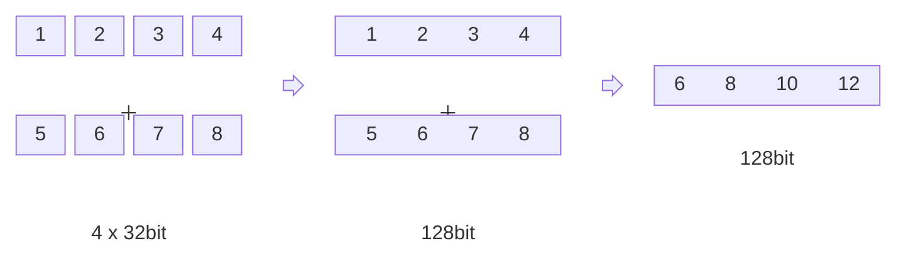

The recently released JDK 22 includes a stable version of the Foreign-Memory Access API, which is officially claimed to provide better performance than JNI.

It just so happens that I have been thinking about using SIMD to optimize encoding algorithms recently, so I am ready to combine these two technologies to optimize VarInt encoding.


[comment]:summary

## SIMD Introduction

Multithreading and concurrency can effectively improve application throughput, but in essence, each thread is only executing a serial stream of instructions.
When there are too many threads, frequent context switching will consume hardware resources, which will ultimately lead to performance degradation instead of improvement.

SIMD is an optimization method for parallel computing implemented at the hardware level: after putting 4 32bit values into a 128bit register, 4 calculations can be performed with one instruction.
In addition to the need to transfer data between registers and memory, SIMD itself does not introduce any performance loss, and it is a reliable optimization method.



SIMD can not only improve the CPU computing power per unit time, but also improve the hit rate of the L1 cache due to the reduction in the number of instructions and the batch loading of data, which further improves the computing efficiency.


### Instruction Set

Some methods in JDK with the `@IntrinsicCandidate` annotation will be replaced with specific assembly implementations inside the JVM.

For example, `Long.numberOfLeadingZeros` and `Long.numberOfTrailingZeros` may be replaced with `lzcnt` and `tzcnt` instructions.

Whether or not the replacement can be done depends on whether the CPU on which the JVM is running supports these instructions.

In addition to some special instructions (e.g. `popcnt`), most instructions exist in the form of instruction sets, and you can check the instruction sets supported by the CPU through `lscpu`:

```
$ lscpu | grep Flags
Flags:                 fpu vme de pse tsc msr pae mce cx8 apic sep mtrr pge mca cmov pat pse36 clflush dts acpi mmx fxsr sse sse2 ss ht tm pbe syscall nx pdpe1gb rdtscp lm constant_tsc art arch_perfmon pebs bts rep_good nopl xtopology nonstop_tsc aperfmperf eagerfpu pni pclmulqdq dtes64 monitor ds_cpl vmx smx est tm2 ssse3 sdbg fma cx16 xtpr pdcm pcid dca sse4_1 sse4_2 x2apic movbe popcnt tsc_deadline_timer aes xsave avx f16c rdrand lahf_lm abm 3dnowprefetch epb cat_l3 cdp_l3 intel_ppin intel_pt ssbd mba ibrs ibpb stibp ibrs_enhanced tpr_shadow vnmi flexpriority ept vpid fsgsbase tsc_adjust bmi1 hle avx2 smep bmi2 erms invpcid rtm cqm mpx rdt_a avx512f avx512dq rdseed adx smap clflushopt clwb avx512cd avx512bw avx512vl xsaveopt xsavec xgetbv1 cqm_llc cqm_occup_llc cqm_mbm_total cqm_mbm_local dtherm ida arat pln pts pku ospke avx512_vnni md_clear spec_ctrl intel_stibp flush_l1d arch_capabilities
```

This VarInt optimization mainly involves two instruction sets:

- **BMI (Bit Manipulation Instructions)**
  - `_pdep_u64`: Split 64 bits into groups of 7 bits each

- **SSE (Streaming SIMD Extensions)**
  - `_mm_set_epi8` : Loads 16 8-bit data into a 128-bit register
  - `_mm_cmpgt_epi8` : Compares data in registers by groups of 8 bits
  - `_mm_movemask_epi8` : Determines whether each group of 8 bits is non-zero and aggregates the result into an int (only the lowest 16 bits are valid)
  - `_mm_bsrli_si128` : Right shift by groups of 8 bits


### Code Implementation

Different compilers support assembly instructions in different ways. In order to ensure the portability of SMID code and coding efficiency, modern operating systems provide **intrinsic functions** in their standard C library functions.
Each SMID instruction has its corresponding intrinsic function, which allows developers to use SMID assembly instructions through high-level languages such as C/C++.

The actual code that will be used next will also use intrinsic functions to implement, from [varint-simd](https://github.com/as-com/varint-simd/blob/master/src/encode/mod.rs) 。
If you are interested in specific instructions, please check it out [here](https://www.intel.com/content/www/us/en/docs/intrinsics-guide/index.html).
```c
#include <stdio.h>
#include <immintrin.h>
#include <x86intrin.h>

typedef unsigned char u8;
typedef unsigned short u16;
typedef unsigned long u64;

void print_out(u8 val[])
{
    printf("out: %x %x %x %x %x %x %x %x %x %x %x %x \n",
           val[0], val[1], val[2], val[3], val[4], val[5],
           val[6], val[7], val[8], val[9], val[10], val[11]);
}

int encode_varint64(u64 val, u8 out[]) {

    // Break the number into 7-bit parts and spread them out into a vector
    __m128i stage1 = _mm_set_epi64x(
            _pdep_u64(val >> 56, 0x000000000000017f),
            _pdep_u64(val, 0x7f7f7f7f7f7f7f7f));

    // Create a mask for where there exist values
    // This signed comparison works because all MSBs should be cleared at this point
    // Also handle the special case when num == 0
    __m128i minimum = _mm_set_epi8(0, 0, 0, 0, 0, 0, 0, 0, 0, 0, 0, 0, 0, 0, 0, 0xFF);
    __m128i exists = _mm_or_si128(_mm_cmpgt_epi8(stage1, _mm_setzero_si128()), minimum);

    // Count the number of bytes used
    int bits = _mm_movemask_epi8(exists);
    u8 bytes = 1 + _bit_scan_reverse(bits);

    // Fill that many bytes into a vector
    __m128i ascend = _mm_setr_epi8(0, 1, 2, 3, 4, 5, 6, 7, 8, 9, 10, 11, 12, 13, 14, 15);
    __m128i mask = _mm_cmplt_epi8(ascend, _mm_set1_epi8(bytes));

    // Shift it down 1 byte so the last MSB is the only one set, and make sure only the MSB is set
    __m128i shift = _mm_bsrli_si128(mask, 1);
    __m128i msbmask = _mm_and_si128(shift, _mm_set1_epi8((u8)0x80));

    // Merge the MSB bits into the vector
    __m128i merged = _mm_or_si128(stage1, msbmask);
    _mm_storeu_si128((__m128i*) out, merged);
    return bytes;
}

int main(int argc, char** argv) {
    u8 out[16];

    encode_varint64(127, out);
    print_out(out);
    encode_varint64(128, out);
    print_out(out);

    encode_varint64(16383, out);
    print_out(out);
    encode_varint64(16384, out);
    print_out(out);

    encode_varint64(~0, out);
    print_out(out);
    return 0;
}

```

Execute `gcc -mbmi2 -o test test.c && ./test` to run the code and you will get the following results:

```text
out: 7f 0 0 0 0 0 0 0 0 0 0 0 
out: 80 1 0 0 0 0 0 0 0 0 0 0 
out: ff 7f 0 0 0 0 0 0 0 0 0 0 
out: 80 80 1 0 0 0 0 0 0 0 0 0 
out: ff ff ff ff ff ff ff ff ff 1 0 0 
```


## FFM Wrapper

### Introduction

The **Foreign-Memory Access API (FFM)**, previously known as the [Panama](https://openjdk.org/projects/panama) project, has been officially released as a standard feature in JDK 22.
Panama aims to establish a unified and efficient calling mechanism between the JVM and native code. This includes the [Vector API](https://openjdk.org/jeps/338) proposal for encapsulating SIMD instructions.

FFM provides two important APIs:

- **Foreign-Memory Access API**: A heap-based memory management mechanism based on `Aerna` and `MemorySegment`.
- **Foreign Linker API**: A dynamic library calling mechanism based on `Linker` and `MethodHandle`.

The **Foreign-Memory Access API** is intended to replace Unsafe and become the standard heap-based memory manager in the future. 
Due to safety considerations, it includes a large number of boundary and lifecycle checks, which may result in a performance decrease compared to direct use of Unsafe. 

Unfortunately, in order to promote the new API, the official has proposed a [draft](https://openjdk.org/jeps/471) to deprecate Unsafe.

The **Foreign Linker API** can be seen as the successor of **JNI (Java Native Interface)**, but with a significant leap in ease of use.
Users can directly access existing dynamic libraries without writing any C/C++ code:

```java
public class FFMTestStrlen {
  public static void main(String[] args) throws Throwable {
    // 1. Get a linker – the central element for accessing foreign functions
    Linker linker = Linker.nativeLinker();

    // 2. Get a lookup object for commonly used libraries
    SymbolLookup stdlib = linker.defaultLookup();

    // 3. Get the address of the "strlen" function in the C standard library
    MemorySegment strlenAddress = stdlib.find("strlen").orElseThrow();

    // 4. Define the input and output parameters of the "strlen" function
    FunctionDescriptor descriptor =
        FunctionDescriptor.of(ValueLayout.JAVA_LONG, ValueLayout.ADDRESS);

    // 5. Get a handle to the "strlen" function
    MethodHandle strlen = linker.downcallHandle(strlenAddress, descriptor);

    // 6. Get a confined memory area (one that we can close explicitly)
    try (Arena offHeap = Arena.ofConfined()) {

      // 7. Convert the Java String to a C string and store it in off-heap memory
      MemorySegment str = offHeap.allocateFrom("Happy Coding!");

      // 8. Invoke the "strlen" function
      long len = (long) strlen.invoke(str);
      System.out.println("len = " + len);
    }
    // 9. Off-heap memory is deallocated at end of try-with-resources
  }
}
```

If you don’t want to manually maintain a large amount of template code, you can try using the code generation tool [jextract](https://docs.oracle.com/en/java/javase/22/core/call-native-functions-jextract.html) provided by FFM.

### Implementation Steps

First, write C code and generate a dynamic link library. This step is very simple and does not involve any Java-related dependencies.

- Compilation

```bash
gcc -Wl,-z,relro -Wl,-z,now -Wl,--as-needed -O3 -mbmi2 varint64.c -shared -o /tmp/varint64.so -fPIC
```

- Code

```c
#include <immintrin.h>
#include <x86intrin.h>

extern int encodeLong(unsigned long value, unsigned char out[]) {

    // Break the number into 7-bit parts and spread them out into a vector
    unsigned long a = _pdep_u64(value, 0x7f7f7f7f7f7f7f7f);
    unsigned long b = _pdep_u64(value >> 56, 0x000000000000017f);
    __m128i stage1 = _mm_set_epi64x(
            _pdep_u64(value >> 56, 0x000000000000017f),
            _pdep_u64(value, 0x7f7f7f7f7f7f7f7f));

    // Create a mask for where there exist values
    // This signed comparison works because all MSBs should be cleared at this point
    // Also handle the special case when num == 0
    __m128i minimum = _mm_set_epi8(0, 0, 0, 0, 0, 0, 0, 0, 0, 0, 0, 0, 0, 0, 0, 0xFF);
    __m128i exists = _mm_or_si128(_mm_cmpgt_epi8(stage1, _mm_setzero_si128()), minimum);

    // Count the number of bytes used
    int bits = _mm_movemask_epi8(exists);
    unsigned char bytes = 1 + _bit_scan_reverse(bits);

    // Fill that many bytes into a vector
    __m128i ascend = _mm_setr_epi8(0, 1, 2, 3, 4, 5, 6, 7, 8, 9, 10, 11, 12, 13, 14, 15);
    __m128i mask = _mm_cmplt_epi8(ascend, _mm_set1_epi8(bytes));

    // Shift it down 1 byte so the last MSB is the only one set, and make sure only the MSB is set
    __m128i shift = _mm_bsrli_si128(mask, 1);
    __m128i msbmask = _mm_and_si128(shift, _mm_set1_epi8((unsigned char)0x80));

    // Merge the MSB bits into the vector
    __m128i merged = _mm_or_si128(stage1, msbmask);
    _mm_storeu_si128((__m128i*) out, merged);
    return bytes;
}
```

Then use FFM to write glue code as the calling stub of the link library.

```java
public class VarIntFFM {

    static final Arena LIBRARY_ARENA;
    static final SymbolLookup SYMBOL_LOOKUP;

    public static final FunctionDescriptor DESC = FunctionDescriptor.of(
            ValueLayout.JAVA_INT,
            ValueLayout.JAVA_LONG,
            ValueLayout.ADDRESS.withTargetLayout(MemoryLayout.sequenceLayout(Long.MAX_VALUE, JAVA_BYTE))
    );

    public static final MemorySegment ADDR;
    public static final MethodHandle HANDLE;

    static {
        try {
            LIBRARY_ARENA = Arena.ofAuto();
            SYMBOL_LOOKUP = SymbolLookup.libraryLookup(Paths.get("/tmp/varint64.so"), LIBRARY_ARENA)
                    .or(SymbolLookup.loaderLookup())
                    .or(Linker.nativeLinker().defaultLookup());

            ADDR = SYMBOL_LOOKUP.find("encodeLong").orElseThrow();
            HANDLE = Linker.nativeLinker().downcallHandle(ADDR, DESC);
        } catch (Throwable e) {
            e.printStackTrace();
            throw new RuntimeException(e);
        }
    }

    public static int encodeLong(long value, MemorySegment out) throws Throwable {
        return (int) HANDLE.invokeExact(value, out);
    }

}
```

### Benchmark

Finally, benchmark with JMH by simulating the following scenario: \
Call native function which writes the encoded data into the intermediate array `buf`, and then copy the data in `buf` into the `result` array which will be return to user.

```java
public class VarIntPerf {

    @Benchmark
    @Warmup(time = 3, iterations = 3)
    @Measurement(time = 5, iterations = 3)
    public void testNative() throws Throwable {
        byte[] result = new byte[10];
        try (Arena offHeap = Arena.ofConfined()) {
            MemorySegment buf = offHeap.allocate(16, 16);
            for (int i=0; i<1000; i++) {
                int n = TestFFM.encodeLong(i, buf);
                Unsafe.COPY_MEMORY.copyMemory(null, buf.address(), result, CodecSlice.BYTES_OFFSET, n);
            }
        }
    }

    @Benchmark
    @Warmup(time = 3, iterations = 3)
    @Measurement(time = 5, iterations = 3)
    public void testPlain()  {
        byte[] result = new byte[10];
        byte[] buf = new byte[10];
        for (int i=0; i<1000; i++) {
            int n = VarInt.encodeLong(i, buf, 0);
            System.arraycopy(buf, 0, result, 0, n);
        }
    }

    public static void main(String[] args) throws RunnerException {
        Options opt = new OptionsBuilder()
                .include(VarIntFFMPerf.class.getSimpleName())
                .forks(1)
                .build();
        new Runner(opt).run();
    }

}
```

Here we use maven-shade-plugin to generate benchmarks.jar :

```xml
<plugin>
    <groupId>org.apache.maven.plugins</groupId>
    <artifactId>maven-shade-plugin</artifactId>
    <version>3.2.0</version>
    <executions>
        <execution>
            <phase>package</phase>
            <goals>
                <goal>shade</goal>
            </goals>
            <configuration>
                <finalName>benchmarks</finalName>
                <transformers>
                    <transformer implementation="org.apache.maven.plugins.shade.resource.ManifestResourceTransformer">
                        <mainClass>org.openjdk.jmh.Main</mainClass>
                    </transformer>
                </transformers>
            </configuration>
        </execution>
    </executions>
</plugin>
```

Finally, execute the following command to start bencmarking:
```bash
mvn clean package
java -jar target/benchmarks.jar VarIntFFMPerf
```

Here is the results:
```text
Benchmark              Mode  Cnt       Score      Error  Units
VarIntPerf.testFFM    thrpt   15   47364.288 ± 1190.314  ops/s
VarIntPerf.testPlain  thrpt   15  109338.097 ±  973.650  ops/s
```

Have to say that this result is quite disappointing.
The overhead of FFM calling local code is still considerable, and its context switching overhead is still not of the same order of magnitude as JVM internal calls.


## JNI Wrapper

Next we will use JNI to implement the same native function and use it as a performance comparison.

### Implementation Steps

First, create a java class as the call stub.

```java
public abstract class VarIntJNI {

    static {
        System.load("/tmp/varintjni.so");
    }
    public static native int encodeLong(long value, long pointer);

}
```

Then execute `javac -h . VarIntJNI.java` to generate JNI header file.

```c
/* DO NOT EDIT THIS FILE - it is machine generated */
#include <jni.h>
/* Header for class VarIntJNI */

#ifndef _Included_VarIntJNI
#define _Included_VarIntJNI
#ifdef __cplusplus
extern "C" {
#endif
/*
 * Class:     VarIntJNI
 * Method:    encodeLong
 * Signature: (JJ)I
 */
JNIEXPORT jint JNICALL Java_VarIntJNI_encodeLong
  (JNIEnv *, jclass, jlong, jlong);

#ifdef __cplusplus
}
#endif
#endif
```

Finally, compile the JNI version shared library.

- Compilation
```
gcc -I $JAVA_HOME/include -I $JAVA_HOME/include/linux/ -Wl,-z,relro -Wl,-z,now -Wl,--as-needed -O3 -mbmi2 varintjni.c -shared -o /tmp/varintjni.so -fPIC
```

- Code
```c
#include <immintrin.h>
#include <x86intrin.h>

#include "varintjni.h"

JNIEXPORT jint JNICALL Java_VarIntJNI_encodeLong
  (JNIEnv * env, jclass obj, jlong value, jlong out) {

    // Break the number into 7-bit parts and spread them out into a vector
    unsigned long a = _pdep_u64(value, 0x7f7f7f7f7f7f7f7f);
    unsigned long b = _pdep_u64(value >> 56, 0x000000000000017f);
    __m128i stage1 = _mm_set_epi64x(
            _pdep_u64(value >> 56, 0x000000000000017f),
            _pdep_u64(value, 0x7f7f7f7f7f7f7f7f));

    // Create a mask for where there exist values
    // This signed comparison works because all MSBs should be cleared at this point
    // Also handle the special case when num == 0
    __m128i minimum = _mm_set_epi8(0, 0, 0, 0, 0, 0, 0, 0, 0, 0, 0, 0, 0, 0, 0, 0xFF);
    __m128i exists = _mm_or_si128(_mm_cmpgt_epi8(stage1, _mm_setzero_si128()), minimum);

    // Count the number of bytes used
    int bits = _mm_movemask_epi8(exists);
    unsigned char bytes = 1 + _bit_scan_reverse(bits);

    // Fill that many bytes into a vector
    __m128i ascend = _mm_setr_epi8(0, 1, 2, 3, 4, 5, 6, 7, 8, 9, 10, 11, 12, 13, 14, 15);
    __m128i mask = _mm_cmplt_epi8(ascend, _mm_set1_epi8(bytes));

    // Shift it down 1 byte so the last MSB is the only one set, and make sure only the MSB is set
    __m128i shift = _mm_bsrli_si128(mask, 1);
    __m128i msbmask = _mm_and_si128(shift, _mm_set1_epi8((unsigned char)0x80));

    // Merge the MSB bits into the vector
    __m128i merged = _mm_or_si128(stage1, msbmask);
    _mm_storeu_si128((__m128i*) out, merged);
    return bytes;
}
```

### Benchmark

To ensure fairness, we'll directly use Unsafe to allocate off-heap memory for communication, avoiding potential memory copying caused by JNI.

```java

public class VarIntPerf {

    static final sun.misc.Unsafe unsafe = (sun.misc.Unsafe) Unsafe.UNSAFE;

    @Benchmark
    @Warmup(time = 3, iterations = 3)
    @Measurement(time = 3, iterations = 3)
    public void testJNI() throws Throwable {
        byte[] result = new byte[16];
        long address = unsafe.allocateMemory(16);
        for (int i=0; i<1000; i++) {
            int n = VarIntJNI.encodeLong(i, address);
            Unsafe.COPY_MEMORY.copyMemory(null, address, result, CodecSlice.BYTES_OFFSET, n);
        }
        unsafe.freeMemory(address);
    }

    //...

    public static void main(String[] args) throws RunnerException {
        Options opt = new OptionsBuilder()
                .include(VarIntJNIPerf.class.getSimpleName())
                .forks(1)
                .build();
        new Runner(opt).run();
    }

}
```

Here is the results:

```text
Benchmark                 Mode  Cnt       Score      Error  Units
VarIntPerf.testJNI       thrpt   15   46634.574 ±  904.912  ops/s
VarIntPerf.testFFM       thrpt   15   44151.628 ±  815.886  ops/s
VarIntPerf.testPlain     thrpt   15  109448.067 ± 1382.802  ops/s
```


While the performance of the JNI wrapper is still not ideal, it still has a slight advantage over the FFM wrapper approach, which is consistent with the official documentation's expectations.

The call paths for FFM and JNI can be divided into two categories:
- **upcall**: Calling Java code from native methods
- **downcall**: Calling native methods from Java code

FFM mainly optimizes the upcall path, while the optimization for downcall is not very significant. 
This test only includes the downcall path, so it cannot fully demonstrate FFM's advantage.


## Conclusion

With the advent of FFM, accessing native code in the JVM is becoming increasingly easier. 
However, the context switching overhead of FFM is still relatively high, so it is not suitable for high-frequency calls. 

There are two possible optimization methods:
- Process as much data as possible in a single call. \
But it means more memory allocation and data copying overhead.
- Implement as much function as possible using native code. \
But it means that the memory safety and ease of debugging provided by JVM will no longer exist.

As a means to eliminate computing hotspots, SIMD is typically only suitable for optimizing hotspot code. 
This is exactly contrary to the design philosophy of FFM and JNI.

If you want to experience the acceleration ability of SIMD in the JVM language, 
it seems that you can only pin your hopes on the Vector API, which is not yet mature.