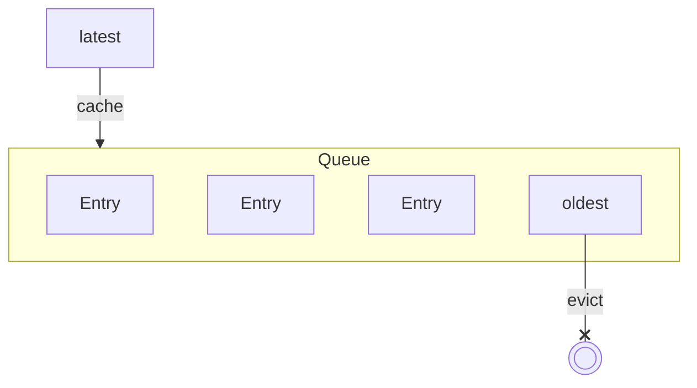
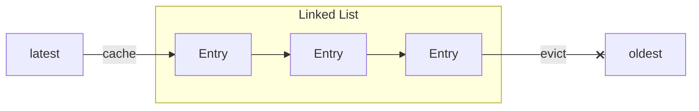
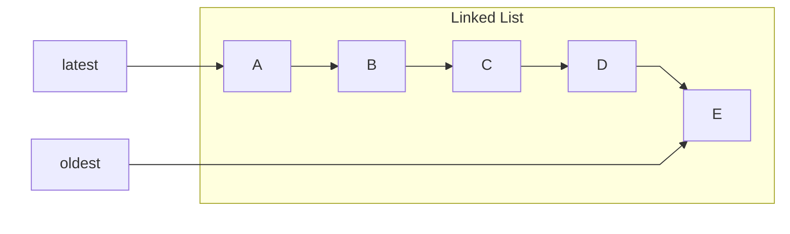
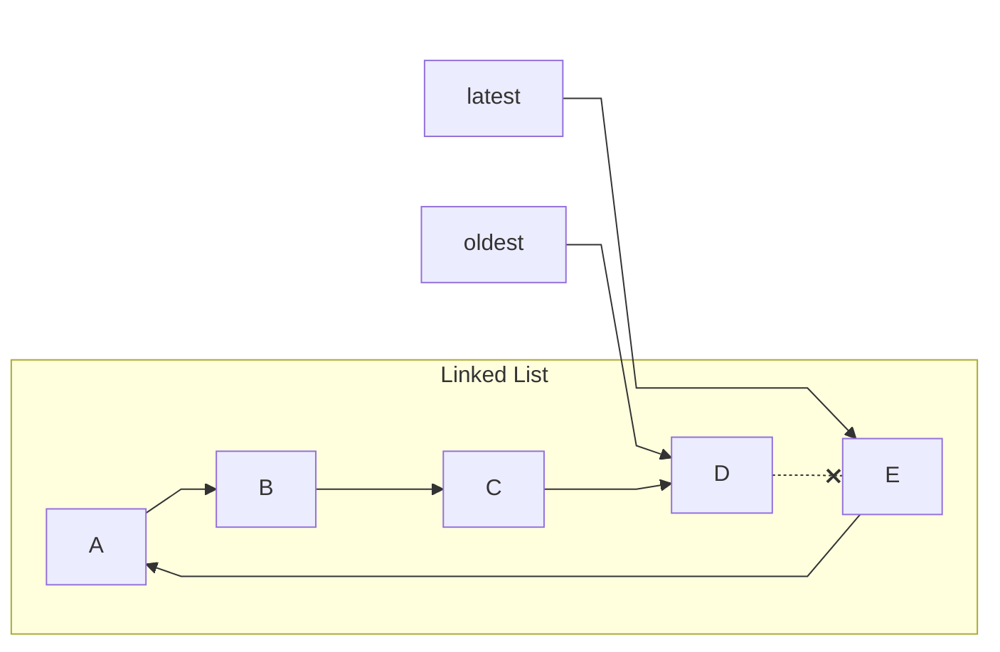
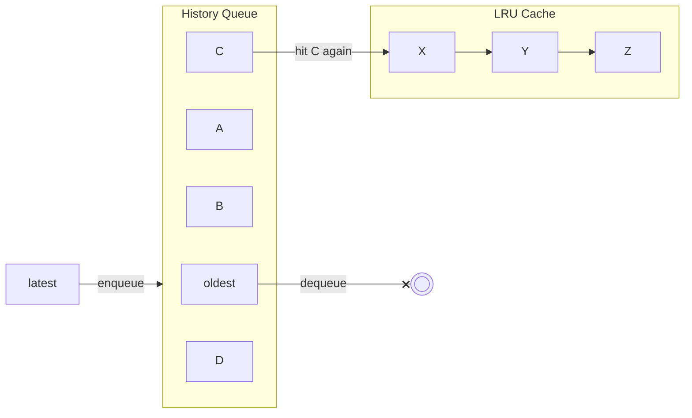
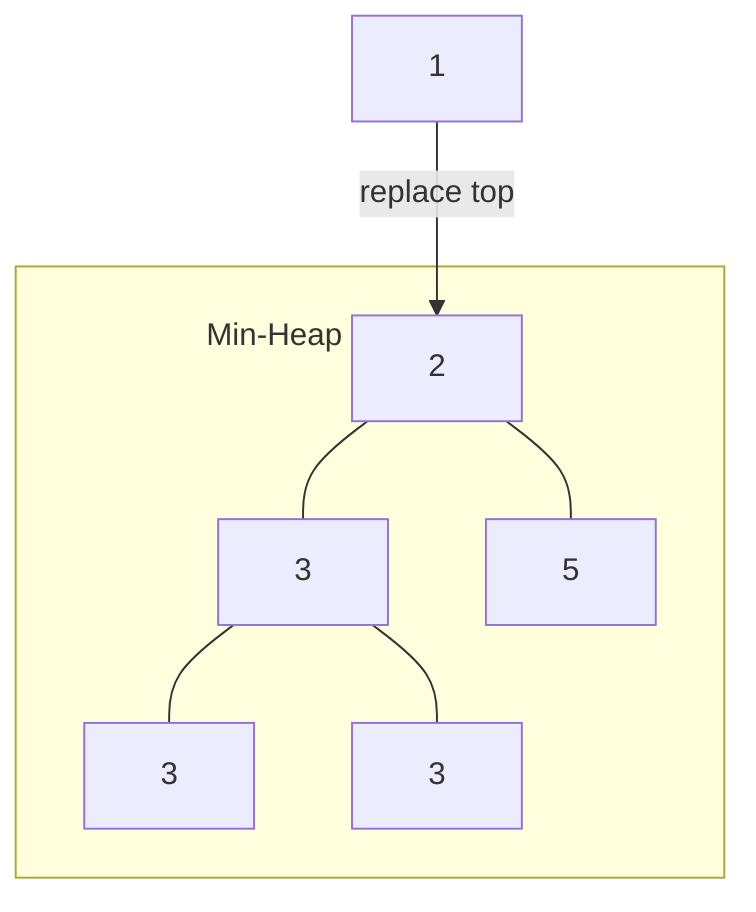
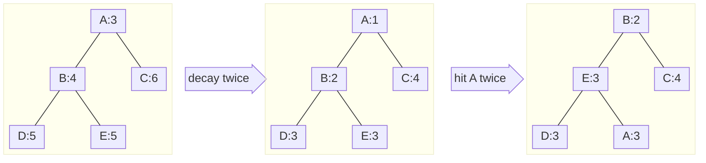
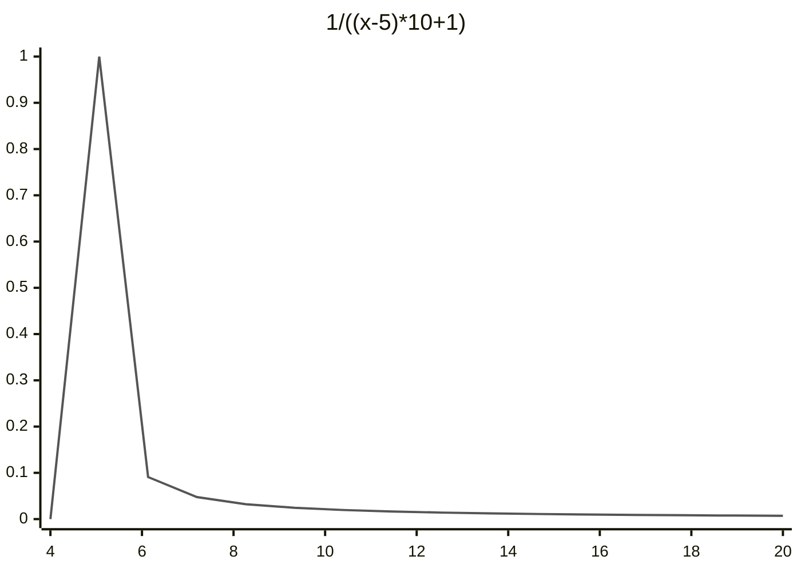

This article analyzes the cache eviction mechanism of Redis from the source code level and describes the implementation approach using Java at the end of the article for reference.

[comment]:summary

## Relevant Configurations

To adapt to caching scenarios, Redis supports cache eviction and provides corresponding configurations:

> **maxmemory**

Sets the upper limit of memory usage, which cannot be set to a capacity less than 1M.
The default value of this option is 0, in which case the system will calculate a memory limit on its own.

> **maxmemory-policy**

Each database in Redis maintains two dictionaries:
- `db.dict`: All key-value pairs in the database, also known as the keyspace of the database
- `db.expires`: Keys with a lifecycle and their corresponding TTL (time to live), thus also known as the **expire set**

When the maximum memory usage **maxmemory** is reached, the available strategies for cleaning the cache are:

- **noeviction**: Returns an error when the maximum memory is reached, without evicting any data.
- **allkeys-lfu:** Evicts the least frequently used (LFU) keys in the entire keyspace (version 4.0 or higher).
- **allkeys-lru:** Evicts the least recently used (LRU) keys in the entire keyspace.
- **allkeys-random**: Evicts random keys in the entire keyspace.
- **volatile-ttl**: Evicts the key with the shortest TTL in the expire set.
- **volatile-lfu**: Evicts the least frequently used keys in the expire set (version 4.0 or higher).
- **volatile-lru**: Evicts the least recently used (LRU) keys in the expire set.
- **volatile-random**: Evicts random keys in the expire set.

When the expire set is empty, **volatile-* **behaves the same as **noeviction**.

> **maxmemory-samples**

To ensure performance, Redis uses approximate implementations of LRU and LFU algorithms. 

When need to evict record, it does not traverse all records but selects a subset of records for eviction through random sampling.

The **maxmemory-samples** option controls the number of samples in this process. 
Increasing this value will increase CPU overhead, but the algorithm's effectiveness can better approximate actual LRU and LFU.

> **lazyfree-lazy-eviction**

Cache cleaning need system call to free memory, which blocks the main thread.

When deleting a gigantic record (e.g. a list containing hundreds of entries), it can cause performance issues or even lead to system frozen.

The **lazy freeing** mechanism delegates the releases procedure to other threads, thereby improving system performance.
Enabling this option may result in exceeding the memory usage limit of **maxmemory**.

## Cache Eviction Mechanism

A complete cache eviction mechanism needs to address two issues:
- Determining which records to evict — **Eviction Strategy**
- Deleting the evicted records — **Deletion Strategy**

### Eviction Strategy

The memory available for caching is limited. 
When space is insufficient, data that will not be accessed again should be evicted.

Therefore, eviction algorithms are designed around the principle of **temporal locality**:
**if data is being accessed, it is likely to be accessed again in the near future.**

To adapt to the characteristic of more reads than writes in caching scenarios, hash tables are commonly used to implement caches. 
When implementing specific cache eviction policies, additional **bookkeeping** structures need to be introduced.

Let's review the 3 most common cache eviction strategies.


#### **FIFO (First In, First Out)**

The data that entered the cache earlier is more likely not to be accessed again. 
Therefore, we should first the cached record that has been in memory for the longest time.

This strategy can be implemented using a queue:



- Pros: Simple implementation, suitable for linear access scenarios.

- Cons: Cannot adapt to specific access hotspots, poor cache hit rate.

- Bookkeeping Overhead: Time O(1), Space O(N)

#### **LRU (Least Recently Used)**

After a cached record is accessed, it is highly likely to be accessed again in the near future. 
So we can keep the latest access time for each record, and the data with the oldest access time should be evicted first.

An alternative implement of LRU is keep the access sequence, usually implemented as a linked list:


When record is accessed, just move it to the head of link list by adjusting pointer:




- Pros: High cache hit rate, suitable for scenarios where access has locality characteristics.

- Cons: Higher bookkeeping space overhead, especially when accessing records.

- Bookkeeping Overhead: Time O(1), Space O(N)


##### LRU Improvement

The original LRU algorithm caches data that has been accessed only once recently, 
thus failing to distinguish well between cold data and hot data. 

This means that some cold data may also enter the cache, pushing out the hot data.

To reduce the impact of sporadic accesses, the subsequent improvement proposed is the LRU-K algorithm, 
which makes the following enhancements:

- Adding a **history queue** on the basis of LRU bookkeeping.
- When the access count is less than K, data will be record in history queue.
- When the access count is greater than or equal to K, recdataord will be removed from the history queue and recorded in the LRU cache.

When the history queue is full, FIFO or LRU strategy can be used for eviction.

The larger the K value, the higher the cache hit rate, but the adaptability is poor, requiring a large number of accesses to eliminate expired hot records.
Taking various factors into account, the commonly used algorithm in practice is LRU-2:



- Pros: Reduces the impact of sporadic accesses on cache hit rate.

- Cons: Requires additional bookkeeping overhead.

- Bookkeeping Overhead: Time $O(1)$, Space $O(N+M)$


#### **LFU (Least Frequently Used)**

The more frequently a data is accessed in the recent period, the more likely it is to be accessed again. 

We can record the access frequency of each cache record over a recent period of time, and data with low access frequency will be evicted first.

A simple way to implement LFU is to set a accesses counter for each record and put them into a min-heap:


To ensure adaptability, the counter needs to be decayed to ensure that expired hot data can be eliminated timely:


### Deletion Strategy

Common deletion strategies can be divided into the following types:

- Instant Deletion

  Every time a new record is added, immediately search and eliminate expired records.
  - Pros: Most memory-saving.
  - Cons: Free memory will affect the efficiency of writing.

- Lazy Deletion:

  Two counters are set in the cache, one counts the number of cache accesses, and the other counts the number of eliminable records.
  After every N accesses or when the current number of eliminable records exceeds M, trigger a batch deletion (M and N can be adjusted).

  - Pros: Minimal impact on normal cache operations, batch deletion reduces maintenance overhead.
  - Cons: Causes memory space waste, and occasional deletion operations may cause fluctuation in access time.

- Asynchronous Deletion:

  Set up an independent timer thread to trigger batch deletion at fixed intervals.
  - Pros: Transparent to normal cache operations, no additional performance overhead.
  - Cons: Requires adding maintenance threads, and thread safety issues have to be considered.


## Implementation in Redis

Redis implements two elimination strategies: LRU and LFU.

To save space, Redis does not use the bookkeeping structures described above to implement LRU or LFU. 
Instead, it uses a 24-bit space in `robj` to record access information:

```c
#define LRU_BITS 24

typedef struct redisObject {
    ...
    unsigned lru:LRU_BITS;  /* LRU time (relative to the global lru_clock time) or
                             * LFU data (8 bits record access frequency, 16 bits record access time). */
} robj;
```

Redis updates `robj.lru` when a record is hit:

```c
robj *lookupKey(redisDb *db, robj *key, int flags) {
    // ...

    // Depending on maxmemory_policy, choose a different update strategy
    if (server.maxmemory_policy & MAXMEMORY_FLAG_LFU) {
        updateLFU(val);
    } else {
        val->lru = LRU_CLOCK();
    }
}
```

The key to updating LFU and LRU lies in the `updateLFU` function and the `LRU_CLOCK` macro.

### Updating LRU Time

When using the LRU algorithm, `robj.lru` records the timestamp of the last access, which can be used to identify records that have not been accessed for a long time.

To reduce system calls, Redis sets a global clock `server.lruclock` and updates it by a background task:

```c
#define LRU_CLOCK_MAX ((1<<LRU_BITS)-1) /* Max value of obj->lru */
#define LRU_CLOCK_RESOLUTION 1000 /* Clock precision in milliseconds */

/**
 * The update frequency of server.lruclock is 1000/server.hz
 * If this frequency is higher than the clock precision of LRU, use server.lruclock directly
 * to avoid calling getLRUClock() incurring additional overhead
 */
#define LRU_CLOCK() ((1000/server.hz <= LRU_CLOCK_RESOLUTION) ? server.lruclock : getLRUClock())

unsigned int getLRUClock(void) {
    return (mstime()/LRU_CLOCK_RESOLUTION) & LRU_CLOCK_MAX;
}
```

The calculation of LRU time is as follows:
```c
unsigned long long estimateObjectIdleTime(robj *o) {
    unsigned long long lruclock = LRU_CLOCK();
    if (lruclock >= o->lru) {
        return (lruclock - o->lru) * LRU_CLOCK_RESOLUTION;
    } else {
        // Handle the case of LRU time overflow
        return (lruclock + (LRU_CLOCK_MAX - o->lru)) *
                    LRU_CLOCK_RESOLUTION;
    }
}
```
When `LRU_CLOCK_RESOLUTION` is 1000ms, the maximum LRU duration that `robj.lru` can record is 194 days (0xFFFFFF / 3600 / 24).


### Updating LFU Counter

When using the LFU algorithm, `robj.lru` is divided into two parts: the first 16 bits record the last access time, and the last 8 bits are used as a counter.

```c
void updateLFU(robj *val) {
    unsigned long counter = LFUDecrAndReturn(val); // Counter decay
    counter = LFULogIncr(counter); // Counter increment
    val->lru = (LFUGetTimeInMinutes()<<8) | counter; // Update time
}
```

#### Updating Access Time
The first 16 bits are used to save the last access time:

```c
/**
 * Get the UNIX minute timestamp, keeping only the lowest 16 bits
 * Used to represent the last decrement time (LDT)
 */
unsigned long LFUGetTimeInMinutes(void) {
    return (server.unixtime/60) & 65535;
}
```

#### Incrementing Access Counter

The last 8 bits are a **logarithmic counter**, which stores the logarithm of the access frequency:
```c
#define LFU_INIT_VAL 5 

// Logarithmic increment counter, with a maximum value of 255
uint8_t LFULogIncr(uint8_t counter) {
    if (counter == 255) return 255;
    double r = (double)rand()/RAND_MAX;
    double baseval = counter - LFU_INIT_VAL;
    if (baseval < 0) baseval = 0;
    double p = 1.0/(baseval*server.lfu_log_factor+1);
    if (r < p) counter++;
    return counter;
}
```
When `server.lfu_log_factor = 10`, the growth function of `p = 1/((counter-LFU_INIT_VAL)*server.lfu_log_factor+1)` is as follows:



The random floating-point number `r` generated by `rand()` follows a uniform distribution between 0 and 1. 
As the counter increases, the probability of successful self-increment decreases rapidly.

The following table shows the number of hits required for the counter to saturate (255) under different `lfu_log_factor` settings:

```text
+--------+------------+------------+------------+------------+------------+
| factor | 100 hits   | 1000 hits  | 100K hits  | 1M hits    | 10M hits   |
+--------+------------+------------+------------+------------+------------+
| 0      | 104        | 255        | 255        | 255        | 255        |
+--------+------------+------------+------------+------------+------------+
| 1      | 18         | 49         | 255        | 255        | 255        |
+--------+------------+------------+------------+------------+------------+
| 10     | 10         | 18         | 142        | 255        | 255        |
+--------+------------+------------+------------+------------+------------+
| 100    | 8          | 11         | 49         | 143        | 255        |
+--------+------------+------------+------------+------------+------------+
```

#### Decaying Access Count

Similarly, to ensure that expired hot data can be eliminated in time, Redis uses the following decay function:

```c
// Calculate the time elapsed since the last decay, in minutes
public long LFUTimeElapsed(long ldt) {
    long now = LFUGetTimeInMinutes();
    if (now >= ldt) return now - ldt;
    return 65535 - ldt + now;
}

/**
 * Decay function, returns the LFU count after decay based on the LDT timestamp
 * Does not update the counter
 */
public long LFUDecrAndReturn(CacheEntry o) {
    long ldt = o.ttl() >>> 8;
    long counter = o.ttl() & 255;
    /**
     * Decay factor server.lfu_decay_time controls the decay rate of the counter
     * The access count decreases by 1 every server.lfu_decay_time minutes
     * Default value is 1
     */
    long num_periods = server.lfu_decay_time != 0 ? LFUTimeElapsed(ldt) / server.lfu_decay_time : 0;
    if (num_periods != 0) {
        counter = (num_periods > counter) ? 0 : counter - num_periods;
    }
    return counter;
}
```
With 16 bits, the maximum number of minutes that can be stored is about 45 days, so the LDT timestamp resets every 45 days.


### Perform Eviction

Whenever a client executes a command that generates new data, Redis checks whether the memory usage exceeds **maxmemory**. 
If it does, it tries to evict data according to **maxmemory_policy**:

```c
// The main method for Redis to handle commands. Before executing the command, various checks are performed, including handling OOM situations:
public int processCommand(Client c) {

    // ...

    // When maxmemory is set, try to free memory (evict) if necessary
    if (server.maxmemory != 0 && !server.lua_timedout) {
        boolean out_of_memory = (performEvictions() == EVICT_FAIL);

        // ...

        // If freeing memory fails and the command to be executed does not allow OOM (usually write commands)
        if (out_of_memory && reject_cmd_on_oom) {
            rejectCommand(c, shared.oomerr); // Return OOM to the client
            return C_OK;
        }
    }
}
```
The actual deletion is performed by the `performEvictions` function:

```c
public int performEvictions() {
    // Loop to try to free up enough memory
    while (mem_freed < mem_tofree) {

        // ...

        if ((server.maxmemory_policy & (MAXMEMORY_FLAG_LRU | MAXMEMORY_FLAG_LFU)) != 0 ||
            server.maxmemory_policy == MAXMEMORY_VOLATILE_TTL) {

            /**
             * Redis uses approximate LRU/LFU algorithms for eviction
             * Instead of traversing all records when evicting objects, samples of records are taken
             * EvictionPoolLRU is used to temporarily store sample data that should be evicted first
             */
            EvictionPoolEntry[] pool = EvictionPoolLRU;

            // Get a bestkey that can be released according to the configured maxmemory-policy
            while (bestkey == null) {
                long total_keys = 0;
                long keys;

                // Traverse all DB instances
                for (i = 0; i < server.dbnum; i++) {
                    db = server.db + i;
                    dict = (server.maxmemory_policy & MAXMEMORY_FLAG_ALLKEYS) != 0 ?
                            db.dict : db.expires;
                    // Select the sampled set (keyspace or expire set) according to the policy
                    if ((keys = dictSize(dict)) != 0) {
                        // Sample and populate the pool
                        evictionPoolPopulate(i, dict, db.dict, pool);
                        total_keys += keys;
                    }
                }

                // Traverse the records in the pool and free up memory
                for (k = EVPOOL_SIZE - 1; k >= 0; k--) {
                    if (pool[k].key == null) continue;
                    bestdbid = pool[k].dbid;

                    if ((server.maxmemory_policy & MAXMEMORY_FLAG_ALLKEYS) != 0) {
                        de = dictFind(server.db[pool[k].dbid].dict, pool[k].key);
                    } else {
                        de = dictFind(server.db[pool[k].dbid].expires, pool[k].key);
                    }

                    // Remove the record from the pool
                    if (!pool[k].key.equals(pool[k].cached)) {
                        sdsfree(pool[k].key);
                    }
                    pool[k].key = null;
                    pool[k].idle = 0;

                    if (de != null) {
                        // Extract the key of the record
                        bestkey = dictGetKey(de);
                        break;
                    } else {
                        /* Ghost... Iterate again. */
                    }
                }
            }
        }

        // If bestkey is finally selected
        if (bestkey != null) {

            // If lazyfree-lazy-eviction is configured, try asynchronous deletion
            if (server.lazyfree_lazy_eviction) {
                dbAsyncDelete(db, keyobj);
            } else {
                dbSyncDelete(db, keyobj);
            }

            // ...

        } else {
            goto cant_free; /* nothing to free... */
        }
    }
}
```

The `evictionPoolPopulate` function responsible for sampling:

```c
#define EVPOOL_SIZE 16
#define EVPOOL_CACHED_SDS_SIZE 255

struct evictionPoolEntry {
    unsigned long long idle;    /* LRU idle time / LFU inverse frequency (prioritize records with larger values) */
    sds key;                    /* Key involved in eviction selection */
    sds cached;                 /* Cached key name */
    int dbid;                   /* Database ID */
};

// The evictionPool array assists eviction operations
static struct evictionPoolEntry *evictionPoolEntry;

/**
 * Perform sampling in the given sampledict set
 * and record the records that should be evicted in evictionPool
 */
void evictionPoolPopulate(int dbid, dict *sampledict, dict *keydict, struct evictionPoolEntry *pool) {
    int j, k, count;
    dictEntry *samples[server.maxmemory_samples];

    // Get maxmemory_samples randomly from sampledict
    count = dictGetSomeKeys(sampledict, samples, server.maxmemory_samples);

    // Traverse sample data
    for (j = 0; j < count; j++) {
        // Calculate the idle time of the sample based on maxmemory_policy
        if (server.maxmemory_policy & MAXMEMORY_FLAG_LRU) {
            idle = estimateObjectIdleTime(o);
        } else if (server.maxmemory_policy & MAXMEMORY_FLAG_LFU) {
            idle = 255 - LFUDecrAndReturn(o);
        } else {
            // ...
        }

        k = 0; // Locate the index of the sample in evictionPool based on idle (samples are sorted in ascending order of idle)
        while (k < EVPOOL_SIZE && pool[k].key && pool[k].idle < idle)
            k++;

        if (k == 0 && pool[EVPOOL_SIZE - 1].key != NULL) {
            // The sample idle time is not long enough, it does not participate in this round of eviction
            continue;
        } else if (k < EVPOOL_SIZE && pool[k].key == NULL) {
            // The corresponding position for the sample is empty, it can be inserted directly into that position
        } else {
            // The corresponding position for the sample is occupied, move other elements to make room for it
        }

        // Insert the sample data into its corresponding position k
        int klen = sdslen(key);
        if (klen > EVPOOL_CACHED_SDS_SIZE) {
            pool[k].key = sdsdup(key);
        } else {
            // If the key length does not exceed EVPOOL_CACHED_SDS_SIZE, reuse the sds object
        }
        pool[k].idle = idle;
        pool[k].dbid = dbid;
    }
}
```

## Java Implementation
After understanding the above concepts, let's attempt to implement a **thread-safe** eviction strategy in Java.


### Designing the Bookkeeping Structure
In a multi-threaded safe cache, it's crucial to minimize bookkeeping:
- On one hand, to avoid the overhead of maintaining additional state
- On the other hand, to reduce boundary cases where the system might end up inconsistent

Thus, we can use a counter similar to Redis to track access patterns:

```java
/**
 * Cache Entry
 */
public abstract class CacheEntry {

    // CAS Updater
    private static final AtomicLongFieldUpdater<CacheEntry>
            TTL_UPDATER = AtomicLongFieldUpdater.newUpdater(CacheEntry.class, "ttl");

    // Remaining survival time of cache records (unsigned long integer)
    private volatile long ttl;

    protected CacheEntry(long ttl) {
        this.ttl = ttl;
    }

    public long ttl() {
        return ttl;
    }

    //Support concurrent update of TTL
    public boolean casTTL(long old, long ttl) {
        return TTL_UPDATER.compareAndSet(this, old, ttl);
    }

}
```
```java
/**
 * Elimination strategy
 */
public interface EvictStrategy {

    // Update the TTL of the cached record
    void updateTTL(CacheEntry node);

    // Calculate the TTL of the cached record based on the current timestamp
    long weightTTL(CacheEntry node, long now);

}
```

### Determining Eviction Strategies

Due to the constraints of the accounting structure, Redis can only avoid large-scale traversal and reduce the blocking of the main thread by instant deletion strategies through sampling.

On the other hand, in situations where memory restrictions are not so strict, the lazy deletion strategy can be used to reduce the overhead of a single request:

```java

public abstract class EvictableCache {

    EvictStrategy evicting; // Eviction strategy

    /**
     * Updates the TTL of the cache entry when reading and writing cache records
     * @param entry The recently accessed cache entry
     */
    void accessEntry(CacheEntry entry) {
        evicting.updateTTL(entry);
    }

    /**
     * Bulk eviction of caches
     * @param evictSamples Cache samples
     * @param evictNum Maximum number of evictions
     * @return Records that should be evicted
     */
    Collection<CacheEntry> evictEntries(Iterable<CacheEntry> evictSamples, int evictNum) {

        // Compare the TTLs of two CacheEntries (evict records with smaller TTLs first)
        Comparator<CacheEntry> comparator = new Comparator<CacheEntry>() {
            final long now = System.currentTimeMillis();
            public int compare(CacheEntry o1, CacheEntry o2) {
                long w1 = evicting.weightTTL(o1, now);
                long w2 = evicting.weightTTL(o2, now);
                return -Long.compareUnsigned(w1, w2);
            }
        };

        // Use a max-heap to record the K CacheEntries with the smallest TTL
        PriorityQueue<CacheEntry> evictPool = new PriorityQueue<>(evictNum, comparator);

        Iterator<CacheEntry> iterator = evictSamples.iterator();
        while (iterator.hasNext()) {
            CacheEntry entry = iterator.next();
            if (evictPool.size() < evictNum) {
                evictPool.add(entry);
            } else {
                // If the TTL of CacheEntry is smaller than the top record
                // Pop the top record and put the record with smaller TTL into the heap
                CacheEntry top = evictPool.peek();
                if (comparator.compare(entry, top) < 1) {
                    evictPool.poll();
                    evictPool.add(entry);
                }
            }
        }

        return evictPool;
    }
}
```

### Implementing Eviction Strategies

#### FIFO Strategy
```java
/**
 * FIFO strategy
 */
public class FirstInFirstOut implements EvictStrategy {

    // Counter, incremented by 1 for each access operation
    private final AtomicLong counter = new AtomicLong(0);

    // Update TTL only on first access
    public void updateTTL(CacheEntry node) {
        node.casTTL(0, counter.incrementAndGet());
    }

    // Returns the first access sequence number
    public long weightTTL(CacheEntry node, long now) {
        return node.ttl();
    }

}
```
#### LRU Strategy
```java
/**
 * LRU-2 strategy
 */
public class LeastRecentlyUsed implements EvictStrategy {

    // Logical clock, incremented by 1 for each access operation
    private final AtomicLong clock = new AtomicLong(0);

    /**
     * Updates LRU time
     */
    public void updateTTL(CacheEntry node) {
        long old = node.ttl();
        long tick = clock.incrementAndGet();
        long flag = old == 0 ? Long.MIN_VALUE: 0;
        // flag = Long.MIN_VALUE means put into History Queue
        // flag = 0              means put into LRU Cache
        long ttl = (tick & Long.MAX_VALUE) | flag;
        while ((old & Long.MAX_VALUE) < tick && ! node.casTTL(old, ttl)) {
            old = node.ttl();
            ttl = tick & Long.MAX_VALUE; // CAS failed indicates a second access
        }
    }

    /**
     * Calculates TTL based on LRU time
     */
    public long weightTTL(CacheEntry node, long now) {
        long ttl = node.ttl();
        return -1L - ttl;
    }
}
```
#### LFU Strategy

```java
/**
 * LFU-AgeDecay Strategy
 */
public class LeastFrequentlyUsed implements EvictStrategy {

    private static final int TIMESTAMP_BITS = 40; // 40 bits for recording access timestamps (to ensure no overflow for 34 years)
    private static final int FREQUENCY_BITS = 24; // 24 bits as a logarithmic counter (overflow of the counter can be ignored)

    private final long ERA = System.currentTimeMillis();  // Starting time (records the timestamp relative to this value)
    private final double LOG_FACTOR = 1;                  // Logarithmic factor
    private final TimeUnit DECAY_UNIT = TimeUnit.MINUTES; // Time decay unit

    /**
     * Update LFU counter and access time
     * Unlike Redis, the counter is not decayed during update
     */
    public void updateTTL(CacheEntry node) {

        final long now = System.currentTimeMillis();

        long old = node.ttl();
        long timestamp = old >>> FREQUENCY_BITS;
        long frequency = old & (~0L >>> TIMESTAMP_BITS);

        // Calculate access time
        long elapsed = Math.min(~0L >>> FREQUENCY_BITS, now - ERA);
        while (timestamp < elapsed) {
            // Increase access counter
            double rand = ThreadLocalRandom.current().nextDouble();
            if (1./(frequency * LOG_FACTOR + 1) > rand) {
                frequency++;
                frequency &= (~0L >>> TIMESTAMP_BITS);
            }
            // Update TTL
            long ttl = elapsed << FREQUENCY_BITS | frequency & (~0L >>> TIMESTAMP_BITS);
            if (node.casTTL(old, ttl)) {
                break;
            }
            old = node.ttl();
            timestamp = old >>> FREQUENCY_BITS;
            frequency = old & (~0L >>> TIMESTAMP_BITS);
        }
    }

    /**
     * Return the decayed LFU counter
     */
    public long weightTTL(CacheEntry node, long now) {
        long ttl = node.ttl();
        long timestamp = ttl >>> FREQUENCY_BITS;
        long frequency = ttl & (~0L >>> TIMESTAMP_BITS);
        long decay = DECAY_UNIT.toMinutes(Math.max(now - ERA, timestamp) - timestamp);
        return frequency - decay;
    }

}
```

