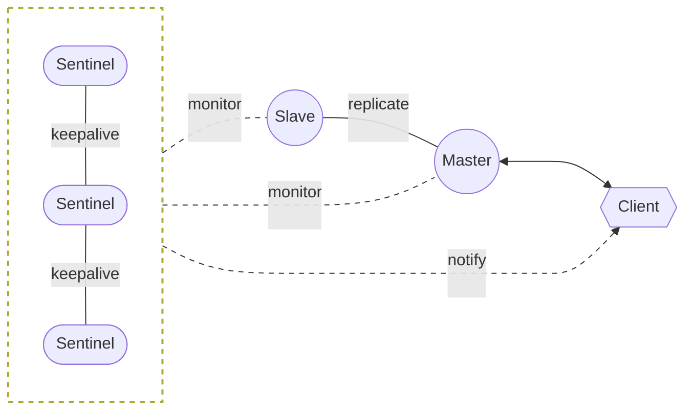
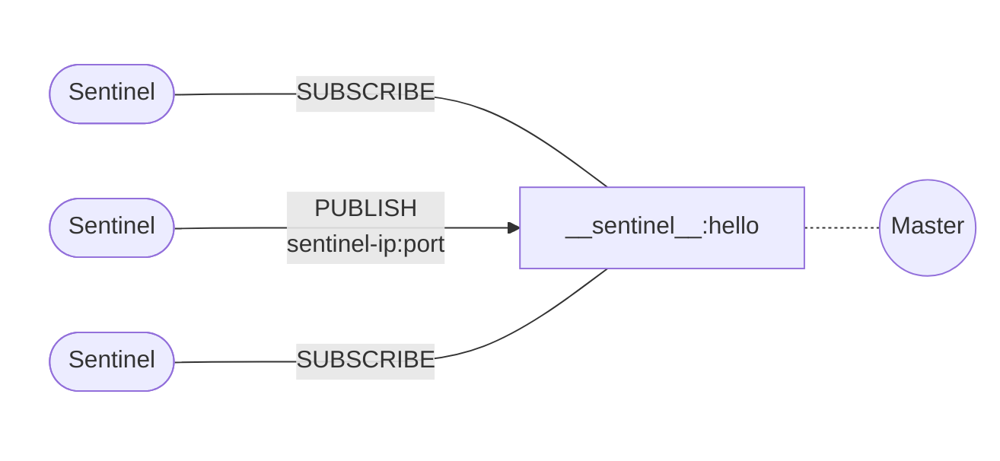
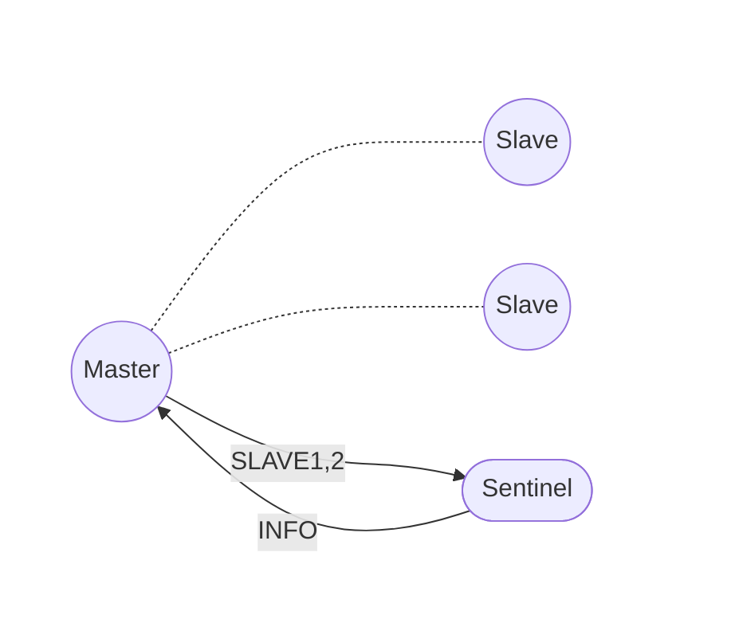
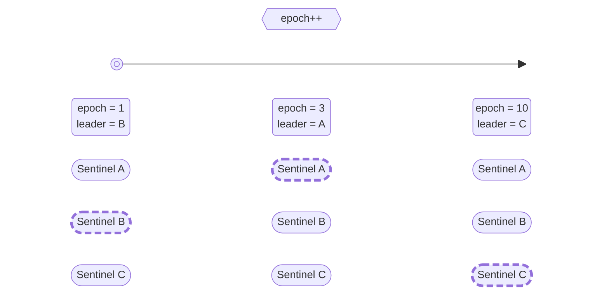

Redis Sentinel is a distributed monitoring system for Redis that can automatically perform failover when the master node is down and forward request traffic to healthy slave nodes.


[comment]:summary

The Sentinel mechanism is an important part of Redis high availability. 
By monitoring the health status of master-slave replication through a high-availability Sentinel cluster and implement automatic disaster recovery:



The Sentinel cluster is deployed in a distributed manner which ensure:
- Avoid single points of failure in the system and prevent the disaster recovery mechanism from failing
- The switch master must be agreed upon by multiple Sentinel nodes to avoid misjudgment


To ensure the high availability of Redis services, the sentinel mechanism provides the following functions:

- Monitoring: Real-time monitoring of the health status of master and slave nodes
- Notification: Use the event API to immediately inform listeners of abnormal situations in the service instance
- Automatic Failover: After the master node fails, select a new master from the slave
- Service Discovery: The client obtains master instance information through the Sentinel cluster, and can inform the client of master changes in a timely manner when automatic failover occurs

## Configurations

### Relevant Commands

The configuration for establishing a sentinel cluster is relatively simple:

> **sentinel monitor &lt;master-name&gt; &lt;ip&gt; &lt;port&gt; &lt;quorum&gt;**

Congifure the master node to be monitored (since sentinel will automatically discover slave node information, so there is no need to configure):

- **master-name** is used to distinguish between different master nodes and will be used for master discovery
- **quorum** is the minimum number of sentinel nodes required to initiate failover


Before the failover, a leader node needs to be elected to perform master switching. 
In order to reach a consensus, **majority** (more than half) of the nodes or more must participate in this process.
Assuming that the current Sentinel cluster has a total of **m** nodes, when quorum is set to **n (n &le; m)**:

- If n nodes simultaneously judge that the current master is offline, one of the Sentinel nodes will try to initiate a failover
- The actual execution of the failover requires a leader election, so only when at least m/2 of the Sentinel nodes in the cluster are available can the failover be started

In short, **quorum** only affects the failover detection process and is used to control the timing of initiating failover, but it cannot determine whether failover will be executed.
Therefore, there should be at least 3 sentinel instances. Otherwise, once a Sentinel node fails, even if quorum is set to 1, failover cannot be started.

> **sentinel down-after-milliseconds &lt;master-name&gt; &lt;milliseconds&gt;**

When a Redis node cannot respond normally for more than this time (does not respond to PING requests or returns an error code), sentinel will consider it offline

> **sentinel parallel-syncs &lt;master-name&gt; &lt;numslaves&gt;**

After promoting a slave node in the slave to a master, the number of remaining nodes immediately reconnected to the new master

Reconnecting will cause slave nodes to batch synchronize data from the master, which indirectly causes the slave to pause for a short period.
If there are a total of **m** slave nodes in the current state, when **parallel-syncs** is set to n, failover will adjust the slave into **m/n** batches.
The smaller the value, the longer the failover takes, but the less impact on the client accessing the slave.

> **sentinel failover-timeout &lt;master-name&gt; &lt;milliseconds&gt;**

Retry interval for failover, with a default value of 3 minutes, which affects:

- The time interval for Sentinel to retry after initiating failover (2 * **failover-timeout**)
- The time required for Sentinel to direct expired slaves to the new master
- The time required to cancel an ongoing failover process
- The time failover waits for slave reconnection to the new master to complete


### Configuration Discovery

Sentinel configurations doesn't require the sentinel nodes and slave node information. 
This is because the sentinel mechanism itself supports configuration discovery, and sentinel node can obtain the information from the monitored master node:

#### Sentinel Discovery



Sentinel nodes comunicate with each other with Redis's publish/subscribe mechanism. 
After the connection between sentinel and the master is established:

- Sentinel publishes a message to the `__sentinel__:hello` channel on the master, providing its own IP and port to other nodes.
- Sentinel subscribes to messages on the `__sentinel__:hello` channel to observe connection information published by other sentinels.

当多个哨兵实例都在主库上做了发布和订阅操作后，它们互相感知到彼此的 IP 地址和端口。
因此扩容哨兵集群十分简单，只需要启动一个新的哨兵节点即可，剩余的操作交由自动发现机制完成即可。

After performing pub/sub operations on the master, sentinel nodes become aware of each other's IP addresses and ports.
Therefore, scaling the sentinel cluster is straightforward—simply by starting a new sentinel node, then the automatic discovery mechanism will finish remaining work.

#### Slave Discovery



Sentinal node obtain slave nodes information by sending `INFO` command to the master.
Then sentinel establishes connections to each slave and continuously monitors them on these connections. 
At the same time, the sentinel also retrieve the following information by sending `INFO` command to the slaves:

- **run_id**: The run ID of the slave.
- **slave_priority**: The priority of the slave.
- **slave_repl_offset**: The replication offset of the slave.

#### Node Offline

The sentinel never forgets nodes it has seen, whether they are sentinels or slaves. 
When it's necessary to take a node offline from the cluster, the `SENTINEL RESET` command is used:

- When taking a sentinel node offline, first stop the process of that node, then execute `ENTINEL RESET *` on the remaining sentinel nodes to update the cluster information.
- When taking a slave node offline, first stop the process of that slave, then execute `SENTINEL RESET <master-name>` on all sentinel nodes to update the monitoring list.


## Status Monitoring

To ensure the availability of the cluster master, sentinel cluster periodically sends `PING` commands to the master and slave nodes:

- If the response is `+PONG`, `-LOADING,` or `-MASTERDOWN`, the node is considered healthy.
- If the response is any other value or there is no response, the node is considered unhealthy.

If a node remains unhealthy for more than `down-after-milliseconds`, it is considered offline.


There is also a special case: if a master node identifies itself as a slave node in the `INFO` command response, the sentinel will also consider that node offline.

To reduce false positives, the sentinel cluster divides node offline detection into two stages:

- Subjective Down `SDOWN`: a sentinel instance considers the node offline.
- Objective Down `ODOWN`: a sentinel send `SENTINEL is-master-down-by-addr` command to others sentinel and discovers that a **quorum** of sentinel instances consider the node offline.


Only master nodes are marked as `ODOWN`, which will trigger a failover. 
Slave and sentinel nodes are only marked as `SDOWN`.


## Failover

The failover process is designed as an asynchronous state machine with the following main steps:

```c
void sentinelFailoverStateMachine(sentinelRedisInstance *ri) {
    serverAssert(ri->flags & SRI_MASTER);

    if (!(ri->flags & SRI_FAILOVER_IN_PROGRESS)) return;

    switch(ri->failover_state) {
        // Elect leader
        case SENTINEL_FAILOVER_STATE_WAIT_START:
            sentinelFailoverWaitStart(ri);
            break;
        // Select a candidate node from the slaves of the offline master
        case SENTINEL_FAILOVER_STATE_SELECT_SLAVE:
            sentinelFailoverSelectSlave(ri);
            break;
        // Send SLAVEOF NO ONE command to the selected slave to make it a master
        case SENTINEL_FAILOVER_STATE_SEND_SLAVEOF_NOONE:
            sentinelFailoverSendSlaveOfNoOne(ri);
            break;
        // Check if the new master node is ready using the INFO command
        case SENTINEL_FAILOVER_STATE_WAIT_PROMOTION:
            sentinelFailoverWaitPromotion(ri);
            break;
        // Send SLAVEOF command to the remaining slave nodes to point to the new master
        case SENTINEL_FAILOVER_STATE_RECONF_SLAVES:
            sentinelFailoverReconfNextSlave(ri);
            break;
    }
}
```

### Leader Election 

A failover is triggered when master node is marked as `ODOWN`. 
To ensure eventual convergence to a consistent state, each modification to the master-slave configuration is associated with a globally unique monotonically increasing version number called the configuration **epoch**. 
Changes with smaller epochs will be overridden by changes with larger epochs, thus ensuring distributed consistency in concurrent modifications.

To avoid unnecessary failovers, the sentinel cluster elects a leader sentinel for each epoch which responsible to implement configuration changes,.



Election is completed through the command `SENTINEL IS-MASTER-DOWN-BY-ADDR <ip> <port> <current-epoch> <runid>`:
```c
char *sentinelVoteLeader(sentinelRedisInstance *master, uint64_t req_epoch, char *req_runid, uint64_t *leader_epoch) {

    // If the requested epoch for voting is greater than the known one, update the local epoch
    if (req_epoch > sentinel.current_epoch) {
        sentinel.current_epoch = req_epoch;
        sentinelFlushConfig();
        sentinelEvent(LL_WARNING,"+new-epoch",master,"%llu",
            (unsigned long long) sentinel.current_epoch);
    }

    // If the requested epoch for voting is greater than the current leader's and does not exceed the current epoch
    if (master->leader_epoch < req_epoch && sentinel.current_epoch <= req_epoch)
    {
        // According to the FCFS principle, vote for the epoch to this sentinel
        sdsfree(master->leader);
        master->leader = sdsnew(req_runid);
        master->leader_epoch = sentinel.current_epoch;
        sentinelFlushConfig();
        sentinelEvent(LL_WARNING,"+vote-for-leader",master,"%s %llu",
            master->leader, (unsigned long long) master->leader_epoch);

        // If this is a voting request from another sentinel, update the failover start time
        // to avoid unnecessary voting by this instance within the failover timeout
        if (strcasecmp(master->leader,sentinel.myid))
            master->failover_start_time = mstime()+rand()%SENTINEL_MAX_DESYNC;
    } 

    // Requests with an epoch less than sentinel.current_epoch will be ignored

    // Update leader information
    *leader_epoch = master->leader_epoch;
    return master->leader ? sdsnew(master->leader) : NULL;
}

```

This election process is a simplified version of the [**Raft**](/en/consistency-with-raft) protocol. 

### Choose Slave

To ensure that the new master has the latest state, the leader will:
- Exclude all nodes in subjective offline state (node health).
- Exclude nodes that have not responded to the `INFO` command issued by the leader within the last 5 seconds (communication normal).
- Exclude nodes whose disconnection time from the original master exceeds `down-after-milliseconds * 10` (replica relatively new).

Finally, the nodes are sorted according to `slave_priority`, `slave_repl_offset`, and `run_id`. 
The node with the `highest priority`, `maximum offset`, and `minimum run ID` will be selected as the new master.


### Promote Master

First, call `sentinelFailoverSendSlaveOfNoOne` to promote the candidate node to master:

```c
void sentinelFailoverSendSlaveOfNoOne(sentinelRedisInstance *ri) {
    int retval;

    // Keep trying until failover timeout if candidate node is unavailable
    if (ri->promoted_slave->link->disconnected) {
        if (mstime() - ri->failover_state_change_time > ri->failover_timeout) {
            sentinelEvent(LL_WARNING,"-failover-abort-slave-timeout",ri,"%@");
            sentinelAbortFailover(ri);
        }
        return;
    }

    // Send SLAVEOF ON ONE command and wait for it to become master
    retval = sentinelSendSlaveOf(ri->promoted_slave,NULL,0);
    if (retval != C_OK) return;
    sentinelEvent(LL_NOTICE, "+failover-state-wait-promotion",
        ri->promoted_slave,"%@");
    ri->failover_state = SENTINEL_FAILOVER_STATE_WAIT_PROMOTION;
    ri->failover_state_change_time = mstime();
}
```
Then, call `sentinelFailoverReconfNextSlave` to make the remaining slaves replicate the new master node:
```c
void sentinelFailoverReconfNextSlave(sentinelRedisInstance *master) {
    // ...

    // Batch adjust slave nodes, ensuring that the number of batches does not exceed the parallel syncs configuration
    di = dictGetIterator(master->slaves);
    while(in_progress < master->parallel_syncs &&
          (de = dictNext(di)) != NULL)
    {
        sentinelRedisInstance *slave = dictGetVal(de);
        int retval;

        // Skip nodes that have been adjusted
        if (slave->flags & (SRI_PROMOTED|SRI_RECONF_DONE)) continue;

        // If a slave fails to complete the configuration change for a long time, it is still considered completed
        // Sentinels will detect configuration anomalies and fix them in subsequent processes
        if ((slave->flags & SRI_RECONF_SENT) &&
            (mstime() - slave->slave_reconf_sent_time) >
            SENTINEL_SLAVE_RECONF_TIMEOUT)
        {
            sentinelEvent(LL_NOTICE,"-slave-reconf-sent-timeout",slave,"%@");
            slave->flags &= ~SRI_RECONF_SENT;
            slave->flags |= SRI_RECONF_DONE;
        }

        // Skip nodes that have already sent commands or are offline
        if (slave->flags & (SRI_RECONF_SENT|SRI_RECONF_INPROG)) continue;
        if (slave->link->disconnected) continue;

        // Send SLAVEOF to make it replicate the new master
        retval = sentinelSendSlaveOf(slave,
                master->promoted_slave->addr->ip,
                master->promoted_slave->addr->port);
        if (retval == C_OK) {
            slave->flags |= SRI_RECONF_SENT;
            slave->slave_reconf_sent_time = mstime();
            sentinelEvent(LL_NOTICE,"+slave-reconf-sent",slave,"%@");
            in_progress++;
        }
    }
    
    // Check if all slave nodes have completed the configuration change
    sentinelFailoverDetectEnd(master);
}
```

When the offline master comes back agian, the sentinel nodes detect that its configuration has become invalid and treat it as a slave, making it becomes a slave of the new master. 
This also means that the part of the data on this node that has not been synchronized to the new master will be permanently lost.

To reduce data loss, you can use the parameters `min-replicas-to-write` and `min-replicas-max-lag` to prevent clients from writing data to the master node that has lost the slave.


## Event API

Redis Sentinel provides an `event subscription` mechanism that allows clients to receive notifications about various events occurring within the Sentinel cluster. 
These events can be used to monitor the health and status of the cluster, and to trigger actions based on specific events.

Events usually consist of the following parts(the part after **@** is optional):

```text
<instance-type> <name> <ip> <port> @ <master-name> <master-ip> <master-port>
```

There are some available events:
- **switch-master**: A new master node is elected.\
The message payload format is **&lt;master-name&gt; &lt;oldip&gt; &lt;oldport> &lt;newip&gt; &lt;newport&gt;**.

- **+sdown**: A node enters subjective down state.\
This means that the Sentinel node has not received a response from the node for a certain period of time.

- **-sdown**: A node exits subjective down state.\
This means that the Sentinel node has received a response from the node, indicating that it is back online.

- **+odown**: A node enters objective down state.\
This means that a majority of Sentinel nodes in the cluster agree that the node is down.

- **-odown**: A node exits objective down state.\
This means that a majority of Sentinel nodes in the cluster agree that the node is back online.

- **+tilt**: The Sentinel cluster enters TILT mode.\
 This mode is triggered when there are insufficient healthy Sentinel nodes to make quorum decisions.

- **-tilt**: The Sentinel cluster exits TILT mode.\
 This occurs when there are enough healthy Sentinel nodes to resume quorum operations.

- **+reset-master**: The monitoring information for a master node is reset.\
 This typically happens after a failover or manual configuration changes.

- **+failover-detected**: A failover is detected.\
 This could be initiated by Sentinel or by manually promoting a slave node to master.

- **failover-end**: The failover process is complete and all slave nodes have successfully replicated from the new master.

- **failover-end-for-timeout**: The failover process times out.\
 This means that not all slave nodes have replicated from the new master within the specified timeout period.


To subscribe to all these events, the `PSUBSCRIBE *` command can be used.

### JedisSentinelPool

To deepen understanding, let's analyze the source code of **JedisSentinelPool** in jedis-3.3.0 to observe how the Event API works.

During initialization, JedisSentinelPool calls the initSentinels function to obtain master information:

```java
private HostAndPort initSentinels(Set<String> sentinels, final String masterName) {
  HostAndPort master = null;
  
  // Iterating through sentinel information and establishing connections
  for (String sentinel : sentinels) {
    final HostAndPort hap = HostAndPort.parseString(sentinel);

    Jedis jedis = null;
    try {
      jedis = new Jedis(hap.getHost(), hap.getPort(), sentinelConnectionTimeout, sentinelSoTimeout);
      // ...

      // Sending get-master-addr-by-name command to obtain master node
      List<String> masterAddr = jedis.sentinelGetMasterAddrByName(masterName);

      if (masterAddr == null || masterAddr.size() != 2) {
        log.warn("Can not get master addr, master name: {}. Sentinel: {}", masterName, hap);
        continue;
      }

      // Exiting after obtaining master node information
      master = toHostAndPort(masterAddr);
      break;
    } catch (JedisException e) {
      log.warn(
        "Cannot get master address from sentinel running @ {}. Reason: {}. Trying next one.", hap, e);
    } finally {
      if (jedis != null) {
        jedis.close();
      }
    }
  }

  if (master == null) {
    // Unable to obtain master information, an exception will be thrown here
    // ...
  }

  // Starting listener thread to monitor all sentinels to promptly detect cluster changes
  for (String sentinel : sentinels) {
    final HostAndPort hap = HostAndPort.parseString(sentinel);
    MasterListener masterListener = new MasterListener(masterName, hap.getHost(), hap.getPort());
    masterListener.setDaemon(true);
    masterListeners.add(masterListener);
    masterListener.start();
  }

  return master;
}
```

The **MasterListener** class listens for master node changes via the Event API and reinitializes the connection pool:

```java
class MasterListener extends Thread {

  protected String masterName;
  protected String host;
  protected int port;
  protected long subscribeRetryWaitTimeMillis = 5000;
  protected volatile Jedis j;
  protected AtomicBoolean running = new AtomicBoolean(false);

  public MasterListener(String masterName, String host, int port) {
    super(String.format("MasterListener-%s-[%s:%d]", masterName, host, port));
    this.masterName = masterName;
    this.host = host;
    this.port = port;
  }

  @Override
  public void run() {

    running.set(true);

    while (running.get()) {

      try {
        // Establishing connection with sentinel
        j = new Jedis(host, port, sentinelConnectionTimeout, sentinelSoTimeout);
        
        // ...

        // Getting master information again
        List<String> masterAddr = j.sentinelGetMasterAddrByName(masterName);
        if (masterAddr == null || masterAddr.size() != 2) {
          log.warn("Can not get master addr, master name: {}. Sentinel: {}:{}.", masterName, host, port);
        } else {
          // Reinitialize connection pool if master changes
          initPool(toHostAndPort(masterAddr));
        }

        // Listening for +switch-master event to detect master node changes
        j.subscribe(new JedisPubSub() {
          @Override
          public void onMessage(String channel, String message) {
            // Master node has changed
            String[] switchMasterMsg = message.split(" ");
            if (switchMasterMsg.length > 3) {
              // Only process information related to the current master-name
              if (masterName.equals(switchMasterMsg[0])) {
                // Reinitialize connection pool if master changes
                initPool(toHostAndPort(Arrays.asList(switchMasterMsg[3], switchMasterMsg[4])));
              }
            } else {
              log.error(
                "Invalid message received on Sentinel {}:{} on channel +switch-master: {}", host, port, message);
            }
          }
        }, "+switch-master");

      } catch (JedisException e) {
        if (running.get()) {
          // Retry after connection loss, wait for 5s
          log.error("Lost connection to Sentinel at {}:{}. Sleeping 5000ms and retrying.", host, port, e);
          try {
            Thread.sleep(subscribeRetryWaitTimeMillis);
          } catch (InterruptedException e1) {
            log.error("Sleep interrupted: ", e1);
          }
        } else {
          log.debug("Unsubscribing from Sentinel at {}:{}", host, port);
        }
      } finally {
        if (j != null) {
          j.close();
        }
      }
    }
  }

  public void shutdown() {
    try {
      log.debug("Shutting down listener on {}:{}", host, port);
      running.set(false);
      // This isn't good, the Jedis object is not thread safe
      if (j != null) {
        j.disconnect();
      }
    } catch (Exception e) {
      log.error("Caught exception while shutting down: ", e);
    }
  }
}
```
