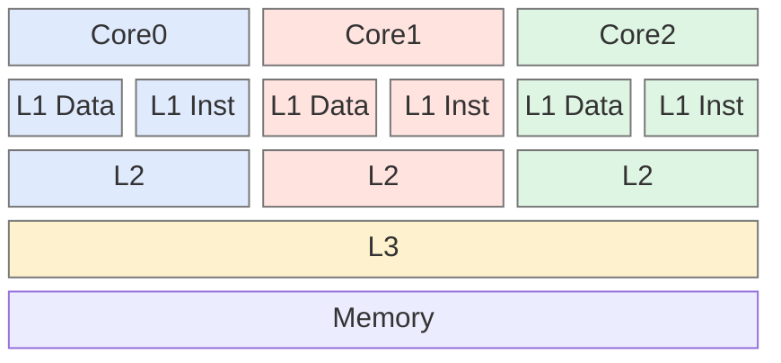
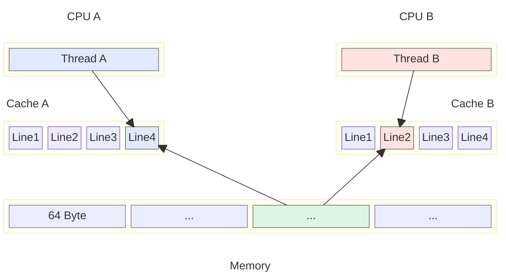
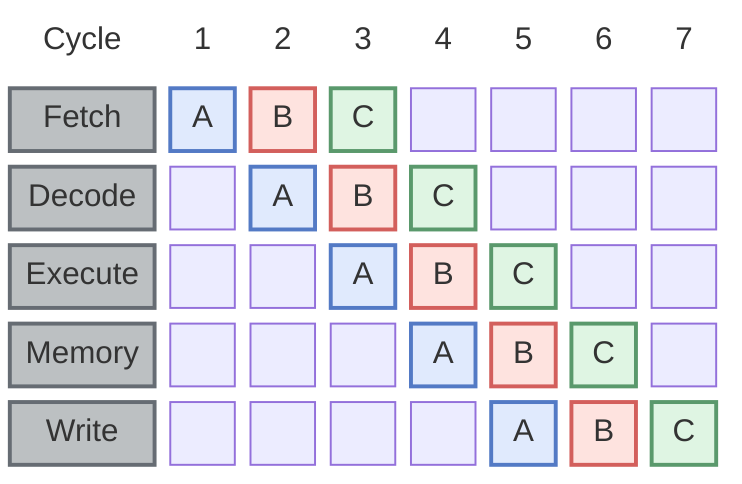
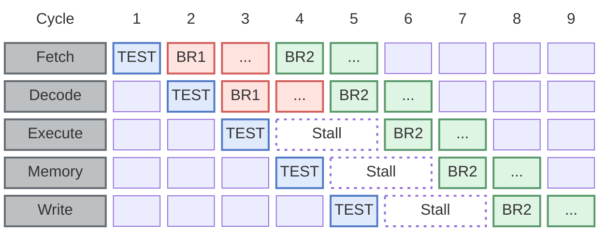
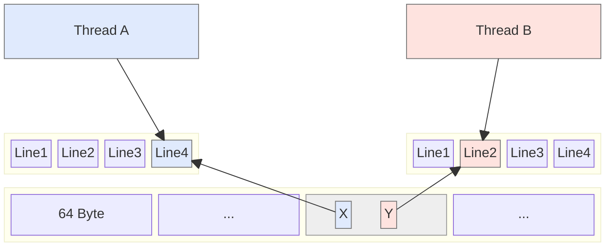

With the assistance of operating systems and compilers, developers can craft efficient and stable code without delving into the intricacies of hardware. 
However, to fully harness the potential of hardware resources, programmers must gain a deeper understanding of hardware architectures and implementation principles.

[comment]:summary

As computer hardware has evolved, [CPU and memory](https://www.akkadia.org/drepper/cpumemory.pdf) have taken divergent paths. 
CPUs prioritize speed, while memory focuses on capacity. This disparity has resulted in a widening gap between CPU core frequencies and memory bus speeds. 
To bridge this gap, modern hardware architectures have introduced several significant innovations:

**Multi-level Caching**: 
Multiple layers of high-speed storage are introduced between CPU cores and main memory to store copies of recently accessed instructions and data, enabling faster access.

**Non-Uniform Memory Access (NUMA)**: 
Memory is divided into independent blocks and managed by different CPU cores, preventing memory access bus frequencies from limiting CPU memory access efficiency.

## Cache

Program code and data exhibit both temporal and spatial locality of reference, meaning that the same code or data is likely to be reused within a short time frame.
Therefore, modern hardware architectures introduce a multi-level cache with limited space between the CPU and memory. 
Caches closer to the CPU are typically faster and smaller.



The L1 cache serves as a private memory haven for each CPU core. Typically divided into two distinct sections:

- **Instruction Cache (L1i)**: Stores decoded machine instructions.
- **Data Cache (L1d)**: Holds recently accessed data.

L2 and L3 are unified caches with no clear functional division.
L3 is shared by multiple cores, and whether L2 is shared depends on the specific CPU architecture.

### Cache Coherence

The most basic storage unit in a cache is called a line, typically sized at 64 bytes:

- When a CPU accesses a piece of memory data, it loads adjacent data into the cache as well to improve access efficiency.
- When a CPU modifies data in the cache, it needs to synchronize the modification with memory. There are two optional strategies:
  - **Write-through**: Synchronously update both the cache and memory.
  - **Write-back**: Mark the cache line as dirty, and write it back to memory only when it is evicted.




Although the **write-back** strategy effectively saves memory bandwidth, it introduces the problem of concurrent modifications with multiple copies:
The same cache line corresponds to different copies in the exclusive caches of different CPUs, and different CPUs can concurrently modify this data.
Therefore, the copy of this cache line in the caches of other CPUs needs to be invalidated and later reloaded.

To establish a coherent cache view among multiple CPUs, a **cache coherence protocol** is needed.
The cache coherence protocol orders write operations to the same location to ensure that all CPUs observe the state changes of that location in the same order.

One popular cache coherence protocol is **MESI**, which sets one of the following four states for cache lines:

- **Modified**: The line is loaded only in the current CPU's cache, and its content is inconsistent with memory.
- **Exclusive**: The line is loaded only in the current CPU's cache, and its content is consistent with memory.
- **Shared**: The line is loaded in the caches of multiple CPUs, and its content is consistent with memory.
- **Invalid**: The cache line is invalid.


State transitions are as follows:


- Initially, all cache line states are **I**.
- After loading data, their states become **S** or **E**.
- When the local CPU modifies it, its state becomes **M**.
- When other CPUs modify their copies, its state becomes **I**.

### Request For Ownership 

Distinguishing between **S** and **E** states primarily serves performance considerations:

- When modifying a cache line in the **E** state, its state can directly be transitioned to **M**.
- When modifying a cache line in the **S** state, an **RFO (Request For Ownership)** message needs to be sent to other CPUs.\
 This notifies them to invalidate their corresponding local copies (**I**) and transmit their content back to the initiator of the RFO.\
 Only then can the cache line's state be transitioned to **M**.

Two scenarios frequently trigger RFO communication and should be avoided as much as possible:
- Parallel running threads on different cores accessing the same cache line data (e.g., thread scheduling disregarding CPU affinity).
- The same thread alternating between different CPU cores, necessitating data movement between the local caches of different CPUs (e.g., cache pseudo-sharing between threads).

The communication of multi-threaded applications relies on RFO for memory synchronization. 
Hence, its concurrency is not only limited by the number of CPU cores but also by the communication latency introduced by memory synchronization.
Careful program design is necessary to minimize accesses to the same memory location from different processors.

### Concurrent Modifications

MESI cache consistency only guarantees the order of values, not the order of write operations themselves. 

Suppose a memory location containing a counter with a value of 1 is in state **S**, and two threads need to perform increment operations on it simultaneously.
The CPU does not need to wait for the cache line to transition to state **E** before fetching the value from the cache and adding it. 
Instead, it will directly add the current value 1 in the cache to get the new value 2.

The new value will be ordered based on the MESI protocol, and once the cache line is available in state **E**, the new value 2 will be written to the cache line.
If the cache reads from these two threads happen concurrently, one of the increment modification operations will be lost: two increment operations have occurred, with an expected value of 3, but the actual result is 2.

**Concurrent writes to the same memory location can lead to unpredictable results**. 

To ensure data integrity, atomic operation instructions provided by the CPU should be used.

### Special Address Spaces

Certain special address spaces have no corresponding physical memory and cannot comply with the aforementioned write-back strategy. 
These spaces mainly fall into two categories:
- Mapped to peripheral memory (e.g., graphics card memory)
- Used to control peripherals themselves (e.g., microcontroller LED addresses)

The former typically employs a write-combining strategy, where multiple consecutive write operations are written back to peripheral memory only once they are complete.

The latter usually adopts an **uncacheable** strategy, and data in these addresses is not cached by the CPU.


### Performance Guidelines


#### Instruction Reduction

The larger the code size, the greater the pressure on the L1 instruction cache. 
Therefore, do not overuse loop unrolling and inlining unless it has a significant performance improvement.

There are two main criteria for evaluating whether a function should be inlined, and the product of these two can be used to estimate the increase in code size after inlining:

- Size of the function body
- Number of function calls

For functions with a low number of calls or a small code size, inlining is often beneficial.

However, for small, high-frequency functions, their code instructions are likely to be present in the L1 cache. 
If the L1 content can be reused and the overall space occupied is reduced, the performance overhead introduced by additional function calls can usually be compensated for.

At this point, you can choose to disable inlining to improve cache hit rate and thus overall performance. 
GCC provides two compiler attributes, `always_inline` and `noinline`, for programmers to control whether to inline.

```c
void __attribute__((noinline)) my_function(int arg) {
  // Function body
} 

void __attribute__((always_inline)) my_function(int arg) {
  // Function body
}
```

#### Branch Elimination

To improve processing efficiency, modern CPUs operate in a **pipeline**: 
prefetching and decoding subsequent instructions to be executed while executing the current instruction.



However, when there are branch jumps in the code, the prefetched instructions may not be the ones that actually need to be executed. 
Take the following code for example:
```c
if (TEST()) // TEST() == false
  BR1()
  ...
else
  BR2()
  ...
```

The code for branch `BR1` follows immediately after the conditional check `TEST`, so it will be prefetched into the pipeline. 
However, the branch that actually needs to be executed is `BR2`.

At this point, pipeline will be stalled, and the CPU can only wait for the `BR2` instruction to finish loading.



To reduce idle time, modern CPUs use **branch prediction** to guess the target code of the jump and preload the corresponding instructions into the cache:

- When branch prediction is correct, it can effectively improve CPU execution efficiency.
- When branch prediction is wrong, the useless instructions will be loaded into the L1 cache, which will actually slow down the CPU's execution.

Although the L1 instruction cache cannot be directly controlled, the instruction prefetch hit rate can be improved by reducing the branch in the code:
```c
// branch
int add_condtional(int a, unsigned int b) {
  if (b < 16) a += b;
  return a;
}

// branchless
int add_condtional(int a, unsigned int b) {
  a += b & 0xf;
  return a;
}
```

#### Code Layout

Before instructions enter the L1 cache, their corresponding code is also prefetched into the L2 cache.
When there are branches in the code, the code layout can affect its hit rate in the L2 cache.

Take the following code as an example, where the function contains three adjacent code blocks `A`, `B`, and `C`. 
These code blocks will be loaded into the L2 cache in the form of cache lines.

And the branch judgment condition in the function is likely to be **false**, which means that the probability of the `B` code block being executed is much lower than `C`.

```c
int branch_layout() {
  ... code block A ...
  if (I()) { // I represents conditional jump instruction
    ... code block B ...
  }
  ... code block C ...
}
```

If the `B` code block is large, a large amount of useless code will be prefetched into the L2 cache each time the function is called.
And if the branch prediction is wrong, a large number of useless instructions will also be loaded into the L1 cache.

For this type of branch code with a low trigger probability, it can be extracted into a non-inlined function.
Place it in a separate code block and simplify the low-probability branch into a function call instruction.


Programmers can use two GCC macros to hint to the compiler which code branch has a higher execution probability, 
and then turn on the **-freorder-blocks** optimization option during compilation to automatically adjust the code layout.

```c
  #define unlikely(expr) __builtin_expect(!!(expr), 0)
  #define likely(expr) __builtin_expect(!!(expr), 1)
```

#### Cache Line Alignment

To ensure access efficiency, memory addresses of structures are aligned by default according to the following rules:

- The starting address of a field must be a multiple of **n** (**n** is the byte size of the field type).
- The starting address of a structure must be a multiple of the length of its longest type field.

However, for shared data that requires frequent read-write operations, the above alignment method still not enough.

Suppose two threads, A and B, respectively hold counters X and Y, and X and Y happen to be allocated in the same cache line. 
In this scenario, even if the data modified by these two threads are completely unrelated, they will severely impact each other's access performance.



For such cases, you can force the structure alignment to the length of a cache line through certain means:

- Ensure that the starting address of the allocated memory block is a multiple of 64.
- By padding with placeholder fields, ensure that the structure occupies an entire cache line.

GCC provides the `aligned` compilation attribute to control memory alignment:

```c
struct strtype variable
     __attribute((aligned(64)));

struct strtype {
  ...members...
} __attribute((aligned(64)));
```

For managed languages like Java, you would need to manually pad fields or use special annotations to instruct the JVM to align the structure to cache lines.


## Virtual Memory

When a process starts, the operating system allocates a contiguous **virtual memory** space for it:
- When users allocate memory using `malloc()`, a segment of this space is mapped to specific physical memory.
- Accessing an unassociated virtual address results in a **segmentation fault** exception.

This design significantly enhances machine resource utilization at the expense of some access efficiency:
- Each process dynamically allocates physical memory during runtime, avoiding space wastage.
- It allows memory overcommitment through **swap** operations, enabling more processes to run concurrently on a machine.

The size of the virtual space is directly related to the length of virtual addresses:
- With a 32-bit virtual address length, the addressable virtual memory space is 4GB.
- With a 64-bit virtual address length, the theoretically addressable virtual memory space is 16EB.


The entire virtual address is divided into **kernel space** and **user space**, with user space mainly comprising two parts:

- **Executable File Loading**

  This part of the layout is related to the executable files generated by the compiler, typically consisting of three sections:

  - **Code** contains machine instructions generated by the compiler, derived from the .text segment of the executable file.
  - **Data** contains global static variables and their corresponding initial values, derived from the .data and .rodata segments of the executable file.
  - **BSS** contains global static variables without initialized values, derived from the .bss segment of the executable file.

  The distinction between **Data** and **BSS** primarily aims to reduce the size of the executable file and avoid unnecessary initial zero values.
  To ensure system security, different memory segments correspond to different physical memory pages with different permissions:
  |section|execute|read|write|
  |:-:|:-:|:-:|:-:|
  |.text|✔|✔|✘|
  |.rodata|✘|✔|✘|
  |.data|✘|✔|✔|
  |.bss|✘|✔|✔|
  
- **Runtime Dynamic Creation**
  - **Stack**

    The stack is used to store local variables in functions, managed by **stack frames**:
    - Memory for a stack frame is automatically allocated on the heap when a function is called, or programmers can allocate space on the stack frame using `alloca()`.
    - When a function returns, the stack frame is destroyed, and its associated memory is reclaimed.


  - **Heap**

    The heap is used to store complex data structures that require dynamic allocation, such as linked lists and binary search trees.\
    Programmers allocate and free space on the heap using `malloc()` and `free()` and are responsible for managing the memory lifecycle.

    For flexibility, in most cases, the stack and heap areas of a process are allocated at opposite ends of the address space.\
    This layout allows either side to grow as much as possible.

  - **Shared Memory**
  
    The memory space between them can be used to implement shared memory, facilitating memory sharing with other processes.\
    Leveraging memory sharing, two common functionalities can be achieved:

    - Inter-process communication by mapping virtual addresses of different processes to the same physical memory.
    - By default, the virtual address of child processes shares the physical memory associated with the parent process, creating a new copy only when the child process modifies data.

  

At this point, have you ever considered the question: Where should JIT compiler-generated code reside?:

- Attempting to write it into the region where **.text** resides would cause the process to crash.
- Simply placing it on the heap would also result in a process crash when the instruction flow jumps to that memory page.

To address this issue, the JIT compiler needs to perform the following operations:

- Directly allocate exclusive physical memory pages on the heap through system calls, avoiding `malloc(`) from allocating memory for this page.
- Set the permissions of this memory page to executable and copy the generated code into it.


### Memory Paging

The smallest unit of memory allocated by the operating system is a page.
The CPU maps virtual addresses to physical addresses through the **Memory Management Unit (MMU)**.\
This mapping process involves a structure called a page table:


A Level-1 page table divides the virtual memory address into two parts:
- **index**: The page associated with this virtual address
- **offset**: The offset of the corresponding physical address within the page

The size of a memory page determines the length of the offset part:
- When the page size is 4MB, the length of the offset part is 22 bits.
- When the page size is 4KB, the length of the offset part is 12 bits.

In a 32-bit system using 4kB memory pages, 20 bits are used to represent the index.\
If a continuous pointer array is used as the page table, the page table occupies space of up to $2^{20} \times 4$ = 4MB.

Due to the isolation of virtual memory, the OS maintains separate page tables for each process, which undoubtedly wastes a lot of memory space.\
To save space, multi-level page tables are usually used to maintain mapping relationships and achieve on-demand space allocation.


Continuous virtual addresses can share high-level page table space, reducing unnecessary memory allocation.\
To reduce the memory space occupied by page tables, memory should be allocated on continuous virtual addresses as much as possible.

However, this multi-level random access method performs poorly in terms of addressing efficiency.
To improve addressing efficiency, modern CPUs introduce a hardware cache called the **Translation Look-Aside Buffer (TLB)**, 
which caches the mapping relationship between index and page, avoiding the performance overhead of multiple jumps:

- When lookup hits, the physical address is calculated based on the page and offset.
- When lookup misses, the result is queried in the main memory's multi-level page table and cached in the TLB.


The hit rate of the TLB directly affects memory access performance, and optimization methods can be divided into two categories:

**Reduce Context Switching**

Processes running on the same CPU core share TLB resources. 
However, because the virtual addresses between different processes are isolated, the same index points to different pages. 
Every time a context switch occurs, the TLB cache records need to be cleared.

To improve cache hit rates, some CPUs add tag bits to the cache index at the hardware level to distinguish between different virtual address spaces:

- Distinguish between kernel space and user space, eliminating the need to clear the TLB on system calls.
- Distinguish between host space and virtual machine space, improving virtual machine execution efficiency.
- Distinguish between different process address spaces, eliminating the need to clear the TLB on process switches.

**Allocate Memory on Continuous Virtual Addresses**

By allocating memory on continuous addresses, unnecessary page table allocation can be avoided, reducing the memory space occupied by page tables. 
This also ensures that hot memory pages reside in the TLB, reducing page table lookups.


### Multithreading Optimization

Threads form the same process share the same address space.

When threads do not share any memory data, each different CPU core has independent cache lines in its L1. 
When threads concurrently modify the cache, there is no need to send RFO requests, and there is no additional communication overhead.

When multiple threads access the same memory location, the L1s of different CPU cores need to communicate with each other to ensure cache consistency.
When threads concurrently modify the cache, a large number of RFO requests are sent, meaning that only one CPU can operate its cache line copy at a time. 
Any other CPU cores will be delayed and unable to do anything. 

The more concurrent threads there are, the greater the synchronization overhead, and each additional processor will only bring more delay.

To avoid this problem, read-write separation is required for data shared between multiple threads: group constants or variables that are only initialized once together. 
When this data is loaded into the cache, the cache line in which it resides will be in the **S** state for a long time and will not be affected by modification operations.


One way to do this is to use the `const` keyword to modify global static variables. When GCC compiles to generate an executable file:

- Variables modified with `const` will be placed in the **.rodata section**
- Variables without `const` will be placed in the **.data section**

At runtime, variables in the same section are loaded into adjacent contiguous memory segments. 
Memory segments of different sections are independent of each other and do not affect each other.

When the `const` keyword not available, custom sections can be defined using compiler attributes:

```c
  int foo = 1;
  int bar __attribute__((section(".data.ro"))) = 2;
  int baz = 3;
  int xyzzy __attribute__((section(".data.ro"))) = 4;
```

## NUMA

### Hypercube

In a traditional **Uniform Memory Access (UMA)** system, all CPUs access memory through a unified **Front Side Bus (FSB)**. 
The FSB connects the CPU to the Northbridge chipset, which then connects to the memory controller, and all memory accesses are made through this bus. 
The consistency of this architecture ensures that CPU access times to all memory locations are consistent.


In contrast, in **Non-Uniform Memory Access (NUMA)** system, the memory control functionality of the Northbridge chipset is integrated into the CPU. 
To address the memory access latency caused by FBS, NUMA divides memory into multiple nodes, each typically containing a group of CPU cores and closely associated memory.


NUMA is an excellent example of applying divide-and-conquer techniques to solve complex problems. 
In this architecture, CPUs can directly communicate with local memory within the same node without going through a unified memory bus. 
Because the bus bandwidth is no longer a system bottleneck, this architecture has greater horizontal scalability, making it particularly suitable for large-scale commercial hardware. 

To accurately describe the communication topology between CPUs and memory, a structure called a **hypercube** is introduced:


Each node contains a group of processor cores and their corresponding local memory. 
These nodes are interconnected through a communication network, forming a highly parallel system. 

- Each node comprises processor cores and local memory, interconnected via a communication network, forming a highly parallel system.
- With $C$ interconnections per node, the hypercube can accommodate up to $2^C$ interconnected nodes, with the maximum distance between any two nodes being *C*.


This topology offers several advantages:

- Locality: Binding cores to local memory improves locality and reduces remote memory access latency.
- Scalability: Easy horizontal scaling avoids bottlenecks, enhancing overall system performance.
- Fault Tolerance: Distributed symmetry facilitates redundancy and backup, improving system reliability.


### OS Optimization

NUMA introduces non-uniform memory access delays, depending on the memory location and the executing CPU core. 
Each core accesses its local node memory faster, while remote node access is slower.

To manage this complexity, OS require NUMA awareness to optimize memory allocation and data layout, minimizing cross-node access latency.


#### Shared Memory Management

Shared libraries like `libc.so` typically reside in a specific set of physical memory pages. 
This implies remote access for most processors. 
A NUMA-friendly OS maintains independent `libc.so` copies per node, avoiding frequent remote access.

#### Thread Scheduling


During thread scheduling, ensure threads and their frequently accessed memory reside on the same NUMA node. 
Avoid frequent cross-node thread migrations.

Consider memory, not just CPU load, during thread scheduling. 
Distribute memory-intensive threads across nodes to prevent memory exhaustion on specific nodes.

### Programming Optimization

NUMA programming optimization techniques align with those for UMA:

- **Large Contiguous Memory Access**: 
Utilize local caches to mitigate remote access overhead by accessing large contiguous memory blocks.

- **Pre-configure CPU Core and Thread Affinity**: 
Avoid cross-NUMA node thread scheduling by pre-configuring CPU core and thread affinity.