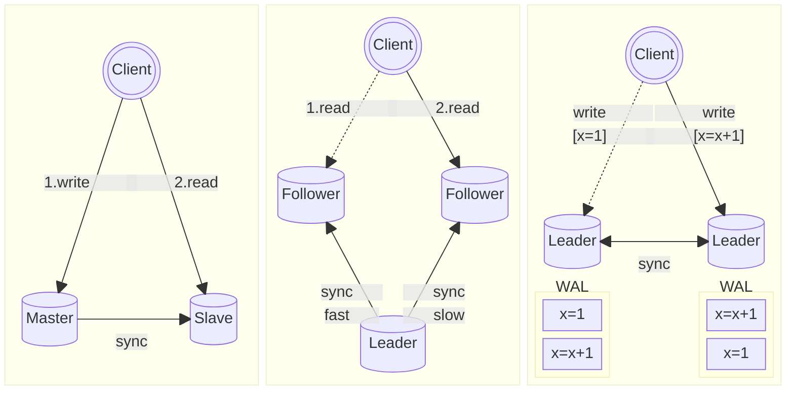

This article is a book note from "Designing Data-Intensive Applications".

[comment]:summary

## Replication Consistency

In modern database systems, **replication mechanisms** are almost ubiquitous. This design approach brings at least two benefits to the system:

- **Disaster Recovery with Multiple Replicas**: As long as one data replica is available, data can be recovered
- **Horizontal Scaling of Read Performance**: By distributing data across different machines, the same data can be accessed simultaneously from multiple nodes externally

Ensuring the data **consistency** of multiple replicas is a challenge.

The simplest way to implement is to use a **synchronous replication mechanism (sync-replication)**:\
Ensure that write operations are successful on all replicas before responding to the client. However, this method usually means poor write performance, so it is rarely used.

In contrast, there is the **asynchronous replication mechanism (async-replication)**:\
The client can be responded to after the write operation is successful on some replicas, and the database will asynchronously synchronize the changes to the remaining replicas. 
Its advantage is high write performance, but the consistency of data replicas cannot be guaranteed.

Taking the most basic master-slave replication architecture as an example, although the master and slave libraries will eventually reach a consistent state, there will be a time delay in the synchronization of the master-slave state. 
This delay is called **replication lag**. During this period, two conflicting data replicas may exist at the same time. 
If applications that rely on this data do not do a good job of preventive processing, it will eventually lead to abnormal system behavior.

In distributed databases, the processes that maintain the replica state are divided into two categories:

- **leader / master**: Processes that can handle both read and write requests
- **follower / slave**: Processes that can only handle read requests

Based on the above definitions, common replication architectures can be divided into the following three categories:

Different architectures face different consistency issues

> Master-Slave &nbsp;&nbsp;->&nbsp;&nbsp; Read-after-write consistency

- **Phenomena**\
The client modifies the data, the change is not synchronized to the slave, and at this time the data is read from the slave, and the result obtained is the unmodified result.
- **Solution**\
  Make write operations are immediately visible to subsequent read operations.
  - According to the characteristics of the application, force some functions to only access the master library to ensure that the read and write order is consistent
  - Maintain the user modification timestamp and the slave modification timestamp, and select whether to read the slave based on the timestamp

> Single-Leader &nbsp;&nbsp;->&nbsp;&nbsp;  Monotonic read consistency

- **Phenomena**\
The client reads the same record multiple times, but the request is routed to different slaves, and it may read old data.

- **Solution**\
The data version that read later must newer than the verion read before.\
Ensure that requests from the same user are only routed to the same slave, and ensure that the read order is consistent.

> Multi-Leader / Leaderless &nbsp;&nbsp;->&nbsp;&nbsp; Causal consistency

- **Phenomena**\
The client modifies data multiple times and routes to different masters, and there is a causal relationship between the data (e.g. question and answer records).
You may read data in a chaotic order, or you may modify data that does not yet exist (e.g. network latency between leaders).

- **Solution**\
The results of write operations must be read in the order in which they are executed.\
Write operations with causal relationships are executed on the same master, and the write order is guaranteed to be consistent.

## Conflict Resolution

In large-scale Internet applications, multi-data centers are becoming increasingly popular, with the following advantages:

- Close geographic location, fast access speed
- High availability, a single data center outage or network problem will not lead to unavailability

When the system needs to be deployed to multiple data centers, the multi-leader architecture will inevitably be used, which brings the following problems:

- The same data may be modified concurrently by two data centers, resulting in write conflicts
- Some features of the database do not well support the multi-leader architecture, such as auto-increment primary keys and triggers

### Write Conflicts

Writes under the single-leader architecture are sequential, and modifications to the same data can achieve a final consistent result on each replica.

Writes in each leader under the multi-leader architecture are also orderly, but write operations between different leaders are disorderly, so modifications to the same data are also disorderly, which may eventually lead to inconsistent replica states.

To ensure that all replica converge to the same state, **conflicts resolution** is necessary:

- Associate each write operation with a unique ID and select the result with the highest priority
- Associate each replica with a unique ID and select the result corresponding to the replica with the highest priority
- Merge two conflicting data into the same data
- Save all conflicting data for subsequent operations to resolve

According he timing of conflict resolution, they can be divided into:

- **Resolve at write**\
Inject conflict resolution logic code into the database, and the database will be called when a conflict occurs. 
For example: MySQL MGR achieves consistency through maintaining a globally consistent Binlog.

- **Resolve at read**\
When there is conflicting data, the application will obtain this conflicting data and automatically or manually resolve these conflicts. 
For example: Dynamo NRW guarantees that the latest data is read by adjusting the number of read and write replicas.

## Consistency Models

As a developer, one of the important questions we care about is: what level of consistency guarantee does the database itself provide us with?

In order to support concurrent operations, databases introduce the concept of transactions to avoid data inconsistencies that lead to abnormal behavior. 
The transaction model of the database has an important concept: **transaction isolation level**

		Repeatable Read	Serializable

|Isolation Level	|Read Uncommitted| Read Committed|Repeatable Read|Serializable|
|:-:|:-:|:-:|:-:|:-:|
|Dirty Read|✔|✘|✘|✘|
|Unrepeatable Read`|✔|✔|✘|✘|
|Phantom Read|✔|✔|✘|✘|
|Write Skew|✔|✔|✔|✘|

Under different transaction levels, developers can obtain different levels of consistency guarantees from the database. 
The higher the isolation level, the stronger the consistency provided, and at the same time, it means greater performance overhead.

One of the benefits of this model is that it allows us to trade off between consistency and performance and make a choice that suits our application scenario. 
In distributed scenarios, we face more complex consistency issues. To facilitate the following discussion, let's first introduce a few consistency models.

### Eventual Consistency

At a certain point in time, the states between the replicas in the database system may be inconsistent.
The consistency problems we have seen above are all solved by the application layer, and the database itself only provides the following guarantee:

> After an arbitrarily long period of time, all replicas in the database can eventually converge (convergence) to the same state.

This very weak consistency guarantee is what we often call **eventual consistency**:

- **Pros**\
This weak consistency guarantee makes the system design more flexible, so that higher performance can be achieved.\
For example: asynchronous replication strategies are used between replicas, and special reconciliation systems are designed to resolve data conflicts offline...

- **Cons**\
 When eventual consistency is involved in system design, the application layer needs to pay close attention to the impact of replication lag on the system.\
And it is necessary to design the system according to the consistency guarantee required by the business, which increases the workload of application developers in disguise.\
In addition, some problems will only be exposed when network errors or high concurrency occur, which is difficult to test.

### Linearizability

The transaction mechanism of a database itself is a fault-tolerant protocol that can provide data security guarantees for applications that run based on transactions.

In order to hide the complexity from the application layer, transactions provide the following abstract guarantees to the application:

- **Atomicity**: The data in the database is complete, and the transaction execution is complete (no need to worry about process crashes during execution)
- **Isolation**: The database will not be modified concurrently, and transactions will not affect each other (no need to worry about race conditions affecting the execution results)
- **Durability**: The storage of the database is reliable, and the changes of the transaction will not be lost (no need to worry about data loss caused by storage failures)

The abstract guarantees provided by the transaction mechanism liberate application developers from complex error handling and allow them to focus on business logic. This not only improves development efficiency but also reduces the probability of bugs, making the system more stable and easier to test.

In an ideal situation, we hope that distributed databases can provide us with a stronger consistency guarantee, like transactions:

- Global write-after-read consistency
  - The system only exposes one data to the outside world, and there is no problem of multiple versions of data existing at the same time
  - All modification operations are atomic, and the data read each time is the latest

- Global monotonic read consistency\
Once the write operation is successful, the result will be visible to all subsequent read operations, and the old data will not be read

This cross-process global strong consistency guarantee is called **Linearizability**.

Next, we will introduce this model in detail through some specific cases.

First, we assume that $x$ is an entry in the database:
- In a key-value database, $x$ is a key
- In a relational database, $x$ is a row
- In a document database, $x$ is a document

The linearizability model defines three basic operations:

- $\text{read}(x) \Rightarrow v$：The client reads the value $v$ corresponding to $x$ from the database
- $\text{write}(x, v) \Rightarrow r$：The client writes the value $v$ corresponding to $x$ to the database and returns the operation result $r$
- $\text{cas}(x, v_1, v_2) \Rightarrow r$：The client uses the **CAS(compare-and-set)** operation to modify the value of $x$ from $v_1$ to $v_2$ then return the and return the operation result $r$

Linearizability is **cross-process** and can be used as the basis for implementing the following distributed application scenarios:

- **Distributed locks and election**\
 Use CAS operations to implement locks, and the node that obtains the lock is the leader
- **Uniqueness constraints**\
 Use CAS operations to obtain the lock corresponding to a value. If the lock is obtained successfully, then the value is unique, otherwise the value is not unique
- **Temporal dependencies between multiple channels**\
 After process A successfully modifies the data and notifies process B, process B can definitely obtain the modification result of process A

**A scenario that satisfies linearizability**

There are 3 clients in the picture, among which clients A and B read $x$, and client C writes $x$:
- When B reads $x$ for the first time, C is performing a write operation\
 At this time B reads the value 0 (C write operation has not been committed at this time)
- When A reads $x$ for the second time, C is performing a write operation\
 At this time A reads the value 1 (C write operation has been committed at this time)
- When B reads $x$ for the second time\
 Since A read x result is 1 before, B will read the value 1 (global monotonic read consistency)

**A scenario that violates linearizability**

There are 4 clients A, B, C, and D in the picture, which perform read and write operations concurrently. 
The lines in the picture indicate the time points when the transaction is committed and the read operation actually occurs.
There is a behavior that violates linearizability in the picture: **B reads 2 after A reads 4**

Although from the perspective of client B itself, it does not violate monotonic read consistency, but globally it violates monotonic read consistency:\
**The result of the later B read request lags behind the result of the earlier A read request**

**A practical application scenario [Thumbnail Image Generator]**

The diagram shows a multi-replica distributed file storage called **FileStorage**, which is used to store user photo data. 
The backend needs to generate thumbnails to speed up web preview:

1. When a user uploads or modifies a photo, the WebServer stores the original-sized user image in FileStorage.
2. The image ID is asynchronously notified to **ImageResizer** via MQ.
3. ImageResizer retrieves the data from FileStorage and generates a thumbnail based on the image ID provided by MQ.

During step B, FileStorage performs replica replication while the MQ message is being delivered. 
If FileStorage does not meet linearizability, ImageResizer may not be able to read the image (violating global write-after-read) or read an old (violating global monotonic read) image. 
This can lead to processing failures, or even the generation of incorrect thumbnails, leaving the entire system in an inconsistent state.

### Implementations

The simplest way to implement linearizability semantics is to use only one replica of the data, but this will make the system not fault-tolerant. 
In order to improve the fault tolerance of the system, a multi-replica architecture is the only choice. The following discusses different cases according to different multi-replica architectures.

#### Single-leader

Without using snapshot isolation (for example: MySQL's MVCC), using the following two strategies can meet linearizability:

- Read and write data from the leader (only access the leader's replica data, and avoid being affected by inconsistent replica data of other followers)
- Use synchronous replication strategy (asynchronous replication cannot guarantee that follower replicas will eventually be consistent with the leader)

Risk points:

- Multiple leaders may appear during a **split-brain** (multiple writable replica data are exposed to the outside world at the same time, and data inconsistency will eventually occur) may violating linearizability
- The choice of a new leader replica for **automatic failover** (if a replica with incomplete data is selected as the new leader, it is equivalent to data loss) may violating linearizability

#### Multi-leader

It allows multiple nodes to write at the same time, and asynchronous replication needs to be supported, which may cause write conflicts. 
Therefore, multiple replicas need to be exposed to resolve conflicts, so it is definitely impossible to meet linearizability.

#### Consensus algorithms

Consensus algorithms cover the functions of single-leader, and also have mechanisms to prevent split-brain and expired replicas, so they naturally meet linearizability.

#### Performance trade-offs

Although linearizability is a powerful consistency guarantee, such strong consistency models are not widely used in practice.

For example, the memory model of modern computers does not guarantee linearizability:

>In order to improve system performance, modern CPUs use a multi-level cache architecture\
When the CPU needs to access and modify data in RAM, it will first modify the cache, and then asynchronously flush the modifications to the actual RAM (multi-replica + asynchronous replication mechanism)

Sacrificing consistency for better performance is more common in database systems.
To ensure strong consistency, the linear consistency model will bring poor performance.

### Causal Consistency

The order in which events occur contains **causality**.

**A scenario that violates causal consistency [Doctor's schedule]**

Each hospital has an on-call shift schedule to ensure that there is at least one on-call doctor on duty to deal with emergencies. 
If the on-call doctor is unwell on the day of duty, they can apply for early leave in the scheduling system. 
The scheduling system will check the current number of on-call doctors and determine whether to allow them to leave work.

One day, there are only two on-call doctors in the hospital, Alice and Bob, but both of them happen to be unwell and apply for early leave at the same time. The following may happen:

1. The system first starts two concurrent transactions, initiated by Alice and Bob respectively
2. Both transactions query the number of on-call personnel, and find that the number of on-call personnel is 2 (currently_on_call = 2)
3. Both transactions update the on-call record at the same time, setting Alice and Bob to non-on-call status, and successfully committing the transaction
4. In the end, there are 0 on-call doctors in the hospital, and emergency patients R.I.P.

This example violates causal consistency: **The write operation in the transaction depends on the read operation**

> Alice's write transaction is committed first, which causes the result of Bob's transaction read to become invalid\
However, Bob's transaction did not detect that the read was invalid, but directly committed the transaction, which eventually caused the system to violate the scheduling constraint

This inconsistency caused by concurrent read-write transactions is called **write skew**. 
It is worth noting that this concurrent transaction situation is not necessarily caused by human factors, and the extended transaction cycle due to network latency may also indirectly trigger this problem.

## Model Comparison

Let's first review two definitions related to order:

- **Total order (total order/linear order)** In a set, any two elements can be compared.
- **Partial order (partial order)** In a set, some elements can be compared.

These two orders represent two consistency models:
- **Linearizability**\
 The system only exposes one data to the outside world, and all operations are executed in series on the only data (no concurrent operations), so there must be a before-and-after order between any operations.
- **Causal consistency**\
Operations that have causal relationships are ordered, but concurrent operations have no causal relationships, so there is no before-and-after order.

The linearizability model is simpler and easier to understand, and it can handle causal problems of multi-channel time-order dependencies.
However, implementing linearizability requires a high performance cost, operations need to wait for each other, and in a high network latency environment, the probability of system unavailability will increase.

The causal consistency model is more abstract and difficult to understand, but it is sufficient to cope with most application scenarios.
It can eventually reach the standard of the eventual consistency model, and it is insensitive to network latency, and can still guarantee availability in the face of network failures.

One of the major differences between causal consistency and linearizability is that it **allows concurrent access to unrelated data**:
- Linearizability has only a single timeline.
- Causal consistency is a tree with multiple forks (you can refer to Git's branch model).

## Sequence Number Generation

> Causal relationship itself is an order problem, so as long as the order is known, causal relationship can be derived from it

Before discussing the causal consistency model, we need to find a suitable method to represent the causal order, so that we can analyze causal dependencies. In practical applications, we cannot record all dependencies, otherwise it will cause huge overhead.

A feasible method is: **assign a sequence number to each operation to represent the order**.
The sequence number itself takes up less space and has a total order relationship.

Common large-scale sequence number generation methods include:

- **Timestamp**: Use a high-precision timestamp as the sequence number.
- **Manually Planning**: Use modulo to divide the available sequence numbers according to the number of generators, and deploy multiple sequence number generation services (for example: two nodes can use the generators of odd and even sequence numbers respectively).
- **Batch Generation**: The generator allocates in batches, and each time it allocates a continuous range to the node.

The problem is that these sequence numbers cannot guarantee global order:

- System clocks will deviate, and the clocks between multiple nodes may not be synchronized, and timestamps may not represent the order of operations.
- If the load of the service nodes is uneven, the old sequence number may be applied to the new operation, and the order cannot be guaranteed.

Thus we need a sequence number generation mechanism that can guarantee global order.

### Lamport timestamps

Let's first introduce a method of generating sequence numbers with causal relationships through logical clocks: **Lamport timestamps**.

Each process needs to maintain the following two pieces of information:

- **$\texttt{ID}$**：Globally unique and immutable process identifier.
- **$\texttt{Counter}$**： A monotonically increasing integer counter with an initial value of 0.

All interactions in the system will be encapsulated into a series of events, and each event will be associated with a globally unique sequence number $(\texttt{C},\texttt{ID})$ with following rules:

- When a process generates an event, it first increments the counter to get a locally unique sequence number $\texttt{C}^{latest} = \texttt{++Counter}$, 
and then combines it with the process identifier to form $(\texttt{C}^{latest},\texttt{ID})$ to represent the occurrence order of this event.
- When a process receives an event from another process, it updates the local counter $\texttt{Counter} = \max(\texttt{C}^{other}, \texttt{Counter})+1$

This sequence number satisfies the following total order relationship: **The larger the C, the higher the priority; if the C is the same, the larger the ID, the higher the priority**. 

By associating such a sequence number with each operation, an indirect total order relationship is established for all operations, so that any two operations are ordered.

However, this scheme also has its drawbacks: the order of operations can only be known after the operation is initiated, and cannot immediately react to data conflicts. 

For example:\
Two clients simultaneously initiate conflicting operations on two different nodes (e.g., adding an account with the same name).
When conflicts occur, the system automatically resolves conflicts by using the value with a larger sequence number, causing the operation with a smaller sequence number to be invalidated. 
However, from the client's perspective, their operation appears to have succeeded.

Such conflicts that cannot be resolved in real-time may lead to consistency issues. 
Although the final sequence number is totally ordered, the real-time sequence at a certain moment is not complete, and there may be unknown sequence numbers inserted later.

For example:\
A has generated the maximum sequence number $(\texttt{A},1)$, and process B has generated the maximum sequence number $(\texttt{B},5)$. 
If process A receives an event $(\texttt{C},2)$ from process C at this moment, a subsequent event with the sequence number $(\texttt{A},4)$ may be generated.

To ensure the safety of operations (irreversibility), we need to ensure that the current known sequence remains unchanged.

## Total Order Broadcast

Total order broadcast (TOB), also known as atomic broadcast, is a communication protocol that ensures all nodes in a distributed system receive messages in the same order. 
This means that each node will process messages in the same sequence, regardless of when or where they were received.

TOB has two main properties:
- **Reliability**: Once a node receives a message, all other nodes will eventually receive the same message. Messages are not lost or duplicated.
- **Total order**: All nodes receive messages in the same order. This means that if node A receives message M1 before message M2, then node B will also receive M1 before M2.

Once a message is sent, the order is determined. 
Nodes are not allowed to insert messages into an existing message sequence; they can only append to it. 
Therefore, total order broadcast can be seen as a process of logging: **all nodes asynchronously record a globally consistent order of events**.
When failures occur, a retry mechanism is needed to ensure the above two constraints.

TOB is a fundamental building block for many distributed systems, and it is used to implement a variety of features:
- **Consistent Replication Mechanism**\
Database write operations are treated as messages. As long as all nodes receive these messages in the same order, the consistency of all replicas can be ensured.
- **Serialized Transactions**\
Transaction operations are treated as messages. If each node processes transactions in the same order, then each node ensures a consistent state.
- **Distributed Locks**\
Each lock acquisition request is recorded in an ordered log, and the order of lock acquisition can be determined based on the order of requests.
- **CAS Operations**\
Taking the example of using CAS(username, A, B) to modify a username:
  - Send an assert(username = A) message
  - Listen for related logs of username, and after receiving the first log:
    - If it is a self-sent assert log, complete the modification by appending a commit(username = B) message,
    - If it is an assert or commit log from another node, the modification fails.
- **Global Consistency Reads**
  - Use the position of messages in the log to determine when a read occurred, send a message, wait for the return of this message, and then perform the read operation (etcd).
  - If the log system can obtain the position of the latest log, it can wait for the log to be appended to this position before performing the read operation (ZooKeeper).
  - Read data only from replicas where write operations are synchronously updated.

Combining the last two functions is equivalent to achieving linearizability.

### Implementations

In a single-leader architecture, there is only one leader node that is responsible for accepting write requests. 
This means that all write requests are naturally ordered, and all replicas can be kept consistent by simply replicating the writes from the leader.

The single-leader architecture itself has the characteristic of total order delivery, 
as long as the reliable transmission problem is solved, total order broadcast can be achieved.

In conventional single-leader architectures, a leader node needs to be manually designated at startup. 
Once this node fails, the entire system will become unavailable until manual intervention designates a new leader. 
This undoubtedly severely affects the system's availability.

To achieve automatic failover, the system itself needs to support leader election functionality:
When the leader fails, a new leader is selected from the healthy followers to continue providing services externally.
During the election process, precautions need to be taken to prevent split-brain scenarios, avoiding the simultaneous occurrence of multiple leaders, which would affect system consistency.

In such election scenarios, distributed consensus algorithms are inevitably used. 
We will discuss them in a separate [section](/en/posts/consistency-with-paxos) later.

