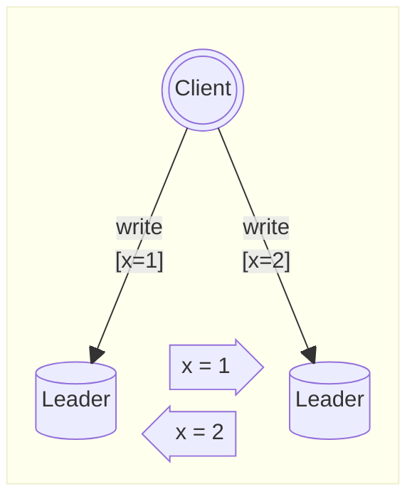
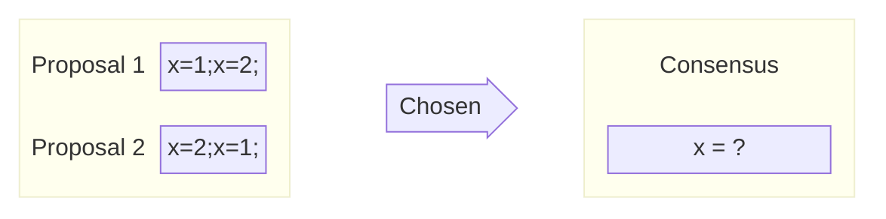
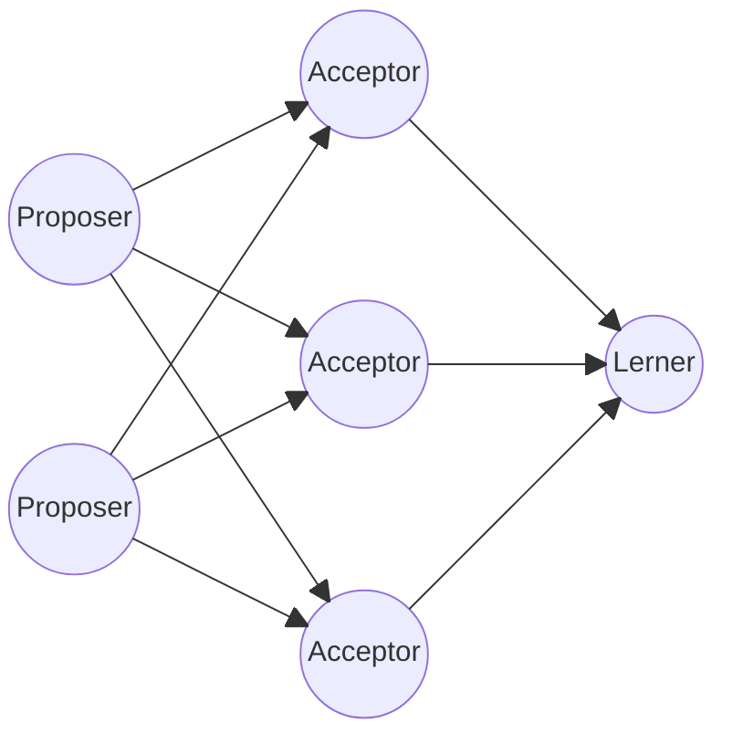
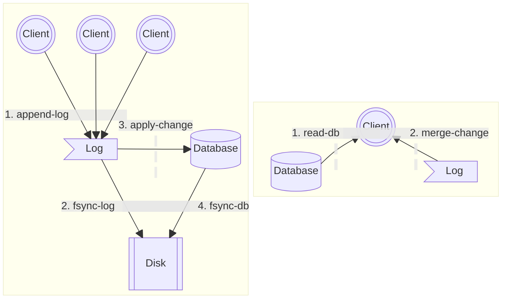
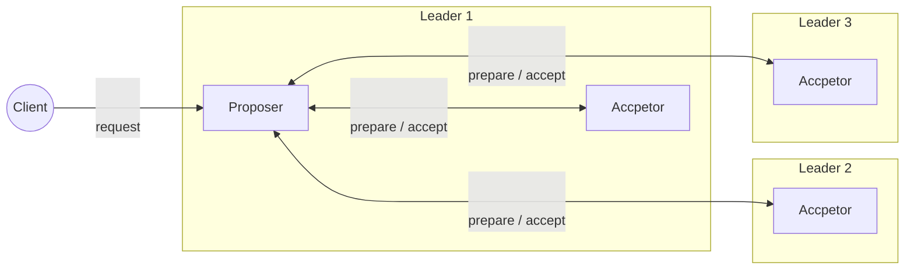
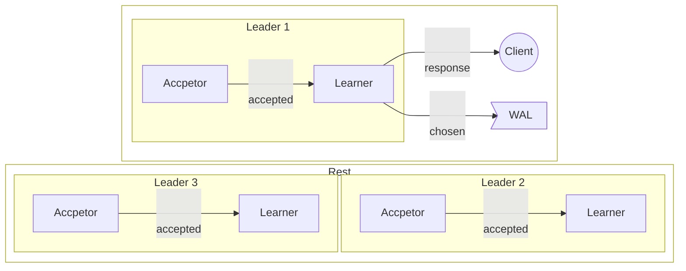
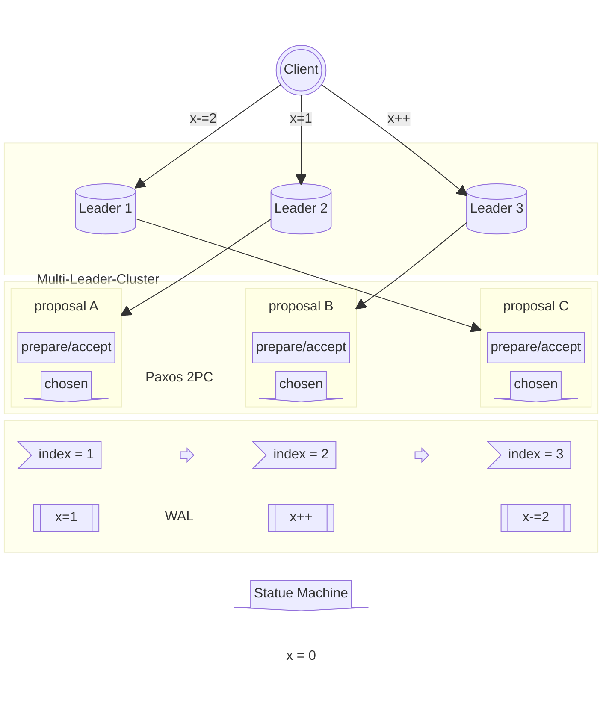

Paxos is a distributed consensus algorithm used to achieve consensus in distributed systems. 
It provides a message-passing mechanism to ensure system reliability and consistency in the face of network and node failures.

[comment]:summary

## Availability and Consistency

To provide users with a better service experience, modern software architectures are increasingly focusing on system **availability**.

Driven by this trend, microservices and containerization technologies have become increasingly popular today.

High availability architectures are based on redundancy:

> A highly available service must consist of multiple processes that back each other up, so that the failure of some processes does not cause the entire service to become unavailable.

If the service is stateful, each process needs to maintain its own **replica** of the state. In order to ensure the substitutability of stateful processes, how to maintain the **consistency** of these replicas becomes a crucial issue.

Take a distributed coordination service that provides locking services as an example. This type of service must meet the following two characteristics:

- High availability: Service failures will cause downstream services to become unavailable
- Strong consistency: Downstream services observing inconsistent states will cause lock failures

According to the **CAP** theory of distributed databases, it is difficult to achieve the following 3 characteristics at the same time:

- When network communication is normal, the distributed database can guarantee both C and A

- When a **network partition** occurs (processes cannot communicate normally), the database must make a trade-off between C and A:

  - AP system —— Guarantee availability, sacrifice consistency Each node can provide external services, but the entire database will be in an inconsistent state
  - CP system —— Guarantee consistency, sacrifice availability Each node refuses to provide external services, but the entire database will always maintain a consistent state

Within the CAP framework, we seem to be in a dilemma: is it impossible to implement a CA system?

Before answering this question, it is first necessary to point out a problem with the CAP theory:

> The CAP theory only considers 3 factors when making trade-offs, and ignores other indicators such as performance, implementation complexity, number of machines...

For example, there is a popular view that ZooKeeper is a CP system. However, in a ZooKeeper cluster, as long as a majority of the nodes can communicate normally, the cluster can still provide external services normally. This means: ZooKeeper is still available and consistent in the event of a network partition.

To ensure that the system is available and consistent in the event of a network partition, some additional costs need to be paid. Taking ZK as an example, the price it pays is more machine resources (3 or more nodes must be deployed) and higher system complexity (using consensus algorithms).

## Consensus

The term consensus refers to reaching an agreement on something. The consensus problem in distributed systems can be described as follows:
> There is a set of processes in the system that can propose **proposals**. 
One or more processes propose a proposal, and then a proposal is **chosen** from them as the final result through a **consensus algorithm**.

Take above scenario as example:
it illustrates a multi-master distributed database where multiple nodes are allowed to receive write operation requests, 
and they exchange modification instructions to ensure data consistency.

At some point, two clients simultaneously initiate change operations on the same record, 
thus potentially having two different update sequences (proposals) at the same time. 
To ensure consistency of data replicas, the two databases must reach a consensus on the update sequence.

### Fault Tolerance

Due to the uncertainty of the operating environment, system failures are always inevitable. 
These failures can be roughly divided into two categories:

- **Non-Byzantine Faults**

  - Processes communicate messages through unreliable networks
  - Processes may experience freezes, crashes, and restarts during operation, but they will not send incorrect messages
  - Messages may be lost, duplicated, or out of order during transmission, but they will not be corrupted or tampered with

- **Byzantine Faults**

  - Malicious processes may appear in the system and deliberately send incorrect messages to other processes
  - This can cause other processes to behave abnormally, leading to the failure of the entire system

Therefore, consensus algorithms can be divided into two categories:

- **Byzantine Fault Tolerance** is mainly applied in the blockchain field, using high computational overhead to eliminate the possibility of malicious processes.\
It is powerful but not suitable for providing high-performance consistency guarantees
- **Non-Byzantine Fault Tolerance** is mainly for data management services.\
It reduces fault tolerance overhead by introducing additional security assumptions, which can provide high-performance consistency guarantees

Our discussion scope is limited to the non-Byzantine fault-tolerant consensus algorithm. 
This type of algorithm can provide the following guarantees for the system in an uncertain environment:

- **Validity**: Proposals must be proposed by a process and cannot appear out of thin air
- **Integrity**: Each process can only vote once and cannot change the result
- **Consistency**: The final decisions of all processes must be consistent

The core of fault-tolerant consensus algorithms can be summarized as follows:

- **Safety**: All processes converge to a consistent and legitimate state
- **Fault** Tolerance: The system can continue to operate even if a small number of processes crash

## Paxos Algorithm

The Paxos algorithm is one of the most classic consistency protocols.

### Basic Concepts

- Proposal: Each proposal **[n,v]** consists of two parts:
  - **n**: The order in which the proposal was made
  - **v**: The value of the proposal

- Roles: Each process can play one or more of the following roles at the same time:
  - **Proposer**: Proactively initiates proposals
  - **Acceptor**: Votes on proposals
  - **Learner**: Passively accepts voting results

- Proposal Status: Each proposal can be in one of the following three states:
  - **Proposed**: Proposed by a Proposer
  - **Accepted**: Accepted by an Acceptor
  - **Chosen**: Accepted by a majority of Acceptors

- Communication Model: Communication between processes is done through message passing, and messages are one-way. 
The message receiving process can choose to refuse to respond. The network is unreliable, and processes need to handle message loss and out-of-order situations themselves.

### Voting

The basic idea of Paxos is to vote on multiple proposals to select one as the final consensus, and once this proposal is selected, the result will not change. 
The roles involved in the voting are **Proposer** (actively initiates requests) and **Acceptor** (passively responds to requests), while **Learner** only cares about the voting results and does not participate in the voting process itself.

Each round of voting in Paxos consists of two phases: **Generate Proposal (Prepare) -> Vote Proposal (Accept)**

In order to support the voting process, the Acceptor process needs to maintain the following two states locally:
- $n^{\text{max\_prepare}}$ ：The largest proposal number of Prepare requests that have been responded to
- $[n^{\text{max\_accept}}, v']$ ：The proposal with the largest number that has been accepted through Accept requests

To better understand the voting process, let's describe it with a specific scenario:

When the cluster starts, it needs to elect a Leader process. Two processes named Alice and Bob are running for the election.
They respectively propose a proposal to elect themselves as Leader in the role of Proposer A / B.
And send a voting process to 3 Acceptors X / Y / Z in the cluster.

##### **Prepare phase**

> Before proposing a proposal **[n,v]**, the Proposer must ensure that the number **n** is not occupied by other proposals\
Therefore, the Proposer sends a prepare request with number **n** to multiple Acceptors to lock this number

First, the two Proposers obtain the available proposal number through some means (such as: maintaining a global counter, asking all Acceptors, etc.), 
A and B respectively obtain the available numbers as 2 and 3. Then use this number to issue prepare requests to the Acceptor cluster.

After Acceptor receiving a prepare request with number n:
- If $n > n^{\text{max\_prepare}}$，returns the largest proposal with a known number$[n^{\text{max\_accept}}, v']$
- Otherwise, refuse to respond to this request

X and Y received A and B's requests one after another, and B's number is larger than A's, so A and B received responses.
Z first received B's request and then received A's request, so it only responded to B's request and ignored A's request.

> Only when the Proposer receives responses from a majority of Acceptors in the prepare phase can it initiate an accept request

In the prepare phase, A and B both received responses from a majority, so they both can enter the accept phase.

##### **Accept phase**

After locking the number **n**, the Proposer needs to generate a new proposal $[n, v^{\text{new}}]$ before initiating an accept request.

The generation of the proposal value $v^{\text{new}}$ needs to follow the following rules:

> All known proposals received by the Acceptor form a set $S^{\text{accept}}$
> - If $S^{\text{accept}}=\emptyset$ (no known proposals exist), $v^{\text{new}}$ can be specified as any value
> - If $S^{\text{accept}}\ne\emptyset$, then find the known proposal with the largest number $[n^{\text{max}}, v'] \in S^{\text{accept}}$ and let $v^{\text{new}}= v'$

In the response to the prepare phase, A and B did not receive any known proposals, so they both used their own process ID as $v^{\text{new}}$ and generated new proposals and initiated accept requests.

> When the Acceptor receives an accept request for a proposal of $[n^{\text{new}},v^{\text{new}}]$
>  - If $n^{\text{new}} \ge n^{\text{max\_prepare}}]$, accept the proposal and update $[n^{\text{max\_accept}},v']=[n^{\text{new}},v^{\text{new}}]$
>  - Otherwise, refuse to accept this proposal

Since X and Y have already responded to B's prepare request, they consider A's proposal to be expired and refuse to accept its accept request.

Since the known prepare requests with the largest number by X, Y, and Z are all issued by B, B's accept request is successfully passed.

In the end, process Alice was defeated and process Bob was elected as the new leader.

##### **Tell learner**

How does the Learner learn about the voting results?
There two common ways:

- After each proposal is passed, the Acceptor actively notifies the Learner
  - Pros: High real-time performance, high efficiency when the number of Learners is low.
  - Cons: High network complexity, and the notification messages from the Acceptor may also be lost, requiring a retry mechanism.

- The Learner actively polls the Acceptor for information on passed proposals
  - Pros: High reliability, able to handle situations where the Acceptor crashes or messages are lost.
  - Cons: Poor real-time performance, need to control the polling frequency carefully.

### Safety
> 一旦半数以上的 Acceptor 通过了某个提案后，意味着该提案被选定了\
并且这个被选定的提案值 $v^{\text{chosen}}$ 今后不会再发生改变

> Once more than half of the Acceptors have accepted a proposal, it means that the proposal has been selected\
And the selected proposal value $v^{\text{chosen}}$ will not change in the future

Since A's accept request did not pass before, a new round of voting was initiated.

Although A's accept request was passed this time, the selected proposal value is the previously selected Bob.

### Fault tolerance

> As long as more than half of the Acceptors are alive, the voting mechanism can still be functional, and the system is still available at this time

Assuming that one of the Acceptors crashed in the previous accpet phase, the remaining two Acceptors in the system can still continue the subsequent voting process, and the system is still available.

### Coner cases

In the accept phase, X and Y passed and selected the proposal value Bob. Due to message loss, Z did not pass the proposal.

Later, the X and Y processes crashed, and only Z was left in the system to function normally. At this time, A initiated a new round of voting.

Due to the majority restriction, A cannot generate a proposal with a value of Alice, and the system state will not be changed.

In the accept phase, X passed the proposal value Bob. Due to message loss, Y and Z did not pass the proposal.

Later, the X process crashed, and only Y and Z were left in the system to function normally. At this time, A initiated a new round of voting.

Due to the majority restriction, the previous proposal value Bob was not selected, and the system selected the value Alice proposed by A.

### Safety Proof

The safety of the Paxos algorithm guarantees:

- Validity: The proposals involved in the decision must come from a Proposer
- Integrity: A proposal with number n can only be proposed by a Proposer once, and can only be voted on by the same Acceptor once
- Consistency: Once the proposal $[n,v^{\text{chosen}}]$ is selected, all subsequent proposals will contain $v^{\text{chosen}}$ 

The consistency of Paxos is achieved by constraining the generation of proposals. The following is a simple proof:

**Assumption**

- The first selected proposal is $[m^0,v^0]$, then there must be a majority Acceptor set $S^0$ that has passed the accept request with number $m^0$.
- The next proposed proposal is $[m^1,v^1]$, then there must be a majority Acceptor set $S^1$ that has responded to the prepare request with number $m^1$.

**Proof: $v^1=v^0$**

According to the majority principle, the intersection of $S_{0}$ and $S_{1}$ must be non-empty, and there must be at least one Acceptor in $S_{1}$
who has passed the proposal $[n_{0},v_{0}]$.\
So the maximum $n^{\text{max\_accept}}$ of all Acceptors in the intersection of $S_{0}$ and $S_{1}$ can only be $m_{0}$

According to the conditions for a successful prepare, the maximum $n^{\text{max\_accept}}$ among all proposals passed by all Acceptors in $S_{1}$
must be less than $m_{1}$.

Suppose the maximum number of all proposals passed by all Acceptors in $S_{1}$ is $x$, obviously there is $m_{0} \le  x < m_{1}$.\
Since $x$ must be proposed by a proposal before $m_{1}$, then $x$ must be $m_{0}$.

Therefore, in the response of prepare, there must be at least one Acceptor who has passed th e$m_{0}$ proposal to return the proposal $[n_{0},v_{0}]$.\
Therefore, $v0 = v1$ is statisfied.

According to mathematical induction, $v_{n+1} = v_{n}$ can also be proved.

### Application Idea

In practical engineering applications, the original Paxos algorithm is not used directly, but we can still try this algorithm to implement a strongly consistent distributed database.

In the database field, Write-Ahead Logging (WAL) is a common way to improve database performance:

- Any command that modifies the state of the database is first written to a sequential log and flushed to disk, and then applied to the database in the order in which the commands were written by an asynchronous thread.
- When reading data, the state in the database is merged with the state in the WAL to ensure that the data returned to the client is the latest.

This mechanism can provide high write performance while ensuring data integrity: **even if the process crash, data will not be lost**.

The entries in the WAL are ordered, and each entry contains one or a group of atomic change commands. 
According to the conclusion of the [previous article](/en/posts/consistency-in-distributed-systems), as long as all databases execute the same commands in the same order, the states of these two databases can be kept consistent. 
In other words, by using the Paxos algorithm to ensure that the content of the local WAL copies of multiple databases is completely consistent, the database can eventually converge to a consistent state.

Suppose there is a KV database similar to Redis, where users can send instructions to the database to store and retrieve key-value pairs. 
This database supports a multi-master architecture and uses Paxos + WAL to guarantee data consistency:

When a database X receives a request:

- Propose a proposal\
As the Proposer, X writes a record to a specific location in the WAL (Write-Ahead Log) to propose a change. This proposal is then submitted to the Acceptor group consisting of X, Y, and Z for voting.

- Acceptor voting\
Each Acceptor in the group votes on the proposal. If a majority of Acceptors (at least two out of three) approve the proposal, they move to the next step.

- Learner notification\
Once a majority of Acceptors have approved the proposal, they inform the Learner group (also consisting of X, Y, and Z) of the outcome.

- Learner application\
Upon receiving the proposal approval from the Acceptor group, the Learner(s) recognize that the proposal has been selected and the corresponding WAL location is available for writing. The Learner(s) then append the proposed command to their local WAL (the WAL of Y and Z nodes is omitted in the diagram) and return a response to the client.

- Retrial on rejection\
If the proposal is not approved by a majority of Acceptors (e.g., due to network issues or conflicts with other proposals), X initiates another round of voting until the proposal is accepted or the client request times out.

Here's a visual representation of the process from the WAL's perspective:

