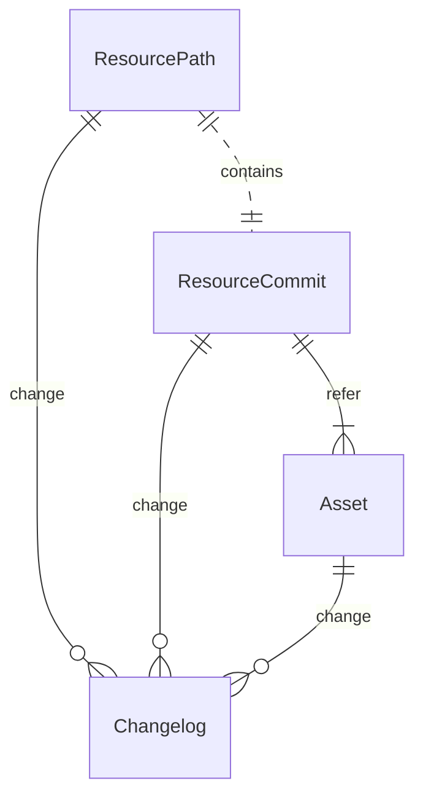
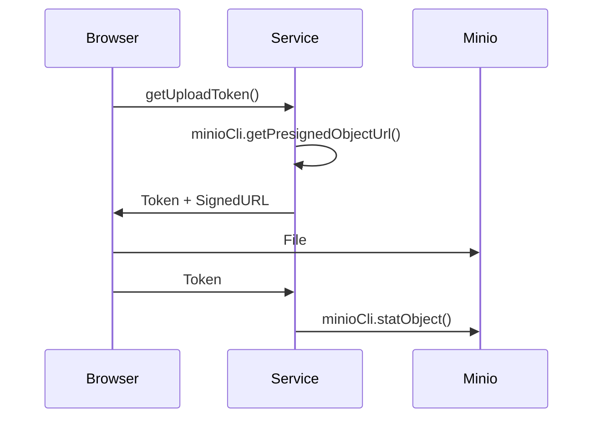

近期负责一个简单的多版本文件管理系统研发。
由于种种原因，该项目最终未能上线，因此决定将其间的思考整理成文章，希望能够帮助到有需要的朋友。

整个系统的功能可以归纳为以下 2 点：

- 支持树状的目录结构
- 基于 PBAC 模型实现多租户隔离

本篇文章主要介绍如何基于 minio 与 mysql 实现多版本的文件存储。

[comment]:summary


## 基本概念

### OSS

  在我们的日常浏览的网页与APP应用中，存在海量的非结构化数据（比如：图片视频、压缩文件）。
  针对这一需求，广大云提供商提供了一类被称为 OSS（Object Storage Service）的文件存储服务。
  OSS 不仅为这些文件提供了低廉的存储方案，更提供了一套通用且安全的 HTTP API。
  外网用户可以直接访问得这些资源，避免多层代理中转，有效降低了传输延迟与服务器成本。

  OSS 常见应用场景有：
  - 静态网站托管
  - 内容分发网络
  - 数据湖存储层
  - 数据备份

  对于无法使用公有云设施，但对 OSS 有需求的存储场景，Minio 是最常用的解决方案。
  Minio 是一个高性能的开源对象存储服务，并提供了与 Amazon S3 兼容的访问接口。
  Minio 具有以下特点：
  - 完全兼容 S3 接口标准
  - 支持多种私有化部署方案（IDC, VPC, K8s）
  - 可靠性高（多副本、纠删码）
  - 安全性高（访问控制、对象加密）
  - 特性丰富（事件监听、空间配额、多版本控制、冷热数据分离）

  Minio 唯一的缺点就是缺点就是运维复杂，学习成本较高。


### CTE

  受限于数据模型，关系型数据库并不擅长存储与检索树状结构的数据。
  通常情况下解决方案有两种：
  1. 发起多次 SQL 查询，每次仅查询一层数据
  2. 使用一个 varchar 类型的字段存储路径，在查询时进行前缀匹配

  前者的缺点在于需要多次查询，性能较差。
  后者则缺点则是难以维护，更新父节点路径会影响子节点。

  为了解决这一问题 SQL 标准中提供了 CTE（Common Table Expressions）。
  CTE 通过 WITH 语句生成临时的具名数据集合，其中包含子查询返回的结果。
  该集合类似于一个临时表，用户可以在后续查询中访问其中的数据。

```sql
WITH cte_name (column1, column2, ...) AS (
    -- CTE query definition
    SELECT column1, column2, ...
    FROM your_table
    WHERE conditions
)
-- Main query that can reference the CTE
SELECT * FROM cte_name;
```

 CTE 的主要特点有：
 - SQL 可读性好，易于维护
 - CTE 中的具名结果集可以被重复访问
 - 更易生成更高性能的查询计划
 - 可以实现递归查询

 为了满足日渐复杂的应用场景，MySQL8 开始提供了 CTE 支持。
 其提供的递归功能极大简化了树状数据的 SQL 查询语句。


## 系统建模

  业务功能点梳理：
  - 多租户隔离与文件共享
  - 按照文件路径查找与授权
  - 版本合并与回滚操作
  - 记录变更日志



### 变更日志

  由于安全审计要求每次操作都需要记录变更日志，
  使用一个全局的 `changelog` 表进行记录，并使用 JSON 字段保证其通用性。

  该表采用了复合主键的设计方式：
  - 变更时间：记录操作发生的时间，并保证顺序插入
  - 变更ID：应用方预生成的长整型 ID，用于保证唯一性

  这一设计有考量主要有两方面：
  - 在应用中预生成 ID，可以实现异步记录日志，减少事务时间
  - 方便实现数据版本与变更日志间的一对一关系
  
```sql
CREATE TABLE IF NOT EXISTS `changelog` (
  `op_time` timestamp NOT NULL COMMENT 'PK',
  `op_code` bigint NOT NULL COMMENT 'PK',
  `op_type` tinyint unsigned NOT NULL COMMENT 'Change event type',
  `op_json` json NOT NULL DEFAULT (JSON_OBJECT()) COMMENT 'Change event json',
   PRIMARY KEY (`op_time`,`op_code`)
) ENGINE=InnoDB COMMENT='Changelog for data modification.'
PARTITION BY KEY(`op_time`) PARTITIONS 5;
```

### 文件去重

  由于需要支持分享功能，系统中可能同时存在大量完全相同的文件副本。
  为了降低 Minio 的存储压力，需要对文件进行去重与复用。
  因此设置一张 `asset` 表记录文件元数据，并通过引用计数维护其生命周期。


```sql
CREATE TABLE IF NOT EXISTS `asset` (
  `id` bigint unsigned NOT NULL AUTO_INCREMENT PRIMARY KEY COMMENT 'PK',
  `bucket` varchar(50) NOT NULL COMMENT 'Bucket name',
  `checksum` varchar(255) COLLATE utf8mb4_bin NOT NULL COMMENT 'Hash and MD5 summary of the whole file',
  `file_size` int unsigned NOT NULL COMMENT 'File size (unit: byte)',
  `file_url` varchar(255) NOT NULL COMMENT 'Cloud file storage path',
  `mime_type` varchar(255) NOT NULL DEFAULT '' COMMENT 'MimeType',
  `extension_name` varchar(255) NOT NULL DEFAULT '' COMMENT 'File extension',
  `preview` varchar(255) NOT NULL DEFAULT '' COMMENT 'Preview Token',
  `ref_count` int unsigned NOT NULL DEFAULT 0 COMMENT 'Reference counting',
  `is_deleted` tinyint unsigned NOT NULL DEFAULT 0 COMMENT 'Delete tag(0:No,1:Yes)',
  `create_by` bigint NOT NULL COMMENT 'Create Code',
  `update_by` bigint NOT NULL COMMENT 'Last Update Code',
  `create_at` timestamp NOT NULL COMMENT 'Create Time',
  `update_at` timestamp NOT NULL COMMENT 'Update Time',
  UNIQUE KEY `uniq_bucket_checksum` (`bucket`,`checksum`),
  KEY `idx_file_url` (`file_url`(20))
) ENGINE=InnoDB COMMENT='Basic information of objects stored in OSS.';
```

  
### 版本控制

  由于前端支持多个版本文件的合并与回滚，因此后端需要维护不同版本提交历史之间的依赖关系。
  每个提交版本都可能指向一个或多个父节点，变更历史可以通过 DAG 的方式进行展现。
  每个版本对应一个唯一的文件资产，并通过记录父版本记录ID维护引用关系。

```sql
CREATE TABLE IF NOT EXISTS `resource_commit` (
  `id` bigint unsigned NOT NULL AUTO_INCREMENT PRIMARY KEY COMMENT 'PK',
  `asset_id` bigint unsigned NOT NULL COMMENT 'Asset ID',
  `asset_meta` json NOT NULL DEFAULT (JSON_OBJECT()) COMMENT 'Asset Meta',
  `commit_path` bigint unsigned NOT NULL COMMENT 'Resource path associated with this commit',
  `commit_root` bigint unsigned NOT NULL COMMENT 'Root resource of associated resource',
  `commit_msg` varchar(50) NOT NULL COMMENT 'Commit message',
  `main_parent` bigint unsigned NOT NULL COMMENT 'Main parent commit', -- root commit point to zero
  `sub_parent` bigint unsigned NOT NULL COMMENT 'Sub parent commit resulting from merging',
  `ref_count` int unsigned NOT NULL DEFAULT 0 COMMENT 'Reference counting',
  `is_deleted` tinyint unsigned NOT NULL DEFAULT 0 COMMENT 'Delete Tag(0: No, 1: Yes)',
  `create_by` bigint NOT NULL COMMENT 'Create Code',
  `update_by` bigint NOT NULL COMMENT 'Last Update Code',
  `create_at` timestamp NOT NULL COMMENT 'Create Time',
  `update_at` timestamp NOT NULL COMMENT 'Update Time',
   KEY `idx_commit_path` (`commit_path`),
   KEY `idx_main_parent` (`main_parent`)
) ENGINE=InnoDB COMMENT='Relationship between resource versions.';

```

### 目录结构

  系统使用树状目录结构维护资源，并通过为每个用户分配不同的的根节点，实现资源隔离。

  这里并没有使用自增 ID 来维护资源间的关联关系，而是使用业务系统生成的字符串 ID，以方便后续实现 PBAC 鉴权。
  表中的记录分为目录与文件两类，文件类型的记录有一个 HEAD 指针，指向最新的版本记录。

  为了方便使用文件路径查询，该表对节点名称设置了唯一索引。
  在实现逻辑删除时，需要对最顶层的节点重命名，避免该名称后续不可用。
  其子节点无需进行该操作，简单设置删除标记即可。

```sql
CREATE TABLE IF NOT EXISTS `resource_path` (
  `id` bigint unsigned NOT NULL AUTO_INCREMENT PRIMARY KEY COMMENT 'PK',
  `space_id` varchar(50) COLLATE utf8mb4_bin NOT NULL COMMENT 'Space ID',
  `node_id` varchar(50) COLLATE utf8mb4_bin NOT NULL COMMENT 'Node ID',
  `parent_id` varchar(50) COLLATE utf8mb4_bin NOT NULL COMMENT 'Parent ID', -- root path point to itself
  `node_name` varchar(50) NOT NULL COMMENT 'Node Name',
  `node_index` double NOT NULL DEFAULT 0 COMMENT 'Sort',
  `node_type` tinyint unsigned NOT NULL COMMENT 'Type (0:Dir,1:File)',
  `fork_root` bigint unsigned NOT NULL COMMENT 'Fork Parent ID (maybe from other space)',
  `fork_parent` bigint unsigned NOT NULL COMMENT 'Fork Root ID (maybe from other space)',
  `commit_init` bigint unsigned NOT NULL COMMENT 'Initial commit', -- never change after init
  `commit_head` bigint unsigned NOT NULL COMMENT 'Commit head',
  `version_num` int unsigned NOT NULL DEFAULT 0 COMMENT 'Total number of commits',
  `is_deleted` tinyint unsigned NOT NULL DEFAULT 0 COMMENT 'Delete tag(0:No,1:Yes)',
  `is_rubbish` tinyint unsigned NOT NULL DEFAULT 0 COMMENT 'Recycle Bin Tag (0: No, 1: Yes)',
  `create_by` bigint NOT NULL COMMENT 'Create Code',
  `update_by` bigint NOT NULL COMMENT 'Last Update Code',
  `create_at` timestamp NOT NULL COMMENT 'Create Time',
  `update_at` timestamp NOT NULL COMMENT 'Update Time',
  UNIQUE KEY `uniq_node_id` (`node_id`),
  UNIQUE KEY `uniq_node_name` (`parent_id`,`node_name`), -- The uniqueness of parent_id is guaranteed by uniq_node_id
  KEY `idx_space_id` (`space_id`)
) ENGINE=InnoDB COMMENT='Path of a resource tree node.';
```

## 实现细节

### CTE 查询

  当给定节点ID `{nodeId}` 时，可以使用以下语句查询出所有子节点：
  - 为了避免性能问题，系统限制目录树的最大深度为 `{maxDepth}`
  - 由于根节点先于所有子节点插入，因此使用根节点的自增ID `{rootPk}` 限定查询范围

```sql
WITH RECURSIVE path_view AS (
    SELECT *, {maxDepth} lv FROM resource_path WHERE parent_id = {nodeId} AND is_deleted = 0
    UNION ALL
    SELECT p.*, lv - 1 FROM path_view pv INNER JOIN resource_path p ON p.parent_id = pv.node_id
    WHERE lv > 0 AND p.id > {rootPk} AND p.is_deleted = 0
)
SELECT * FROM path_view ORDER BY lv DESC
```

  当给定文件路径时，首先要将其转换为节点名称列表 `{pathNames}` ，然后使用以下语句查询出所有子节点：
  - 使用根节点的自增ID `{rootPk}` 指定查询起点
  - 使用 IN 语句的多值匹配特性降低 SQL 复杂度

```sql
WITH RECURSIVE path_view AS (
    SELECT *, 0 lv FROM resource_path WHERE id = {rootPk}
    UNION ALL
    SELECT p.*, lv + 1 FROM path_view pv INNER JOIN resource_path p ON p.parent_id = pv.node_id
    WHERE lv < {pathNames.size} AND (p.node_name, lv) IN (({pathNames[1]},1), ({pathNames[2]},2), ...)
)
SELECT * FROM path_view
```

### 版本更新

  文件版本的更新操作借鉴了 Git 概念：
  - 提交：创建新版本，并移动 HEAD 引用（可通过 HEAD 实现乐观锁）

```java
@Data
public class CommitOp {

    private Long dataId; // The asset pk refered by this commit
    private String dataHash; // The expect hash checksum of asset
    private String dataMeta; // The json metadata for this commit (optional)

    private String message; // Commit message
    private Long expectHead; // Optimistic locking with head (optional)
    private Long mergeCommit; // Specify sub_parent for merge op (optional)

}
```

  - 撤销：回滚至旧版本，并移动 HEAD 引用（可实现删除功能）
```java
@Data
public class RevertOp {

    private Long checkoutCommit; // Set the path head to specific commit
    private Long deleteCommit; // Delete specific commit (optional)

}
```

  - 分叉：根据特定提交创建新版本
```java
@Data
public class ForkOp {

    private Long commitId;
    private String commitMsg;

}
```

### 预签名URL

  为了提升文件传输效率，可以利用 Minio 提供的预签名机制，从而允许前端直接与其进行交互。
  以文件上传为例，整体流程如下：

  - 根据 bucket 与 key 预先生成 SignedURL
  - 生成一个全局唯一的 Token 记录 SignedURL 对应的 bucket 与 key 信息
  - 前端使用 SignedURL 将文件上传至 Minio
  - 使用 Token 检查上传情况并删除重复的文件

