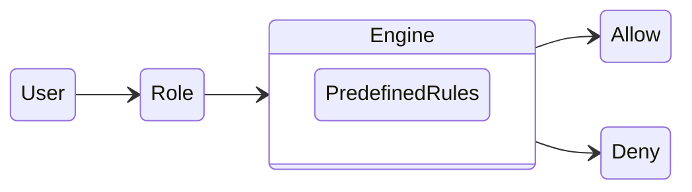
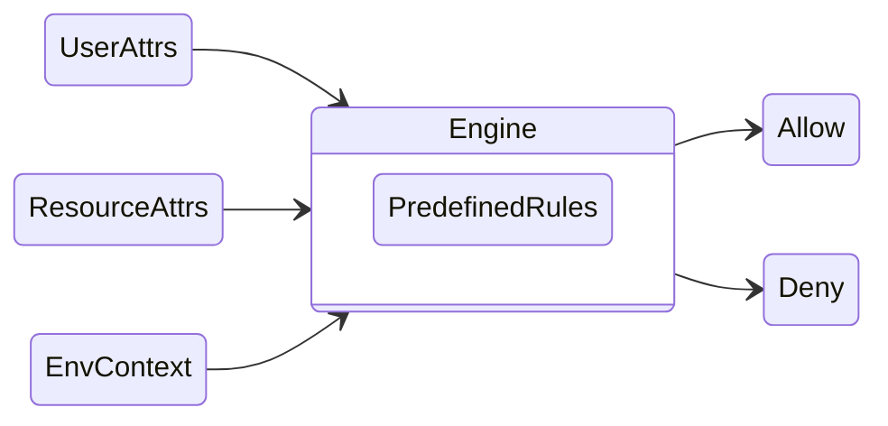
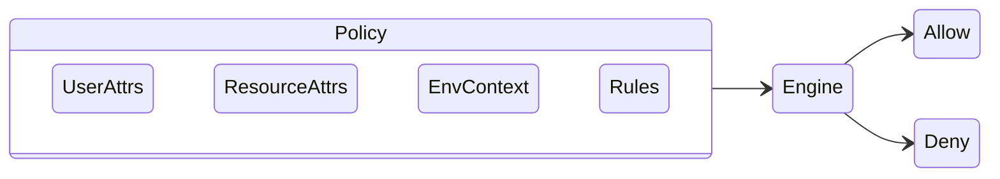
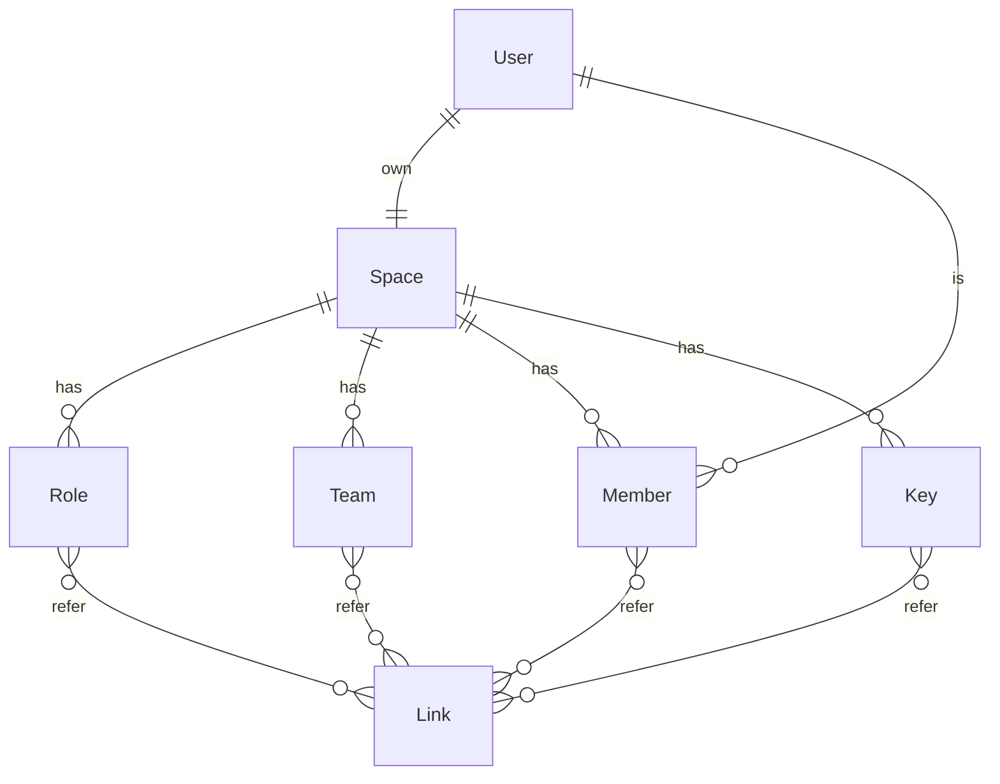
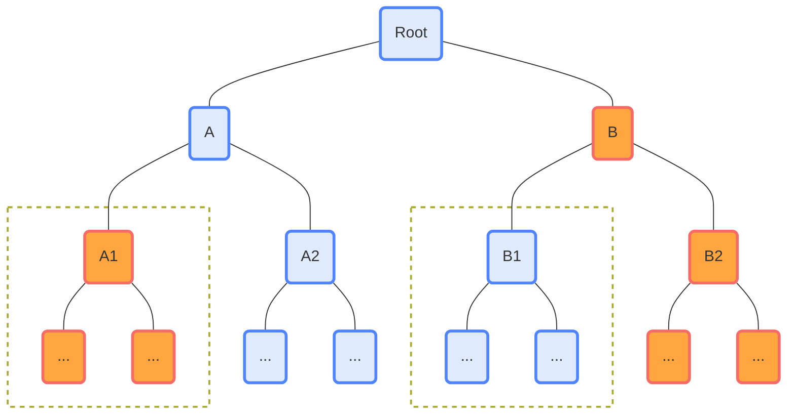
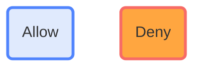

在完成 [资源目录设计](/zh/posts/backend-dev/file-versioning-with-minio-and-mysql) 后，接下来是多租户功能的实现，其中有两项核心功能：
- 组织架构
- 资源授权

接下来我们将拆解如何实现这两项功能。

[comment]:summary


## 基本概念

### 组织架构

  清晰的组织架构是高效协作的前提：通过定义各个团队的职责和权力范围，可以避免混乱和冲突，从而提高整体工作效率。

  一个典型组织架构通常由两类实体组成：团队与成员。
  - 根据权责关系，不同的团队之间可以互相嵌套，形成一棵树或者 DAG
  - 每个成员可以隶属于一个或者多个团队


### 权限控制模型

  权限控制是保证组织数据安全的基石，目前常见的鉴权模型有 3 种：

#### RBAC


  授权步骤：
  - 将权限授予预定义好的角色
  - 将组织中的团队或成员关联至具体的角色

  鉴权步骤：
  - 获取访问者的拥有的角色列表
  - 判断角色中是否具备访问资源的权限

  其优点是清晰易懂，鉴权过程简单高效。
  缺点是粒度较粗，并且可能出现组合爆炸的情况。

#### ABAC


  授权步骤：
  - 预定义鉴权是需要的属性
    - 用户属性（角色、部门 ...）
    - 资源熟悉（类型、所有者 ...）
    - 环境上下文（时间、地点、设备 ...）
  - 围绕预定义好的属性实现鉴权引擎
  - 根据需要在鉴权引擎中维护鉴权规则
  
  鉴权步骤：
  - 获取用户属性、资源属性与环境上下文
  - 鉴权引擎根据属性查找相关的鉴权规则
  - 判断用户是否具备访问权限

  其优点是授权粒度细，可以实现灵活的鉴权策略。
  缺点是系统复杂难以理解，且维护成本高。

#### PBAC


  PBAC 与 ABAC 十分相似，唯一的差异是将维护鉴权规则的责任交给了授权者：
  - 鉴权引擎提供描述鉴权规则的语言（通常是JSON）
  - 授权者通过编写规则实现授权

  这一设计在保留 ABAC 优点的同时，避免了鉴权引擎与具体规则间的耦合，降低了系统维护成本。

## 系统建模

  业务功能点梳理：
  - 每个用户有自己的存储空间
    - 可以邀请其他用户加入当前空间成为成员，一个用户在不同空间内具有不同的成员身份
    - 空间管理员内可以建立团队与角色，并为成员赋予特定的职责
    - 空间管理员可以创建 Key (AccessKey + SecretKey) 实现免登陆访问
  - 实现灵活的授权策略
    - 管理员可以为角色、团队、成员、Key独立分配角色
    - 团队和 Key 可以从角色继承访问权限
    - 成员可以从团队继承访问权限
    - 可以指定权限到期日期



### 基础信息

  `user` 与 `space` 是整个多租户模块的最基础的实体，一旦创建不可变更。

```sql
CREATE TABLE IF NOT EXISTS `user` (
  `id` bigint unsigned NOT NULL AUTO_INCREMENT PRIMARY KEY COMMENT 'PK',
  `uuid` varchar(32) COLLATE utf8mb4_bin NOT NULL COMMENT 'User ID',
  `name` varchar(50) NOT NULL COMMENT 'Nick Name',
  `mobile` varchar(50) NOT NULL DEFAULT '' COMMENT 'Phone Number',
  `email` varchar(100) NOT NULL DEFAULT '' COMMENT 'Email',
  ...
  UNIQUE KEY `uniq_uuid` (`uuid`),
  KEY `idx_email` (`email`)
) ENGINE=InnoDB COMMENT='Basic user information.';

CREATE TABLE IF NOT EXISTS `space` (
  `id` bigint unsigned NOT NULL AUTO_INCREMENT PRIMARY KEY COMMENT 'PK',
  `space_id` varchar(50) COLLATE utf8mb4_bin NOT NULL COMMENT 'Space unique identifier character',
  `name` varchar(50) NOT NULL COMMENT 'Space Name',
  `bucket` varchar(50) NOT NULL COMMENT 'Space Bucket',
  `props` json NOT NULL DEFAULT (JSON_OBJECT()) COMMENT 'Space properties',
  ...
  UNIQUE KEY `uniq_space_id` (`space_id`)
) ENGINE=InnoDB COMMENT='Workspace for resource isolation.';

```

### 组织结构

  空间内可能存在的实体类型：`unit_role`、`unit_team`、`unit_member`、`unit_key`。
  权限传递关系通过 `unit_link` 表示，总共包含以下 4 类传递关系：
  - Team -> Member
  - Role -> Team
  - Role -> Member
  - Role -> Key

```sql
CREATE TABLE IF NOT EXISTS `unit_role` (
  `id` bigint unsigned NOT NULL AUTO_INCREMENT PRIMARY KEY COMMENT 'PK',
  `space_id` varchar(50) COLLATE utf8mb4_bin NOT NULL COMMENT 'Space ID',
  `role_id` varchar(50) COLLATE utf8mb4_bin NOT NULL COMMENT 'Role ID',
  `role_name` varchar(100) NOT NULL COMMENT 'Role Name',
  `role_index` double NOT NULL DEFAULT 0 COMMENT 'Sort',
  ...
  UNIQUE KEY `uniq_role_id` (`role_id`),
  KEY `idx_space_id` (`space_id`)
) ENGINE=InnoDB COMMENT='Authorized roles in a certain workspace.';

CREATE TABLE IF NOT EXISTS `unit_team` (
  `id` bigint unsigned NOT NULL AUTO_INCREMENT PRIMARY KEY COMMENT 'PK',
  `space_id` varchar(50) COLLATE utf8mb4_bin NOT NULL COMMENT 'Space ID',
  `team_id` varchar(50) COLLATE utf8mb4_bin NOT NULL COMMENT 'Team ID',
  `parent_id` varchar(50) COLLATE utf8mb4_bin NOT NULL COMMENT 'Team ID',
  `team_name` varchar(50) NOT NULL COMMENT 'Department Name',
  `team_index` double NOT NULL DEFAULT 0 COMMENT 'Sort',
  ...
  UNIQUE KEY `uniq_team_id` (`team_id`),
  UNIQUE KEY `uniq_team_name` (`parent_id`,`team_name`), -- The uniqueness of parent_id is guaranteed by uniq_node_id
  KEY `idx_space_id` (`space_id`)
) ENGINE=InnoDB COMMENT='Organization information in a certain workspace.';

CREATE TABLE IF NOT EXISTS `unit_member` (
  `id` bigint unsigned NOT NULL AUTO_INCREMENT PRIMARY KEY COMMENT 'PK',
  `user_id` varchar(50) COLLATE utf8mb4_bin NOT NULL COMMENT 'User UUID',
  `space_id` varchar(50) COLLATE utf8mb4_bin NOT NULL COMMENT 'Space ID',
  `member_id` varchar(50) COLLATE utf8mb4_bin NOT NULL COMMENT 'Member ID',
  `member_name` varchar(255) NOT NULL COMMENT 'Member Name',
  `member_index` double NOT NULL DEFAULT 0 COMMENT 'Sort',
  `job_number` varchar(60) NOT NULL DEFAULT '' COMMENT 'Job Number',
  `position` varchar(255) NOT NULL DEFAULT '' COMMENT 'Position',
  ...
  UNIQUE KEY `uniq_member_id` (`member_id`),
  KEY `idx_user_id` (`user_id`),
  KEY `idx_mobile` (`mobile`),
  KEY `idx_email` (`email`)
) ENGINE=InnoDB COMMENT='Member information in a certain workspace.';

CREATE TABLE IF NOT EXISTS `unit_key` (
  `id` bigint unsigned NOT NULL AUTO_INCREMENT PRIMARY KEY COMMENT 'PK',
  `space_id` varchar(50) COLLATE utf8mb4_bin NOT NULL COMMENT 'Space ID',
  `key_id` varchar(50) COLLATE utf8mb4_bin NOT NULL COMMENT 'Key ID',
  `key_name` varchar(100) NOT NULL COMMENT 'Key Name',
  `key_index` double NOT NULL DEFAULT 0 COMMENT 'Sort',
  `access_key` varchar(50) COLLATE utf8mb4_bin NOT NULL COMMENT 'Access Key',
  `secret_key` varchar(50) COLLATE utf8mb4_bin NOT NULL COMMENT 'Secret Key',
   ...
   UNIQUE KEY `uniq_key_id` (`key_id`),
   UNIQUE KEY `uniq_access_key` (`access_key`),
   KEY `idx_space_id` (`space_id`)
) ENGINE=InnoDB COMMENT='Access keys in a certain workspace.';


CREATE TABLE IF NOT EXISTS `unit_link` (
  `id` bigint unsigned NOT NULL AUTO_INCREMENT PRIMARY KEY COMMENT 'PK',
  `space_id` varchar(50) COLLATE utf8mb4_bin NOT NULL COMMENT 'Space ID',
  `link_index` double NOT NULL DEFAULT 0 COMMENT 'Sort',
  `link_type` tinyint unsigned NOT NULL COMMENT 'Link Type(0: Team-Member, 1: Role-Team, 2: Role-Member, 3:Role-Key)',
  `main_unit_id` varchar(50) COLLATE utf8mb4_bin NOT NULL COMMENT 'Main Unit(0: Team, 1: Role, 2: Role, 3:Role)',
  `sub_unit_id` varchar(50) COLLATE utf8mb4_bin NOT NULL COMMENT 'Sub Unit(0: Member, 1: Team, 2: Member, 3:Key)',
   ...
   UNIQUE KEY `uniq_link_pair` (`main_unit_id`,`sub_unit_id`),
   KEY `idx_space_id` (`space_id`)
) ENGINE=InnoDB COMMENT='Permission delegation link.';

```

### 授权策略

在 PBAC 模型中的 `policy` 定义借鉴 [AWS IAM]('https://docs.aws.amazon.com/IAM/latest/UserGuide/access_policies.html#access_policies-json') 并进行简化：
- 规则效果（Allow / Deny）
- 授权主体（角色、团队 ...）
- 访问行为（修改、删除 ...）
- 访问资源
- 条件表达式

```sql
CREATE TABLE IF NOT EXISTS `policy` (
  `id` bigint unsigned NOT NULL AUTO_INCREMENT PRIMARY KEY COMMENT 'PK',
  `space_id` varchar(50) COLLATE utf8mb4_bin NOT NULL COMMENT 'Space ID',
  `policy_id` varchar(50) COLLATE utf8mb4_bin NOT NULL COMMENT 'Policy ID',
  `principal_type` tinyint unsigned NOT NULL COMMENT 'Principal Type(0: Role, 1: Team, 2: Member, 3: Key, 4: User)',
  `resource_type` tinyint unsigned NOT NULL COMMENT 'Resource Type',
  `principal` varchar(50) COLLATE utf8mb4_bin NOT NULL COMMENT 'Principal ID',
  `resource` varchar(50) COLLATE utf8mb4_bin NOT NULL COMMENT 'Resource ID',
  `effect` tinyint unsigned NOT NULL COMMENT 'Policy effect(0: Deny, 1: Allow)',
  `action` json NOT NULL COMMENT 'Policy action array',
  `condition` json NOT NULL COMMENT 'Policy condition object',
  ...
  UNIQUE KEY `uniq_policy_id` (`policy_id`),
  KEY `idx_space_id` (`space_id`)
) ENGINE=InnoDB COMMENT='Authorization policy.';
```

#### 访问行为

以下是系统中预定义的行为类型：每个通配符都有一个域前缀，可以通过通配符实现批量关联这个域下的所有行为。

使用通配符的好处：当该域后续新增行为时，使用通配符的策略会默认引入该行为，避免批量修改。


```java
@Getter
@RequiredArgsConstructor
@Accessors(fluent = true)
public enum PolicyAction {

    AnyAdmAction("adm:*"),
    AnyResAction("res:*"),
    AnyOrgAction("org:*"),

    AdmAddTeam("adm:addTeam"),
    AdmRemoveTeam("adm:removeTeam"),
    AdmAddRole("adm:addRole"),
    AdmRemoveRole("adm:removeRole"),
    AdmAddMember("adm:addMember"),
    AdmRemoveMember("adm:removeMember"),
    AdmAddKey("adm:addKey"),
    AdmRemoveKey("adm:removeKey"),
    AdmGrantTeam("adm:grantTeam"),
    AdmGrantRole("adm:grantRole"),
    AdmGrantPolicy("adm:grantPolicy"),

    ResListDir("res:listDir"),
    ResCreateDir("res:createDir"),
    ResDeleteDir("res:deleteDir"),
    ResForceDelDir("res:forceDelDir"),
    ResReadNode("res:readNode"),
    ResEditNode("res:editNode"),
    ResCreateNode("res:createNode"),
    ResDeleteNode("res:deleteNode"),

    ...
    ;
}
```

#### 条件表达式

条件表达式是一个 JSON 字符串，可以表达复杂的规则：
- 当表达式结果为 true 时，规则生效
- 当表达式结果为 false 时，规则不生效

如果不需要支持复杂的匹配功能，只需将其设置为常量 true 即可。

```java
@RequiredArgsConstructor
public abstract class PolicyMatcher {

    private final String expression;

    public abstract boolean match(PolicyContext ctx);

    static class TrueMatcher extends PolicyMatcher {
        TrueMatcher() { super("true"); }
        @Override
        public boolean match(PolicyContext ctx) {
            return true;
        }
    }

    static PolicyMatcher compile(String expression) {
        if ("true".equals(expression)) {
            return new TrueMatcher();
        }
        ...
    }

}
```

## 实现细节

### 资源可见性

按照目前的设计，资源访问权限具有传递性：
- 如果用户有父节点的访问权限，则其默认对子节点也有访问权限
- 如果用户无父节点的访问权限，则其默认对子节点也无访问权限

但是管理员也可以通过配置达到以下效果：
- 父节点有访问权限，但是子节点无访问权限（通过 Deny 规则实现）
- 父节点无访问权限，但是子节点具有访问权限（通过 Allow 规则实现）




**为了保证展示的完整性，只要子节点存在，则父节点就必须是对用户可见的：**

- 当用户获取 A 节点的子节点时，流程如下：
  - 用户查询 A 节点的访问列表，发现本身具备访问权限
  - 查询 A 节点的子节点信息，得到 A1 与 A2 两个节点
  - 查询规则树，发现 A1 存在 Deny 规则，因此将 A1 节点从返回列表中剔除
  - 返回 A2 数据给用户

- 当用户获取 B 节点的子节点时，流程如下：
  - 用户查询 B 节点的访问列表，发现本身不具备访问权限
  - 查询规则树，发现 B1 存在 Allow 规则，因此判断 B 节点具有访问权限
  - 查询 B 节点的子节点信息，得到 B1 与 B2 两个节点
  - 返回 B1 数据给用户


### ACL 与 ACT

为了实现上述的资源可见性，需要引入两个数据结构实现匹配规则：

- ACL 仅加载与特定资源相关的策略，并判断用户是否具备访问该资源的权限
```java
List<ResourcePath> paths = resourceService.getResourcesById(nodeId);
List<Policy> policies = policyService.getPolicies(spaceId, ResourceType.Path);
PolicyACL<ResourcePath> ctrl = PolicyACL.attachPolicyToResource(paths, policies, ResourcePath::getNodeId);
Preconditions.checkState(ctrl.hasPermission(currentContext(), PolicyAction.ResListDir));
```

- ACT 则会加载出所有资源的的策略，判断当前用户是否具备访问该资源的权限
```java
List<ResourcePath> nodes = resourceService.getResources(rootId);
List<Policy> policies = policyService.getPolicies(spaceId, ResourceType.Path);
PolicyACT<ResourceNode> tree = PolicyACT.buildTreeAndGetRoot(nodes, ResourceNode::new, ResourcePath::getNodeId, ResourcePath::getParentId);
tree.attachPolicyToTree(policies);
for (ResourcePath node: nodes) {
  Preconditions.checkState(tree.hasAllowChild(node.getNodeId(), currentContext(), PolicyAction.ResListDir));
  Preconditions.checkState(!tree.hasDenyParent(node.getNodeId(), currentContext(), PolicyAction.ResListDir));
}
```

#### AccessControlList

```java
@Data
@Accessors(chain = true)
@RequiredArgsConstructor
public class PolicyCarrier<R> {

    private static class CarrierChain {
        CarrierNode allowances;
        CarrierNode denials;
        @Override
        public String toString() {
            List<PolicyMatcher> allow = null;
            List<PolicyMatcher> deny = null;
            if (allowances != null) allowances.visit((allow = new ArrayList<>())::add);
            if (denials != null) denials.visit((deny = new ArrayList<>())::add);
            return "(" + "allow:" + allow + ", deny:" + deny + ')';
        }
    }

    private record CarrierNode(PolicyMatcher matcher, CarrierNode next) {
        boolean match(PolicyContext context) {
            CarrierNode node = this;
            while (node != null && !node.matcher.match(context)) node = node.next;
            return node != null;
        }
        void visit(Consumer<PolicyMatcher> visitor) {
            CarrierNode node = this;
            while (node != null) {
                visitor.accept(node.matcher);
                node = node.next;
            }
        }
    }

    R object;
    Map<PolicyAction, CarrierChain> matchers;

    public void addMatcher(PolicyAction action, PolicyEffect effect, PolicyMatcher matcher) {
        if (matchers == null)
            matchers = new IdentityHashMap<>(0);
        CarrierChain chain = matchers.computeIfAbsent(action, k -> new CarrierChain());
        switch (effect) {
            case Allow -> chain.allowances = new CarrierNode(matcher, chain.allowances);
            case Deny -> chain.denials = new CarrierNode(matcher, chain.denials);
        }
    }

    public PolicyEffect matchEffect(PolicyContext context, PolicyAction action) {
        if (matchers != null) {
            CarrierChain chain = matchers.get(action);
            if (chain != null) { // Allow effect has higher priority
                if (chain.allowances != null && chain.allowances.match(context)) {
                    return PolicyEffect.Allow;
                }
                if (chain.denials != null && chain.denials.match(context)) {
                    return PolicyEffect.Deny;
                }
            }
        }
        return null;
    }

}
```

```java
/**
 * ACL is a node list, indicating the path from the root node to the current node <p/>
 * Pass the permission information of the parent node to the child node through bottom-up query
 */
public class PolicyACL<R> extends ArrayList<PolicyCarrier<R>> {

    public PolicyACL(int capacity) { super(capacity); }

    public static <T> PolicyACL<T> attachPolicyToResource(List<T> resources, List<Policy> policies, Function<T,String> toId) {
        PolicyACL<T> acl = new PolicyACL<>(resources.size());
        for (T res : resources) {
            PolicyCarrier<T> attach = new PolicyCarrier<T>().setObject(res);
            for (Policy policy : policies) { // The resource ID may be repeated, can't use map here
                if (policy.getResource().equals(toId.apply(res))) {
                    PolicyMatcher condition = PolicyMatcher.compile(policy.getCondition());
                    PolicyAction.parse(policy.getAction(), action -> attach.addMatcher(action, policy.getEffect(), condition));
                }
            }
            acl.add(attach);
        }
        return acl;
    }

    public void checkAllPermission(PolicyContext context, Collection<PolicyAction> actions) {
        Checker.check(!hasAllPermission(context, actions), PermissionException.NODE_ACCESS_DENIED);
    }

    public boolean hasAllPermission(PolicyContext context, Collection<PolicyAction> actions) {
        for (PolicyAction action : actions) {
            if (!hasPermission(context, action))
                return false;
        }
        return !actions.isEmpty();
    }

    public void checkAnyPermission(PolicyContext context, Collection<PolicyAction> actions) {
        Checker.check(!hasAnyPermission(context, actions), PermissionException.NODE_ACCESS_DENIED);
    }

    public boolean hasAnyPermission(PolicyContext context, Collection<PolicyAction> actions) {
        for (PolicyAction action : actions) {
            if (hasPermission(context, action))
                return true;
        }
        return false;
    }

    public void checkPermission(PolicyContext context, PolicyAction action) {
        Checker.check(!hasPermission(context, action), PermissionException.NODE_ACCESS_DENIED);
    }

    // Bottom-up query
    public boolean hasPermission(PolicyContext context, PolicyAction action) {
        for (int i = size()-1; i >= 0; i--) {
            PolicyEffect effect = get(i).matchEffect(context, action);
            if (effect != null) { // Inherit permissions from the nearest parent node that specifies permissions
                return effect == PolicyEffect.Allow;
            }
        }
        return false;
    }

    public R resource() {
        return isEmpty() ? null : get(size()-1).getObject();
    }

}
```


#### AccessControlTree


```java
@Setter
@RequiredArgsConstructor
@SuppressWarnings("unchecked")
public class PolicyNode<T> extends PolicyCarrier<T> {

    PolicyNode<T> parent;
    List<PolicyNode<T>> children;

    public <Node extends PolicyNode<T>> Node getParent() {
        return (Node) parent;
    }

    public <Node extends PolicyNode<T>> List<Node> getChildren() {
        return (List<Node>) children;
    }

    public boolean containsNode(Predicate<T> predicate) {
        if (predicate.test(getObject())) {
            return true;
        }
        return hasChildren(predicate, false);
    }

    public boolean hasChildren(Predicate<T> predicate, boolean direct) {
        Deque<PolicyNode<T>> stack = new ArrayDeque<>();
        stack.push(this);
        boolean visited = false;
        while(!stack.isEmpty()) {
            PolicyNode<T> node = stack.pop();
            if (ObjectUtils.isNotEmpty(node.getChildren()) && (!visited || !direct)) {
                for (PolicyNode<T> child : node.getChildren()) {
                    if (predicate.test(child.getObject())) {
                        return true;
                    }
                }
                stack.addAll(node.getChildren());
            }
            visited = true;
        }
        return false;
    }

    @Override
    public String toString() {
        return "Node(" + "obj=" + getObject() + ", matchers=" + getMatchers() + ')';
    }
}
```


```java
/**
 * ACT is a sparse node tree that only contains nodes for which the user has explicitly specified rules<p/>
 * Pass the permission information of the child node to the parent node through top-down query
 */
@SuppressWarnings({"unchecked","rawtypes"})
public record PolicyACT<Node extends PolicyNode>(Node root, Map<String, Node> lookup) {

    public static <T, Node extends PolicyNode<T>> PolicyACT<Node>
    buildTreeAndGetRoot(
            List<T> resources,
            Supplier<Node> newNode,
            Function<T, String> toId,
            Function<T, String> toParentId) {
        List<PolicyACT<Node>> trees = buildTreeAndGetRoots(resources, newNode, toId, toParentId);
        Checker.check(trees.size() != 1, "unexpected tree topology");
        return trees.get(0);
    }

    public static <T, Node extends PolicyNode<T>> List<PolicyACT<Node>>
    buildTreeAndGetRoots(List<T> resources,
                         Supplier<Node> newNode,
                         Function<T, String> toId,
                         Function<T, String> toParentId) {
        Map<String, Node> lookup = new HashMap<>();
        resources.forEach(x -> lookup.put(toId.apply(x), (Node) newNode.get().setObject(x)));
        for (Node node : lookup.values()) {
            Node parent = lookup.get(toParentId.apply(node.getObject()));
            if (parent != null && parent != node) {
                node.setParent(parent);
                if (parent.getChildren() == null) {
                    parent.setChildren(new ArrayList<>());
                }
                parent.getChildren().add(node);
            }
        }
        List<PolicyACT<Node>> roots = new ArrayList<>(1);
        for (Node node : lookup.values()) {
            if (node.getParent() == null) {
                roots.add(new PolicyACT<>(node, lookup));
            }
        }
        return roots;
    }

    public void attachPolicyToTree(List<Policy> policies) {
        for (Policy policy : policies) {
            PolicyMatcher condition = PolicyMatcher.compile(policy.getCondition());
            Node node = lookup().get(policy.getResource());
            PolicyAction.parse(policy.getAction(), action -> node.addMatcher(action, policy.getEffect(), condition));
        }
    }

    // Top-down query
    public boolean hasAllowChild(String nodeId, PolicyContext context, PolicyAction action) {
        Node node = lookup().get(nodeId);
        if (node != null) {
            Queue<Node> queue = new LinkedList<>();
            queue.add(node);
            while (!queue.isEmpty()) {
                Node n = queue.poll();
                PolicyEffect effect = n.matchEffect(context, action);
                if (effect == PolicyEffect.Allow) {
                    return true; // Return if any child node is specified with Allow
                }
                if (ObjectUtils.isNotEmpty(n.getChildren())) {
                    queue.addAll(n.getChildren());
                }
            }
        }
        return false;
    }

    // Bottom-up query
    public boolean hasDenyParent(String nodeId, PolicyContext context, PolicyAction action) {
        Node node = lookup().get(nodeId);
        while (node != null) {
            PolicyEffect effect = node.matchEffect(context, action);
            if (effect == PolicyEffect.Deny) {
                return true; // Return if any parent node is specified with Deny
            }
            node = (Node) node.getParent();
        }
        return false;
    }
}
```
