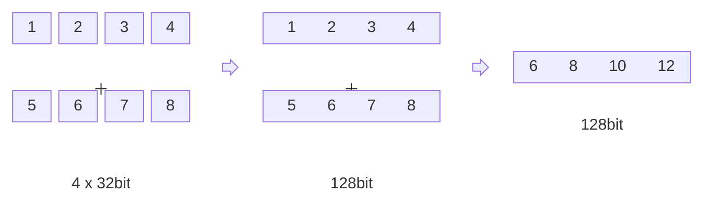

最新发布的 JDK 22 中包含稳定版本的 Foreign-Memory Access API，官方声称该 API 能够提供比 JNI 更优的性能。
恰好最近有尝试使用 SIMD 优化编码算法的想法，因此准备结合这两种技术对 VarInt 编码进行优化。

[comment]:summary

## SMID 简介

多线程并发能够有效提升应用吞吐量，但是本质上每个线程也只是在执行串行的指令流。
当线程数量过多时，频繁的上下文切换会耗费硬件资源，最终导致性能不升反降。

SIMD 是一种在硬件层面上实现的并行计算的优化手段：将 4 个 32bit 数值放入 128bit 寄存器后，即可通过一条指令执行 4 次计算。
除了需要在寄存器与内存间搬运数据外，SIMD 本身并不会引入任何性能损耗，是一种可靠的优化手段。



SIMD 不仅能够提升单位时间内的 CPU 计算能力，由于指令数量减少与批量加载数据的特性，L1 缓存的命中率也会随之提升，从而进一步提升计算效率。

### 指令集

JDK 中某些带有 `@IntrinsicCandidate` 注解的方法，会在 JVM 内部被替换为特定的汇编实现。
比如 `Long.numberOfLeadingZeros` 与 `Long.numberOfTrailingZeros` 可能会被替换为 `lzcnt` 与 `tzcnt` 指令。
具体是否能进行替换，取决 JVM 所运行的 CPU 是否支持这些指令。

除了某些特殊指令（比如：`popcnt`) 外，大多数指令都以指令集的形式存在，可以通过 `lscpu` 查看 CPU 支持的指令集合：
```
$ lscpu | grep Flags
Flags:                 fpu vme de pse tsc msr pae mce cx8 apic sep mtrr pge mca cmov pat pse36 clflush dts acpi mmx fxsr sse sse2 ss ht tm pbe syscall nx pdpe1gb rdtscp lm constant_tsc art arch_perfmon pebs bts rep_good nopl xtopology nonstop_tsc aperfmperf eagerfpu pni pclmulqdq dtes64 monitor ds_cpl vmx smx est tm2 ssse3 sdbg fma cx16 xtpr pdcm pcid dca sse4_1 sse4_2 x2apic movbe popcnt tsc_deadline_timer aes xsave avx f16c rdrand lahf_lm abm 3dnowprefetch epb cat_l3 cdp_l3 intel_ppin intel_pt ssbd mba ibrs ibpb stibp ibrs_enhanced tpr_shadow vnmi flexpriority ept vpid fsgsbase tsc_adjust bmi1 hle avx2 smep bmi2 erms invpcid rtm cqm mpx rdt_a avx512f avx512dq rdseed adx smap clflushopt clwb avx512cd avx512bw avx512vl xsaveopt xsavec xgetbv1 cqm_llc cqm_occup_llc cqm_mbm_total cqm_mbm_local dtherm ida arat pln pts pku ospke avx512_vnni md_clear spec_ctrl intel_stibp flush_l1d arch_capabilities
```

本次优化 VarInt 主要涉及两个指令集：

- **BMI (Bit Manipulation Instructions)**
  - `_pdep_u64`: 将 64bit 以每 7bit 为一组进行拆分

- **SSE (Streaming SIMD Extensions)**
  - `_mm_set_epi8` : 将 16 个 8bit 数据加载进 128bit 寄存器
  - `_mm_cmpgt_epi8` : 按每 8bit 一组进行比较寄存器中的数据
  - `_mm_movemask_epi8` : 按照 8bit 一组判断是否非 0 并将结果聚合为 int (仅最低 16bit 有效)
  - `_mm_bsrli_si128` : 按照 8bit 一组进行按位右移

### 代码实现

不同编译器对对汇编指令的支持方式不同，为了保证 SMID 代码的可移植性并编码效率，现代操作系统在其标准 C 库函数种提供了 **内嵌函数(intrinsic function)**。
每个 SMID 指令都有其对应的内嵌函数，这使得开发者可以通过 C/C++ 之类的高级语言使用 SMID 汇编指令。

接下来要用到的是实际代码也将使用内嵌函数实现，来源于 [varint-simd](https://github.com/as-com/varint-simd/blob/master/src/encode/mod.rs) 。
如果对具体的指令感兴趣，可以在[这里](https://www.intel.com/content/www/us/en/docs/intrinsics-guide/index.html)查询。
```c
#include <stdio.h>
#include <immintrin.h>
#include <x86intrin.h>

typedef unsigned char u8;
typedef unsigned short u16;
typedef unsigned long u64;

void print_out(u8 val[])
{
    printf("out: %x %x %x %x %x %x %x %x %x %x %x %x \n",
           val[0], val[1], val[2], val[3], val[4], val[5],
           val[6], val[7], val[8], val[9], val[10], val[11]);
}

int encode_varint64(u64 val, u8 out[]) {

    // Break the number into 7-bit parts and spread them out into a vector
    __m128i stage1 = _mm_set_epi64x(
            _pdep_u64(val >> 56, 0x000000000000017f),
            _pdep_u64(val, 0x7f7f7f7f7f7f7f7f));

    // Create a mask for where there exist values
    // This signed comparison works because all MSBs should be cleared at this point
    // Also handle the special case when num == 0
    __m128i minimum = _mm_set_epi8(0, 0, 0, 0, 0, 0, 0, 0, 0, 0, 0, 0, 0, 0, 0, 0xFF);
    __m128i exists = _mm_or_si128(_mm_cmpgt_epi8(stage1, _mm_setzero_si128()), minimum);

    // Count the number of bytes used
    int bits = _mm_movemask_epi8(exists);
    u8 bytes = 1 + _bit_scan_reverse(bits);

    // Fill that many bytes into a vector
    __m128i ascend = _mm_setr_epi8(0, 1, 2, 3, 4, 5, 6, 7, 8, 9, 10, 11, 12, 13, 14, 15);
    __m128i mask = _mm_cmplt_epi8(ascend, _mm_set1_epi8(bytes));

    // Shift it down 1 byte so the last MSB is the only one set, and make sure only the MSB is set
    __m128i shift = _mm_bsrli_si128(mask, 1);
    __m128i msbmask = _mm_and_si128(shift, _mm_set1_epi8((u8)0x80));

    // Merge the MSB bits into the vector
    __m128i merged = _mm_or_si128(stage1, msbmask);
    _mm_storeu_si128((__m128i*) out, merged);
    return bytes;
}

int main(int argc, char** argv) {
    u8 out[16];

    encode_varint64(127, out);
    print_out(out);
    encode_varint64(128, out);
    print_out(out);

    encode_varint64(16383, out);
    print_out(out);
    encode_varint64(16384, out);
    print_out(out);

    encode_varint64(~0, out);
    print_out(out);
    return 0;
}

```

执行 `gcc -mbmi2 -o test test.c && ./test` 运行代码将得到以下结果：

```text
out: 7f 0 0 0 0 0 0 0 0 0 0 0 
out: 80 1 0 0 0 0 0 0 0 0 0 0 
out: ff 7f 0 0 0 0 0 0 0 0 0 0 
out: 80 80 1 0 0 0 0 0 0 0 0 0 
out: ff ff ff ff ff ff ff ff ff 1 0 0 
```


## FFM 封装

### 基础知识

JDK22 中已经将 **FFM (Foreign Function and Memory API)** 作为正式特性进行发布。
其前身是 [Panama](https://openjdk.org/projects/panama) 项目，致力在 JVM 与 NativeCode 间建立一个统一高效的调用机制。
其中就包含一个用于封装 SIMD 指令的 [Vector API](https://openjdk.org/jeps/338) 提案。 


FFM 提供了两个重要的 API：
- **Foreign-Memory Access API** : 基于 `Aerna` 与 `MemorySegment` 实现的的堆外内存管理机制
- **Foreign Linker API** : 基于 `Linker` 与 `MethodHandle` 实现的动态链接库调用机制


**Foreign-Memory Access API** 的出现主要是为了取代 Unsafe，在未来成为标准的堆外内存管理器。

出于安全考虑，其中包含了大量的边界与生命周期检查，因此性能相对直接使用 Unsafe 会有所下降。\
令人遗憾的是，为了强制推行新 API，目前官方已经提出了废弃 Unsafe 的[草案](https://openjdk.org/jeps/471)。


**Foreign Linker API** 可以看作是 **JNI(Java Native Interface)** 的后继者，但在易用性上有了质的飞跃。

用户可以无需编写任何 C/C++ 代码，即可直接访问现存的动态链接库：

```java
public class FFMTestStrlen {
  public static void main(String[] args) throws Throwable {
    // 1. Get a linker – the central element for accessing foreign functions
    Linker linker = Linker.nativeLinker();

    // 2. Get a lookup object for commonly used libraries
    SymbolLookup stdlib = linker.defaultLookup();

    // 3. Get the address of the "strlen" function in the C standard library
    MemorySegment strlenAddress = stdlib.find("strlen").orElseThrow();

    // 4. Define the input and output parameters of the "strlen" function
    FunctionDescriptor descriptor =
        FunctionDescriptor.of(ValueLayout.JAVA_LONG, ValueLayout.ADDRESS);

    // 5. Get a handle to the "strlen" function
    MethodHandle strlen = linker.downcallHandle(strlenAddress, descriptor);

    // 6. Get a confined memory area (one that we can close explicitly)
    try (Arena offHeap = Arena.ofConfined()) {

      // 7. Convert the Java String to a C string and store it in off-heap memory
      MemorySegment str = offHeap.allocateFrom("Happy Coding!");

      // 8. Invoke the "strlen" function
      long len = (long) strlen.invoke(str);
      System.out.println("len = " + len);
    }
    // 9. Off-heap memory is deallocated at end of try-with-resources
  }
}
```

如果不想人工维护大量的模版代码，可以尝试使用 FFM 提供的代码生成工具 [jextract](https://docs.oracle.com/en/java/javase/22/core/call-native-functions-jextract.html) 。


### 实现步骤

首先，编写 C 代码并生成动态链接库。这一步十分简单，不涉及到任何与 Java 的相关依赖。

- 编译命令

```bash
gcc -Wl,-z,relro -Wl,-z,now -Wl,--as-needed -O3 -mbmi2 varint64.c -shared -o /tmp/varint64.so -fPIC
```

- 代码实现

```c
#include <immintrin.h>
#include <x86intrin.h>

extern int encodeLong(unsigned long value, unsigned char out[]) {

    // Break the number into 7-bit parts and spread them out into a vector
    unsigned long a = _pdep_u64(value, 0x7f7f7f7f7f7f7f7f);
    unsigned long b = _pdep_u64(value >> 56, 0x000000000000017f);
    __m128i stage1 = _mm_set_epi64x(
            _pdep_u64(value >> 56, 0x000000000000017f),
            _pdep_u64(value, 0x7f7f7f7f7f7f7f7f));

    // Create a mask for where there exist values
    // This signed comparison works because all MSBs should be cleared at this point
    // Also handle the special case when num == 0
    __m128i minimum = _mm_set_epi8(0, 0, 0, 0, 0, 0, 0, 0, 0, 0, 0, 0, 0, 0, 0, 0xFF);
    __m128i exists = _mm_or_si128(_mm_cmpgt_epi8(stage1, _mm_setzero_si128()), minimum);

    // Count the number of bytes used
    int bits = _mm_movemask_epi8(exists);
    unsigned char bytes = 1 + _bit_scan_reverse(bits);

    // Fill that many bytes into a vector
    __m128i ascend = _mm_setr_epi8(0, 1, 2, 3, 4, 5, 6, 7, 8, 9, 10, 11, 12, 13, 14, 15);
    __m128i mask = _mm_cmplt_epi8(ascend, _mm_set1_epi8(bytes));

    // Shift it down 1 byte so the last MSB is the only one set, and make sure only the MSB is set
    __m128i shift = _mm_bsrli_si128(mask, 1);
    __m128i msbmask = _mm_and_si128(shift, _mm_set1_epi8((unsigned char)0x80));

    // Merge the MSB bits into the vector
    __m128i merged = _mm_or_si128(stage1, msbmask);
    _mm_storeu_si128((__m128i*) out, merged);
    return bytes;
}
```


接着使用 FFM 编写胶水代码，作为链接库的调用入口。

```java
public class VarIntFFM {

    static final Arena LIBRARY_ARENA;
    static final SymbolLookup SYMBOL_LOOKUP;

    public static final FunctionDescriptor DESC = FunctionDescriptor.of(
            ValueLayout.JAVA_INT,
            ValueLayout.JAVA_LONG,
            ValueLayout.ADDRESS.withTargetLayout(MemoryLayout.sequenceLayout(Long.MAX_VALUE, JAVA_BYTE))
    );

    public static final MemorySegment ADDR;
    public static final MethodHandle HANDLE;

    static {
        try {
            LIBRARY_ARENA = Arena.ofAuto();
            SYMBOL_LOOKUP = SymbolLookup.libraryLookup(Paths.get("/tmp/varint64.so"), LIBRARY_ARENA)
                    .or(SymbolLookup.loaderLookup())
                    .or(Linker.nativeLinker().defaultLookup());

            ADDR = SYMBOL_LOOKUP.find("encodeLong").orElseThrow();
            HANDLE = Linker.nativeLinker().downcallHandle(ADDR, DESC);
        } catch (Throwable e) {
            e.printStackTrace();
            throw new RuntimeException(e);
        }
    }

    public static int encodeLong(long value, MemorySegment out) throws Throwable {
        return (int) HANDLE.invokeExact(value, out);
    }

}
```


### 性能测试

最后使用 JMH 进行测试，模拟以下场景：使用编码函数将中间结果写入中间数组 `buf` 中，接着将 `buf` 中的数据拷贝进 `result` 数组。

```java
public class VarIntPerf {

    @Benchmark
    @Warmup(time = 3, iterations = 3)
    @Measurement(time = 5, iterations = 3)
    public void testNative() throws Throwable {
        byte[] result = new byte[10];
        try (Arena offHeap = Arena.ofConfined()) {
            MemorySegment buf = offHeap.allocate(16, 16);
            for (int i=0; i<1000; i++) {
                int n = TestFFM.encodeLong(i, buf);
                Unsafe.COPY_MEMORY.copyMemory(null, buf.address(), result, CodecSlice.BYTES_OFFSET, n);
            }
        }
    }

    @Benchmark
    @Warmup(time = 3, iterations = 3)
    @Measurement(time = 5, iterations = 3)
    public void testPlain()  {
        byte[] result = new byte[10];
        byte[] buf = new byte[10];
        for (int i=0; i<1000; i++) {
            int n = VarInt.encodeLong(i, buf, 0);
            System.arraycopy(buf, 0, result, 0, n);
        }
    }

    public static void main(String[] args) throws RunnerException {
        Options opt = new OptionsBuilder()
                .include(VarIntFFMPerf.class.getSimpleName())
                .forks(1)
                .build();
        new Runner(opt).run();
    }

}
```

最后在在 pom.xml 中引用 **maven-shade-plugin** 插件用于生成 benchmarks.jar。

```xml
<plugin>
    <groupId>org.apache.maven.plugins</groupId>
    <artifactId>maven-shade-plugin</artifactId>
    <version>3.2.0</version>
    <executions>
        <execution>
            <phase>package</phase>
            <goals>
                <goal>shade</goal>
            </goals>
            <configuration>
                <finalName>benchmarks</finalName>
                <transformers>
                    <transformer implementation="org.apache.maven.plugins.shade.resource.ManifestResourceTransformer">
                        <mainClass>org.openjdk.jmh.Main</mainClass>
                    </transformer>
                </transformers>
            </configuration>
        </execution>
    </executions>
</plugin>
```

最后执行以下命令即可进行测试：
```bash
mvn clean package
java -jar target/benchmarks.jar VarIntFFM
```

测试结果如下：
```text
Benchmark              Mode  Cnt       Score      Error  Units
VarIntPerf.testFFM    thrpt   15   47364.288 ± 1190.314  ops/s
VarIntPerf.testPlain  thrpt   15  109338.097 ±  973.650  ops/s
```

不得不说，这个结果比较令人失望。
FFM 的调用本地代码的开销依然比较可观，其上下文切换的开销仍无法做到跟 JVM 内部调用同个数量级。

## JNI 封装

接下来我们将使用 JNI 实现相同的功能，并以此作为性能对照。

### 实现步骤

首先，编写作为调用入口的 Java 类。

```java
public abstract class VarIntJNI {

    static {
        System.load("/tmp/varintjni.so");
    }
    public static native int encodeLong(long value, long pointer);

}
```

接着使用命令 `javac -h . VarIntJNI.java` 生成 JNI 所需的头文件。

```c
/* DO NOT EDIT THIS FILE - it is machine generated */
#include <jni.h>
/* Header for class VarIntJNI */

#ifndef _Included_VarIntJNI
#define _Included_VarIntJNI
#ifdef __cplusplus
extern "C" {
#endif
/*
 * Class:     VarIntJNI
 * Method:    encodeLong
 * Signature: (JJ)I
 */
JNIEXPORT jint JNICALL Java_VarIntJNI_encodeLong
  (JNIEnv *, jclass, jlong, jlong);

#ifdef __cplusplus
}
#endif
#endif
```

最后编译生成 JNI 版本的动态连接库：

- 编译命令
```
gcc -I $JAVA_HOME/include -I $JAVA_HOME/include/linux/ -Wl,-z,relro -Wl,-z,now -Wl,--as-needed -O3 -mbmi2 varintjni.c -shared -o /tmp/varintjni.so -fPIC
```

- 代码实现
```c
#include <immintrin.h>
#include <x86intrin.h>

#include "varintjni.h"

JNIEXPORT jint JNICALL Java_VarIntJNI_encodeLong
  (JNIEnv * env, jclass obj, jlong value, jlong out) {

    // Break the number into 7-bit parts and spread them out into a vector
    unsigned long a = _pdep_u64(value, 0x7f7f7f7f7f7f7f7f);
    unsigned long b = _pdep_u64(value >> 56, 0x000000000000017f);
    __m128i stage1 = _mm_set_epi64x(
            _pdep_u64(value >> 56, 0x000000000000017f),
            _pdep_u64(value, 0x7f7f7f7f7f7f7f7f));

    // Create a mask for where there exist values
    // This signed comparison works because all MSBs should be cleared at this point
    // Also handle the special case when num == 0
    __m128i minimum = _mm_set_epi8(0, 0, 0, 0, 0, 0, 0, 0, 0, 0, 0, 0, 0, 0, 0, 0xFF);
    __m128i exists = _mm_or_si128(_mm_cmpgt_epi8(stage1, _mm_setzero_si128()), minimum);

    // Count the number of bytes used
    int bits = _mm_movemask_epi8(exists);
    unsigned char bytes = 1 + _bit_scan_reverse(bits);

    // Fill that many bytes into a vector
    __m128i ascend = _mm_setr_epi8(0, 1, 2, 3, 4, 5, 6, 7, 8, 9, 10, 11, 12, 13, 14, 15);
    __m128i mask = _mm_cmplt_epi8(ascend, _mm_set1_epi8(bytes));

    // Shift it down 1 byte so the last MSB is the only one set, and make sure only the MSB is set
    __m128i shift = _mm_bsrli_si128(mask, 1);
    __m128i msbmask = _mm_and_si128(shift, _mm_set1_epi8((unsigned char)0x80));

    // Merge the MSB bits into the vector
    __m128i merged = _mm_or_si128(stage1, msbmask);
    _mm_storeu_si128((__m128i*) out, merged);
    return bytes;
}
```

### 性能测试

为了公平起见，这里直接使用 Unsafe 分配的堆外内存进行通信，避免发生潜在的内存复制：

```java

public class VarIntPerf {

    static final sun.misc.Unsafe unsafe = (sun.misc.Unsafe) Unsafe.UNSAFE;

    @Benchmark
    @Warmup(time = 3, iterations = 3)
    @Measurement(time = 3, iterations = 3)
    public void testJNI() throws Throwable {
        byte[] result = new byte[16];
        long address = unsafe.allocateMemory(16);
        for (int i=0; i<1000; i++) {
            int n = VarIntJNI.encodeLong(i, address);
            Unsafe.COPY_MEMORY.copyMemory(null, address, result, CodecSlice.BYTES_OFFSET, n);
        }
        unsafe.freeMemory(address);
    }

    //...

    public static void main(String[] args) throws RunnerException {
        Options opt = new OptionsBuilder()
                .include(VarIntJNIPerf.class.getSimpleName())
                .forks(1)
                .build();
        new Runner(opt).run();
    }

}
```

最终测试结果如下：

```text
Benchmark                 Mode  Cnt       Score      Error  Units
VarIntPerf.testJNI       thrpt   15   46634.574 ±  904.912  ops/s
VarIntPerf.testFFM       thrpt   15   44151.628 ±  815.886  ops/s
VarIntPerf.testPlain     thrpt   15  109448.067 ± 1382.802  ops/s
```

虽然 JNI 封装的性能表现依然不佳，但是相较于 FFM 封装的方式相比仍有少量优势，这也与官方的介绍预期相符。

FFM 与 JNI 的调用路径可以分为两类：
- **upcall**: 在本地方法中调用 java 代码
- **downcall**: 在 java 代码中调用本地方法

FFM 主要优化的调用路径是 upcall，而对 downcall 的优化不甚明显。
本次测试仅包含 downcall 路径，无法体现出 FFM 的优势。


## 总结

随着 FFM 的出现，在 JVM 中访问本地代码正在变得越来越简单。
但是 FFM 的上下文切换开销仍然较大，因此不适合频率过高的调用，可能的优化方式有两种：
- 单次调用尽可能处理更多的数据。\
但这也意味着更多的内存分配与数据复制开销。
- 将尽可能多的业务逻辑使用本地代码进行实现。\
但这也意味着 JVM 语言本身内存安全与易于调试的优势将不复存在。

而作为一种消除计算热点的的手段，SIMD 通常仅适合用于优化热点代码。
这恰好与 FFM 和 JNI 的设计理念相互违背。

如果想在 JVM 语言中体验 SIMD 的加速能力，似乎只能将希望寄托于尚未成熟的 Vector API 上了。

