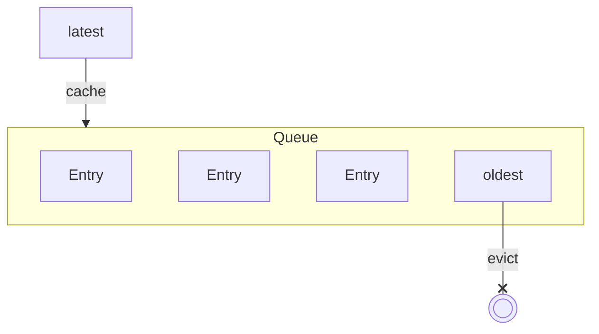
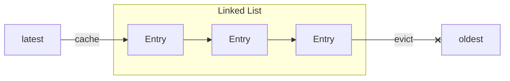
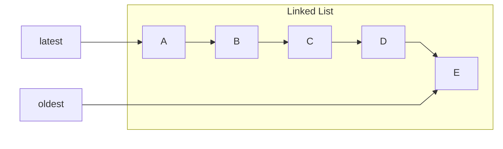
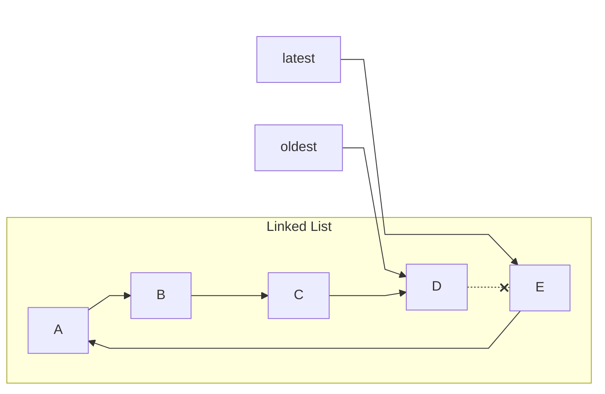
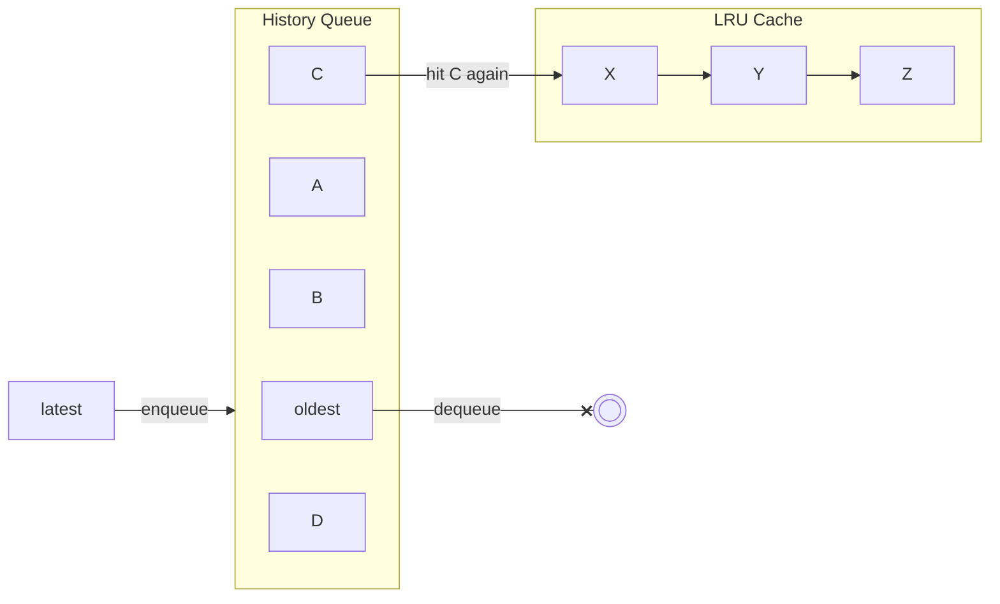
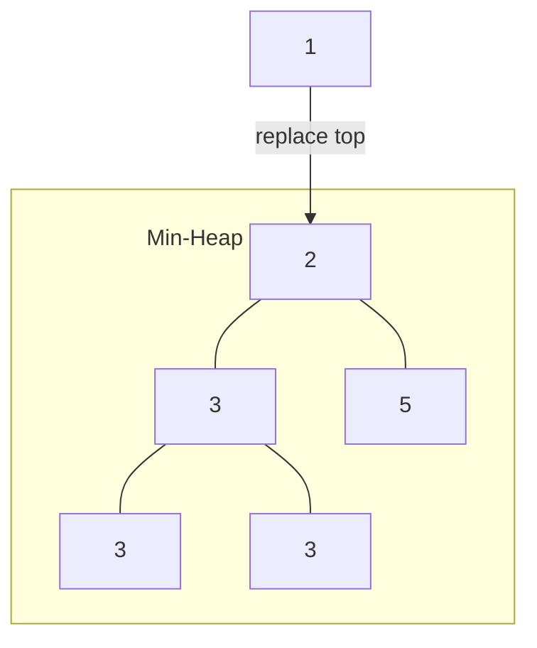
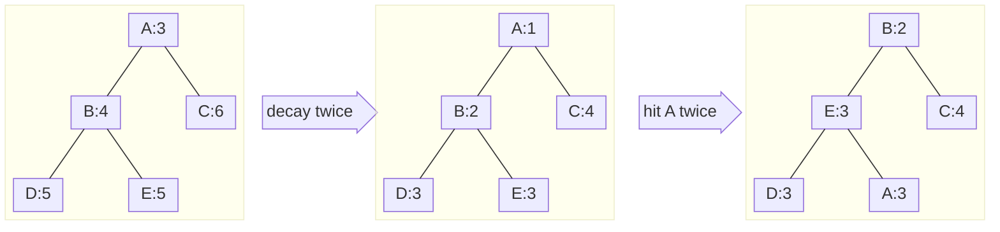
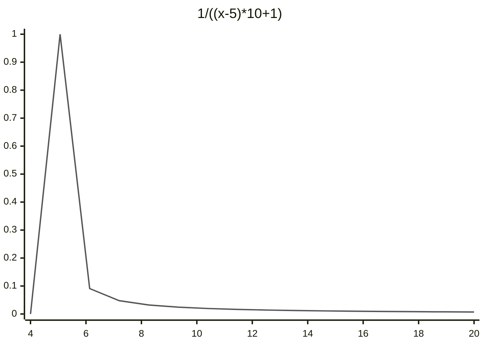

本文从源码层面分析了 redis 的缓存淘汰机制，并在文章末尾描述使用 Java 实现的思路，以供参考。

[comment]:summary

## 相关配置
为了适配用作缓存的场景，redis 支持缓存淘汰（eviction）并提供相应的了配置项：

> **maxmemory**

　设置内存使用上限，该值不能设置为小于 1M 的容量。
　选项的默认值为 0，此时系统会自行计算一个内存上限。

> **maxmemory-policy**

　熟悉 redis 的朋友都知道，每个数据库维护了两个字典：
  - `db.dict`：数据库中所有键值对，也被称作数据库的 **keyspace**
  - `db.expires`：带有生命周期的 key 及其对应的 TTL（存留时间），因此也被称作 **expire set**

　当达到内存使用上限**maxmemory**时，可指定的清理缓存所使用的策略有：
  - **noeviction** 当达到最大内存时直接返回错误，不覆盖或逐出任何数据
  - **allkeys-lfu** 淘汰整个 keyspace 中最不常用的 (LFU) 键 (4.0 或更高版本)
  - **allkeys-lru** 淘汰整个 keyspace 最近最少使用的 (LRU) 键 
  - **allkeys-random** 淘汰整个 keyspace 中的随机键
  - **volatile-ttl** 淘汰 expire set 中 TTL 最短的键
  - **volatile-lfu** 淘汰 expire set 中最不常用的键 (4.0 或更高版本)
  - **volatile-lru** 淘汰 expire set 中最近最少使用的 (LRU) 键
  - **volatile-random** 淘汰 expire set 中的随机键
 
 　当 expire set 为空时，**volatile-* ** 与 **noeviction** 行为一致。

> **maxmemory-samples**

　为了保证性能，redis 中使用的 LRU 与 LFU 算法是一类近似实现。简单来说就是：
算法选择被淘汰记录时，不会遍历所有记录，而是以 **随机采样** 的方式选取部分记录进行淘汰。

　maxmemory-samples 选项控制该过程的采样数量，增大该值会增加 CPU 开销，但算法效果能更逼近实际的 LRU 与 LFU 。

> **lazyfree-lazy-eviction**

　清理缓存就是为了释放内存，但这一过程会阻塞主线程，影响其他命令的执行：
当删除某个巨型记录（比如：包含数百条记录的 list）时，会引起性能问题，甚至导致系统假死。

　**延迟释放** 机制会将巨型记录的内存释放，交由其他线程异步处理，从而提高系统的性能。
开启该选项后，可能出现使用内存超过 maxmemory 上限的情况。


## 缓存淘汰机制

一个完整的缓存淘汰机制需要解决两个问题：
- 确定淘汰哪些记录 —— **淘汰策略**
- 删除被淘汰的记录 —— **删除策略**


### 淘汰策略
缓存能使用的内存是有限的，当空间不足时，应该优先淘汰那些将来不再被访问的数据，保留那些将来还会频繁访问的数据。因此淘汰算法会围绕 **时间局部性** 原理进行设计，即：**如果一个数据正在被访问，那么在近期很可能会被再次访问**。

为了适应缓存读多写少的特点，实际应用中会使用哈希表来实现缓存。当需要实现某种特定的缓存淘汰策略时，需要引入额外的 **簿记（book keeping）** 结构。

下面回顾 3 种最常见的缓存淘汰策略。

#### **FIFO (先进先出)**

　越早进入缓存的数据，其不再被访问的可能性越大。因此在淘汰缓存时，应选择在内存中停留时间最长的缓存记录。

　使用队列即可实现该策略：


　优点：实现简单，适合线性访问的场景

　缺点：无法适应特定的访问热点，缓存的命中率差

　簿记开销：时间 $O(1)$，空间 $O(N)$

#### **LRU (最近最少使用)**

　一个缓存被访问后，近期再被访问的可能性很大。可以记录每个缓存记录的最近访问时间，最近未被访问时间最长的数据会被首先淘汰。

　使用链表即可实现该策略：


　当更新 LRU 信息时，只需调整指针：




　优点：实现简单，能适应访问热点

　缺点：对偶发的访问敏感，影响命中率

　簿记开销：时间 $O(1)$，空间 $O(N)$

##### LRU 改进
　原始的 LRU 算法缓存的是最近访问了 1 次的数据，因此不能很好地区分频繁和不频繁缓存引用。
这意味着，部分冷门的低频数据也可能进入到缓存，并将原本的热点记录挤出缓存。

　为了减少偶发访问对缓存的影响，后续提出的 LRU-K 算法作出了如下改进：
> 在 LRU 簿记的基础上增加一个历史队列 **History Queue**
- 当记录访问次数小于 K 时，会记录在历史队列中（当历史队列满时，可以使用 FIFO 或 LRU 策略进行淘汰）
- 当记录访问次数大于等于 K 时，会被从历史队列中移出，并记录到 LRU 缓存中


　K 值越大，缓存命中率越高，但适应性差，需要经过大量访问才能将过期的热点记录淘汰掉。
综合各种因素后，实践中常用的是 LRU-2 算法：


　优点：减少偶发访问对缓存命中率的影响

　缺点：需要额外的簿记开销

　簿记开销：时间 $O(1)$，空间 $O(N+M)$


#### **LFU (最不经常使用)**

　一个缓存近期内访问频率越高，其再被访问的可能性越大。可以记录每个缓存记录的最近一段时间的访问频率，访问频率低的数据会被首先淘汰。

　实现 LFU 的一个简单方式，是在缓存记录设置一个记录访问次数的计数器，然后将其放入一个小顶堆：


　为了保证数据的时效性，还要以一定的时间间隔对计数器进行衰减，保证过期的热点数据能够被及时淘汰：


### 删除策略
常见删除策略可以分为以下几种：
- 实时删除

  每次增加新的记录时，立即查找可淘汰的记录，如果存在则将该记录从缓存中删除
  - 优点：实时性好，最节省内存空间
  - 缺点：查找淘汰记录会影响写入的效率，需要额外的簿记结构提高查找效率（比如 LRU 中的链表）

- 惰性删除

  在缓存中设置两个计数器，一个统计访问缓存的次数，一个统计可淘汰记录的数量
  每经过 N 次访问后或当前可淘汰记录数量大于 M，则触发一次批量删除（M 与 N 可调节）
  - 优点：对正常缓存操作影响小，批量删除减少维护开销
  - 缺点：实时性较差，偶发的删除操作会导致访问耗时波动

- 异步删除
  
  设置一个独立的定时器线程，每隔固定的时间触发一次批量删除
  - 优点：对正常缓存操作影透明，无额外性能开销
  - 缺点：需要增加维护线程，并且需要提前规划缓存的负载，以此决定如何在多个缓存实例上调度

## redis 实现

redis 中实现了 LRU 与 LFU 两种淘汰策略

为了节省空间，redis 没有使用前面描述的簿记结构实现 LRU 或 LFU，而是在 `robj` 中使用一个 24bits 的空间记录访问信息：
```c
#define LRU_BITS 24

typedef struct redisObject {
    ...
    unsigned lru:LRU_BITS;  /* LRU 时间 (相对与全局 lru_clock 的时间) 或
                             * LFU 数据 (8bits 记录访问频率，16 bits 记录访问时间). */
} robj;
```

每当记录被命中时，redis 都会更新 `robj.lru` 作为后面淘汰算法运行的依据：
```c
robj *lookupKey(redisDb *db, robj *key, int flags) {
    // ...

    // 根据 maxmemory_policy 选择不同的更新策略
    if (server.maxmemory_policy & MAXMEMORY_FLAG_LFU) {
        updateLFU(val);
    } else {
        val->lru = LRU_CLOCK();
    }
}
```

LFU 与 LRU 的更新关键在于 `updateLFU` 函数与 `LRU_CLOCK` 宏，下面分别进行分析。

### 更新 LRU 时间
当时使用 LRU 算法时，`robj.lru` 记录的是最近一次访问的时间戳，可以据此找出长时间未被访问的记录。

为了减少系统调用，redis 设置了一个全局的时钟 `server.lruclock` 并交由后台任务进行更新：
```c
#define LRU_CLOCK_MAX ((1<<LRU_BITS)-1) /* Max value of obj->lru */
#define LRU_CLOCK_RESOLUTION 1000 /* 以毫秒为单位的时钟精度 */

/**
 * server.lruclock 的更新频率为 1000/server.hz
 * 如果该频率高于 LRU 时钟精度，则直接用 server.lruclock
 * 避免调用 getLRUClock() 产生额外的开销
 */
#define LRU_CLOCK() ((1000/server.hz <= LRU_CLOCK_RESOLUTION) ? server.lruclock : getLRUClock())

unsigned int getLRUClock(void) {
    return (mstime()/LRU_CLOCK_RESOLUTION) & LRU_CLOCK_MAX;
}
```

计算 LRU 时间方法如下：
```c
unsigned long long estimateObjectIdleTime(robj *o) {
    unsigned long long lruclock = LRU_CLOCK();
    if (lruclock >= o->lru) {
        return (lruclock - o->lru) * LRU_CLOCK_RESOLUTION;
    } else {
        // 处理 LRU 时间溢出的情况
        return (lruclock + (LRU_CLOCK_MAX - o->lru)) *
                    LRU_CLOCK_RESOLUTION;
    }
}
```
当`LRU_CLOCK_RESOLUTION`为 1000ms 时，`robj.lru`最长可记录的 LRU 时长为 194 天（0xFFFFFF / 3600 / 24）。


### 更新 LFU 计数
当时使用 LFU 算法时，`robj.lru` 被分为两部分：16bits 记录最近一次访问时间，8bits 用作计数器
```c
void updateLFU(robj *val) {
    unsigned long counter = LFUDecrAndReturn(val); // 衰减计数
    counter = LFULogIncr(counter); // 增加计数
    val->lru = (LFUGetTimeInMinutes()<<8) | counter; // 更新时间
}
```

#### 更新访问时间
前 16bits 用于保存最近一次被访问的时间：
```c
/**
 * 获取 UNIX 分钟时间戳，且只保留最低 16bits
 * 用于表示最近一次衰减时间 LDT (last decrement time)
 */
unsigned long LFUGetTimeInMinutes(void) {
    return (server.unixtime/60) & 65535;
}
```

#### 增加访问计数
后 8bits 是一个**对数计数器（logarithmic counter）**，里面保存的是访问次数的对数：
```c
#define LFU_INIT_VAL 5 

 // 对数递增计数器，最大值为 255
uint8_t LFULogIncr(uint8_t counter) {
    if (counter == 255) return 255;
    double r = (double)rand()/RAND_MAX;
    double baseval = counter - LFU_INIT_VAL;
    if (baseval < 0) baseval = 0;
    double p = 1.0/(baseval*server.lfu_log_factor+1);
    if (r < p) counter++;
    return counter;
}
```
当 `server.lfu_log_factor = 10` 时，`p = 1/((counter-LFU_INIT_VAL)*server.lfu_log_factor+1)` 的增长函数如图所示：


使用函数 `rand()` 生成的介于 0 与 1 之间随机浮点数 `r` 符合均匀分布，随着 `counter` 的增大，其自增成功的概率迅速降低。

下列表格展示了 `counter` 在不同 `lfu_log_factor` 情况下，达到饱和（255）所需的访问次数：

```text
+--------+------------+------------+------------+------------+------------+
| factor | 100 hits   | 1000 hits  | 100K hits  | 1M hits    | 10M hits   |
+--------+------------+------------+------------+------------+------------+
| 0      | 104        | 255        | 255        | 255        | 255        |
+--------+------------+------------+------------+------------+------------+
| 1      | 18         | 49         | 255        | 255        | 255        |
+--------+------------+------------+------------+------------+------------+
| 10     | 10         | 18         | 142        | 255        | 255        |
+--------+------------+------------+------------+------------+------------+
| 100    | 8          | 11         | 49         | 143        | 255        |
+--------+------------+------------+------------+------------+------------+
```

#### 衰减访问计数
同样的，为了保证过期的热点数据能够被及时淘汰，redis 使用如下衰减函数：
```c
// 计算距离上一次衰减的时间 ，单位为分钟
unsigned long LFUTimeElapsed(unsigned long ldt) {
    unsigned long now = LFUGetTimeInMinutes();
    if (now >= ldt) return now-ldt;
    return 65535-ldt+now;
}

/**
 * 衰减函数，返回根据 LDT 时间戳衰减后的 LFU 计数
 * 不更新计数器
 */
unsigned long LFUDecrAndReturn(robj *o) {
    unsigned long ldt = o->lru >> 8;
    unsigned long counter = o->lru & 255;
    /**
    * 衰减因子 server.lfu_decay_time 用于控制计数器的衰减速度
    * 每过 server.lfu_decay_time 分钟访问计数减 1
    * 默认值为 1
    */
    unsigned long num_periods = server.lfu_decay_time ? LFUTimeElapsed(ldt) / server.lfu_decay_time : 0;
    if (num_periods)
        counter = (num_periods > counter) ? 0 : counter - num_periods;
    return counter;
}
```
16bits 最多能保存的分钟数，换算成天数约为 45 天，因此 LDT 时间戳每隔 45 天就会重置一次。


### 执行删除

每当客户端执行命令产生新数据时，redis 会检查内存使用是否超过 **maxmemory**，如果超过则尝试根据 **maxmemory_policy** 淘汰数据：

```c
// redis 处理命令的主方法，在真正执行命令前，会有各种检查，包括对OOM情况下的处理:
int processCommand(client *c) {

    // ...

    // 设置了 maxmemory 时，如果有必要，尝试释放内存(evict)
    if (server.maxmemory && !server.lua_timedout) {
        int out_of_memory = (performEvictions() == EVICT_FAIL);
        
        // ...

        // 如果释放内存失败，并且当前将要执行的命令不允许OOM（一般是写入类命令）
        if (out_of_memory && reject_cmd_on_oom) {
            rejectCommand(c, shared.oomerr); // 向客户端返回OOM
            return C_OK;
        }
    }
}
```
实际执行删除的是 `performEvictions` 函数：
```c
int performEvictions(void) {
    // 循环，尝试释放足够大的内存
    while (mem_freed < (long long)mem_tofree) {
        
        // ...

        if (server.maxmemory_policy & (MAXMEMORY_FLAG_LRU|MAXMEMORY_FLAG_LFU) ||
            server.maxmemory_policy == MAXMEMORY_VOLATILE_TTL)
        {

            /**
            * redis 使用的是近似 LRU / LFU 算法
            * 在淘汰对象时不会遍历所有记录，而是对记录进行采样
            * EvictionPoolLRU 被用于临时存储应该被优先淘汰的样本数据
            */
            struct evictionPoolEntry *pool = EvictionPoolLRU;
            
            // 根据配置的 maxmemory-policy，拿到一个可以释放掉的bestkey
            while(bestkey == NULL) {
                unsigned long total_keys = 0, keys;

                // 遍历所有的 db 实例
                for (i = 0; i < server.dbnum; i++) {
                    db = server.db+i;
                    dict = (server.maxmemory_policy & MAXMEMORY_FLAG_ALLKEYS) ?
                            db->dict : db->expires;
                    // 根据 policy 选择采样的集合（keyspace 或 expire set）
                    if ((keys = dictSize(dict)) != 0) {
                        // 采样并填充 pool
                        evictionPoolPopulate(i, dict, db->dict, pool);
                        total_keys += keys;
                    }
                }

                // 遍历 pool 中的记录，释放内存
                for (k = EVPOOL_SIZE-1; k >= 0; k--) {
                    if (pool[k].key == NULL) continue;
                    bestdbid = pool[k].dbid;

                    if (server.maxmemory_policy & MAXMEMORY_FLAG_ALLKEYS) {
                        de = dictFind(server.db[pool[k].dbid].dict, pool[k].key);
                    } else {
                        de = dictFind(server.db[pool[k].dbid].expires, pool[k].key);
                    }

                    // 将记录从 pool 中剔除
                    if (pool[k].key != pool[k].cached)
                        sdsfree(pool[k].key);
                    pool[k].key = NULL;
                    pool[k].idle = 0;

                    if (de) {
                        // 提取该记录的 key
                        bestkey = dictGetKey(de);
                        break;
                    } else {
                        /* Ghost... Iterate again. */
                    }
                }
            }
        }

        // 最终选中了一个 bestkey
        if (bestkey) {

            // 如果配置了 lazyfree-lazy-eviction，尝试异步删除
            if (server.lazyfree_lazy_eviction)
                dbAsyncDelete(db,keyobj);
            else
                dbSyncDelete(db,keyobj);
            
            // ...

        } else {
            goto cant_free; /* nothing to free... */
        }
    }
}
```

负责采样的 `evictionPoolPopulate` 函数：
```c
#define EVPOOL_SIZE 16
#define EVPOOL_CACHED_SDS_SIZE 255
struct evictionPoolEntry {
    unsigned long long idle;    /* LRU 空闲时间 / LFU 频率倒数（优先淘汰该值较大的记录） */
    sds key;                    /* 参与淘汰筛选的键 */
    sds cached;                 /* 键名缓存 */
    int dbid;                   /* 数据库ID */
};

// evictionPool 数组用于辅助 eviction 操作
static struct evictionPoolEntry *evictionPoolEntry;

/**
 * 在给定的 sampledict 集合中进行采样
 * 并将其中应该被淘汰的记录记录至 evictionPool
 */
void evictionPoolPopulate(int dbid, dict *sampledict, dict *keydict, struct evictionPoolEntry *pool) {
    int j, k, count;
    dictEntry *samples[server.maxmemory_samples];

    // 从 sampledict 中随机获取 maxmemory_samples 个样本数据
    count = dictGetSomeKeys(sampledict,samples,server.maxmemory_samples);

    // 遍历样本数据
    for (j = 0; j < count; j++) {
        // 根据 maxmemory_policy 计算样本空闲时间 idle
        if (server.maxmemory_policy & MAXMEMORY_FLAG_LRU) {
            idle = estimateObjectIdleTime(o);
        } else if (server.maxmemory_policy & MAXMEMORY_FLAG_LFU) {
            idle = 255-LFUDecrAndReturn(o);
        } else {
            // ...
        }

        k = 0; // 根据 idle 定位样本在 evictionPool 中的索引（样本按照 idle 升序）
        while (k < EVPOOL_SIZE && pool[k].key && pool[k].idle < idle) k++;
        
        if (k == 0 && pool[EVPOOL_SIZE-1].key != NULL) {
            // 样本空闲时间不够长，不参与该轮 eviction
            continue;
        } else if (k < EVPOOL_SIZE && pool[k].key == NULL) {
            // 样本对应的位置为空，可以直接插入至该位置
        } else {
           // 样本对应的位置已被占用，移动其他元素空出该位置
        }

        // ...
        
        // 将样本数据插入其对应的位置 k 
        int klen = sdslen(key);
        if (klen > EVPOOL_CACHED_SDS_SIZE) {
            pool[k].key = sdsdup(key);
        } else {
           // 如果 key 长度不超过 EVPOOL_CACHED_SDS_SIZE，则复用 sds 对象
        }
        pool[k].idle = idle;
        pool[k].dbid = dbid;
    }
}
```

## Java 实现
在了解以上知识后，尝试使用 Java 实现 **线程安全** 的淘汰策略。

### 确定簿记结构
在一个多线程安全的缓存中，很重要的一点是减少簿记：
- 一方面避免额外状态的维护开销
- 另一方面可以减少系统处于不一致状态的边界情况

因此参考 redis 使用计数器来记录访问模式：
```java
/**
 * 缓存记录
 */
public abstract class CacheEntry {

    // CAS Updater
    private static final AtomicLongFieldUpdater<CacheEntry>
            TTL_UPDATER = AtomicLongFieldUpdater.newUpdater(CacheEntry.class, "ttl");

    // 缓存记录的剩余存活时间（无符号长整数）
    private volatile long ttl;

    protected CacheEntry(long ttl) {
        this.ttl = ttl;
    }

    public long ttl() {
        return ttl;
    }

    // 支持并发更新 TTL
    public boolean casTTL(long old, long ttl) {
        return TTL_UPDATER.compareAndSet(this, old, ttl);
    }

}
```
```java
/**
 * 淘汰策略
 */
public interface EvictStrategy {

    // 更新缓存记录的 TTL
    void updateTTL(CacheEntry node);

    // 根据当前时间戳，计算缓存记录的 TTL
    long weightTTL(CacheEntry node, long now);

}
```

### 确定删除策略
受限于簿记结构，redis 只能通过采样来规避大量的遍历，减少 **实时删除** 策略对主线程的阻塞。
而在对于内存限制没那么严谨的情况下，可以使用 **懒惰删除** 策略，减少单次请求的开销：
```java

public abstract class EvictableCache {

    EvictStrategy evicting; // 淘汰策略

    /**
     * 在读写缓存记录时，更新该记录的 TTL
     * @param entry 最近被访问的缓存记录
     */
    void accessEntry(CacheEntry entry) {
        evicting.updateTTL(entry);
    }

    /**
     * 批量淘汰缓存
     * @param evictSamples 缓存样本
     * @param evictNum 最大淘汰数量
     * @return 应该被淘汰的记录
     */
    Collection<CacheEntry> evictEntries(Iterable<CacheEntry> evictSamples, int evictNum) {

        // 比较两个 CacheEntry 的 TTL（优先淘汰 TTL 较小的记录）
        Comparator<CacheEntry> comparator = new Comparator<CacheEntry>() {
            final long now = System.currentTimeMillis();
            public int compare(CacheEntry o1, CacheEntry o2) {
                long w1 = evicting.weightTTL(o1, now);
                long w2 = evicting.weightTTL(o2, now);
                return -Long.compareUnsigned(w1, w2);
            }
        };

        // 使用大顶堆记录 TTL 最小的 K 个 CacheEntry
        PriorityQueue<CacheEntry> evictPool = new PriorityQueue<>(evictNum, comparator);

        Iterator<CacheEntry> iterator = evictSamples.iterator();
        while (iterator.hasNext()) {
            CacheEntry entry = iterator.next();
            if (evictPool.size() < evictNum) {
                evictPool.add(entry);
            } else {
                // 如果 CacheEntry 的 TTL 小于堆顶记录
                // 则弹出堆顶记录，并将 TTL 更小的记录放入堆中
                CacheEntry top = evictPool.peek();
                if (comparator.compare(entry, top) < 1) {
                    evictPool.poll();
                    evictPool.add(entry);
                }
            }
        }

        return evictPool;
    }
}
```

### 实现淘汰策略

#### FIFO 策略
```java
/**
 * FIFO 策略
 */
public class FirstInFirstOut implements EvictStrategy {

    // 计数器，每发生一次访问操作自增 1
    private final AtomicLong counter = new AtomicLong(0);

    // 第一次访问时才更新 TTL
    public void updateTTL(CacheEntry node) {
        node.casTTL(0, counter.incrementAndGet());
    }

    // 返回第一次被访问的序号
    public long weightTTL(CacheEntry node, long now) {
        return node.ttl();
    }

}
```
#### LRU 策略
```java

/**
 * LRU-2 策略
 */
public class LeastRecentlyUsed implements EvictStrategy {

    // 逻辑时钟，每发生一次访问操作自增 1
    private final AtomicLong clock = new AtomicLong(0);

    /**
     * 更新 LRU 时间
     */
    public void updateTTL(CacheEntry node) {
        long old = node.ttl();
        long tick = clock.incrementAndGet();
        long flag = old == 0 ? Long.MIN_VALUE: 0;
        // flag = Long.MIN_VALUE 表示放入 History Queue
        // flag = 0              表示放入 LRU Cache
        long ttl = (tick & Long.MAX_VALUE) | flag;
        while ((old & Long.MAX_VALUE) < tick && ! node.casTTL(old, ttl)) {
            old = node.ttl();
            ttl = tick & Long.MAX_VALUE; // CAS 失败说明已经是二次访问
        }
    }

    /**
     * 根据 LRU 时间计算 TTL
     */
    public long weightTTL(CacheEntry node, long now) {
        long ttl = node.ttl();
        return -1L - ttl;
    }

}
```
#### LFU 策略
```java

/**
 * LFU-AgeDecay 策略
 */
public class LeastFrequentlyUsed implements EvictStrategy {

    private static final int TIMESTAMP_BITS = 40; // 40bits 记录访问时间戳（保证 34 年不溢出）
    private static final int FREQUENCY_BITS = 24; // 24bits 作为对数计数器（可以忽略计数溢出的情况）

    private final long ERA = System.currentTimeMillis();  // 起始时间（记录相对于该值的时间戳）
    private final double LOG_FACTOR = 1;                  // 对数因子
    private final TimeUnit DECAY_UNIT = TimeUnit.MINUTES; // 时间衰减单位

    /**
     * 更新 LFU 计数器与访问时间
     * 与 redis 不同，更新时不会对计数进行衰减
     */
    public void updateTTL(CacheEntry node) {

        final long now = System.currentTimeMillis();

        long old = node.ttl();
        long timestamp = old >>> FREQUENCY_BITS;
        long frequency = old & (~0L >>> TIMESTAMP_BITS);

        // 计算访问时间
        long elapsed = Math.min(~0L >>> FREQUENCY_BITS, now - ERA);
        while (timestamp < elapsed) {
            // 增加访问计数
            double rand = ThreadLocalRandom.current().nextDouble();
            if (1./(frequency * LOG_FACTOR + 1) > rand) {
                frequency++;
                frequency &= (~0L >>> TIMESTAMP_BITS);
            }
            // 更新 TTL
            long ttl = elapsed << FREQUENCY_BITS | frequency & (~0L >>> TIMESTAMP_BITS);
            if (node.casTTL(old, ttl)) {
                break;
            }
            old = node.ttl();
            timestamp = old >>> FREQUENCY_BITS;
            frequency = old & (~0L >>> TIMESTAMP_BITS);
        }
    }

    /**
     * 返回衰减后的 LFU 计数
     */
    public long weightTTL(CacheEntry node, long now) {
        long ttl = node.ttl();
        long timestamp = ttl >>> FREQUENCY_BITS;
        long frequency = ttl & (~0L >>> TIMESTAMP_BITS);
        long decay = DECAY_UNIT.toMinutes(Math.max(now - ERA, timestamp) - timestamp);
        return frequency - decay;
    }

}
```

