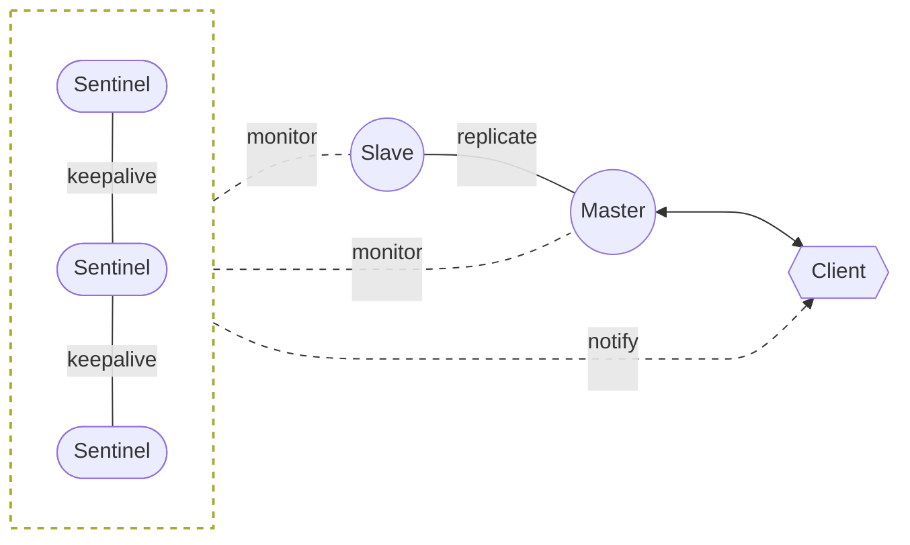
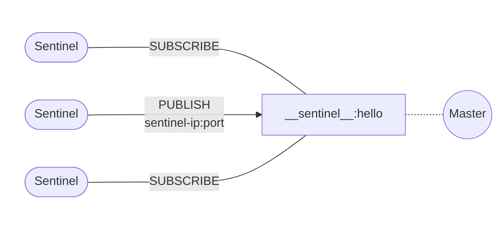
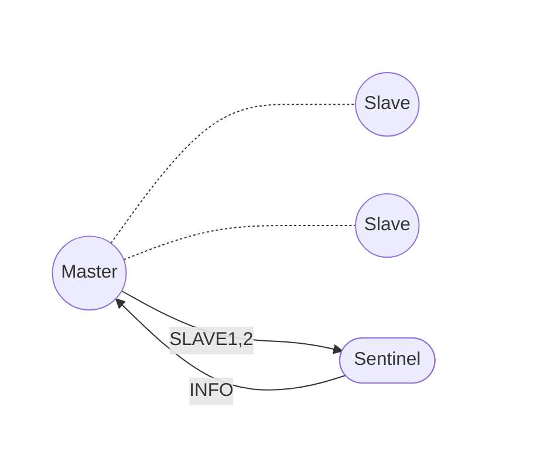
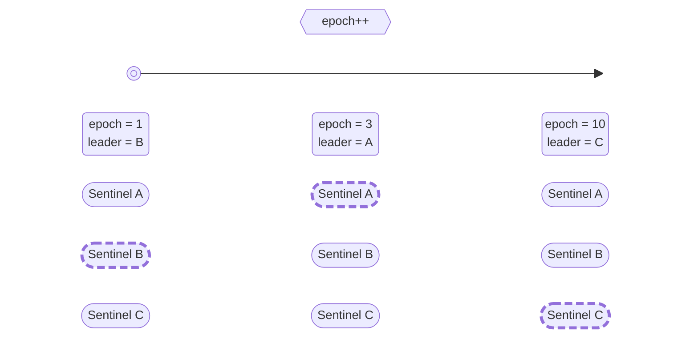

Redis Sentinel 是 Redis 的一个分布式监控系统，可以并发现主节点宕机时自动执行故障转移，将请求流量转发至健康的从节点。

[comment]:summary

哨兵机制是 Redis 高可用中重要的一环，其核心是 **通过高可用哨兵集群，监控主从复制的健康状态，并实现自动灾备**：



哨兵集群以集群的方式进行部署，这种分布式特性具有以下优点：
- 避免系统中存在单点，防止灾备机制失效
- 切换 master 必须经过多个 sentinel 节点协商同意，避免出现误判

为了保证 Redis 服务的高可用，哨兵机制提供了以下功能：
- 监控(Monitoring)：实时监控主从节点的健康状况
- 通知(Notification)：通过事件 API 将服务实例异常情况即时告知监听者
- 自动灾备(Automatic failover)：当 master 节点失效时从 slave 中选举出新的 master
- 服务发现(Configuration provider)：客户端通过哨兵集群获取 master 实例信息，在发生自动灾备时能及时将 master 变化告知客户端


## 相关配置

### 配置项

建立哨兵集群的配置相对简单，只需配置以下选项即可：

> **sentinel monitor &lt;master-name&gt; &lt;ip&gt; &lt;port&gt; &lt;quorum&gt;**

　需要监控的 master 节点的信息（由于 sentinel 会自动发现 slave 节点信息，因此无需配置）
- **master-name** 用于区分不同的 master 节点，会被用于 master 发现
- **quorum** 是启动故障转移`failover`时，所需的最小 sentinel 数量

　故障转移前需要选举出一个 leader 节点执行 master 切换，为了达成共识，该过程必须有半数以上的节点 **majority** 参与。

　假设当前哨兵集群总共有 **m** 个节点，当 **quorum** 设置为  **n** 时（**n** &le; **m**）：
- 若同时有 n 个节点判断当前 master 已经下线，则其中的某个 sentinel 会尝试发起故障转移
- 实际执行故障转移需要进行 leader 选举，因此仅当集群中至少有 m/2 以上的 sentinel 节点可用时，故障转移才可能启动

　简而言之，**quorum** 仅影响故障检测流程，用于控制发起故障转移的时机，但是无法决定 failover 是否会被执行。
　因此，哨兵实例应不少于 3 个，否则一旦某个哨兵节点失效后，即便 **quorum** 设置为 1，依然无法启动 faiover。

> **sentinel down-after-milliseconds &lt;master-name&gt; &lt;milliseconds&gt;**

　当某个 redis 节点超过该时间无法正常响应（对 PING 请求没有响应或返回错误码），sentinel 会认为其已经下线

> **sentinel parallel-syncs &lt;master-name&gt; &lt;numslaves&gt;**

　将 slave 中的某个节点中提升为 master 后，剩余节点立即重连新 master 的数量

　重新同步会导致 slave 节点从 master 批量同步数据，间接会造成 slave 的短暂停顿。
　假如当前总共有 **m** 个 slave 节点，当 **parallel-syncs** 设置为 **n** 时，则 failover 会将 slave 分为 **m/n** 批进行调整。
　该值越小，则 failover 所需的时间越长，但对访问 slave 客户端的影响越小。


> **sentinel failover-timeout &lt;master-name&gt; &lt;milliseconds&gt;**

　故障转移对重试间隔，默认值为 3min，该选项会影响：
  - sentinel 对同个 master 发起 failover 后，再次重试的时间间隔 (2 * **failover-timeout**)
  - sentinel 发现 salve 配置过期后，将其指向新的 master 所需的时间
  - 取消一个正在进行的 failover 流程所需的时间
  - failover 等待 slave 重连新 master 完成的时间


### 配置发现
仔细观察哨兵配置时，会发现缺失了 **其他哨兵节点信息** 与 **从节点信息**。
这是因为哨兵机制本身支持配置发现，每个哨兵节点能够自行从监控的 master 节点处获取到上面两项信息：


#### 哨兵发现


哨兵利用了 Redis 的 **发布/订阅** 实现来实现互相通信，哨兵和主库建立连接后：
- 向主库上名为 `__sentinel__:hello` 的频道发布消息，将自己的 IP 和端口告知其他节点
- 订阅 `__sentinel__:hello` 消息，获得其他哨兵发布的连接信息

当多个哨兵实例都在主库上做了发布和订阅操作后，它们互相感知到彼此的 IP 地址和端口。
因此扩容哨兵集群十分简单，只需要启动一个新的哨兵节点即可，剩余的操作交由自动发现机制完成即可。

#### 从库发现


哨兵向主库发送 `INFO` 命令，主库接受到这个命令后，就会把从库列表返回给哨兵。
然后哨兵根据从库列表中的连接信息，和每个从库建立连接，并在这个连接上持续地对从库进行监控。
同时，哨兵也会向从库发送 `INFO` 命令以获取以下信息：
- **run_id :** 从库的运行ID
- **slave_priority :** 从库的优先级
- **slave_repl_offset :** 从库的复制偏移量

#### 节点下线
哨兵永远不会忘记已经见过的节点，无论这个节点是哨兵还是从库。如果需要下线集群中的节点时，需要用到`SENTINEL RESET`命令：
- 当需要下线哨兵节点时，首先停止该节点进程，然后在剩余哨兵节点上执行`SENTINEL RESET *`更新集群信息
- 当需要下线某个 master 的从库时，首先停止该节点进程，然后在所有哨兵节点上执行`SENTINEL RESET <master-name>`更新监控列表


## 状态监控

为了保证主库的可用性，哨兵集群会以一定的间隔向主从库发送`PING`命令，并根据命令的返回结果判断主库是否健康：
- 返回值为`+PONG`、`-LOADING`或`-MASTERDOWN`，则认为这个节点健康
- 返回其他值或没有响应，则认为这个节点不健康

不健康的状态持续超过 `down-after-milliseconds`，则认为这个节点已经下线。

还有一种特殊情况：某个本应是 master 的节点，在`INFO`命令返回值中将自己标榜为 slave，那么哨兵也会认为该节点已经下线。

为了降低误判率，哨兵集群将节点下线分为两个阶段：
- 主观下线`SDOWN`：某个 sentinel 实例认为该节点已经下线
- 客观下线`ODOWN`：某个 sentinel 通过 `SENTINEL is-master-down-by-addr` 命令向其他节点询问，发现同时有 **quorum** 个 sentinel 实例认为该节点已经下线

只有 master 节点会被标记为`ODOWN`，并且仅当 master 节点被标记为`ODOWN`时才肯会触发 failover 流程。而 slave 与 sentinel 节点仅会被标记为`SDOWN`。


## 故障转移
故障转移过程被设计为一个异步的状态机，其主要步骤如下：
```c
void sentinelFailoverStateMachine(sentinelRedisInstance *ri) {
    serverAssert(ri->flags & SRI_MASTER);

    if (!(ri->flags & SRI_FAILOVER_IN_PROGRESS)) return;

    switch(ri->failover_state) {
        // 选举 leader
        case SENTINEL_FAILOVER_STATE_WAIT_START:
            sentinelFailoverWaitStart(ri);
            break;
        // 从已下线 master 的 slave 中挑选出一个候选节点
        case SENTINEL_FAILOVER_STATE_SELECT_SLAVE:
            sentinelFailoverSelectSlave(ri);
            break;
        // 向候选节点发送 SLAVEOF NO ONE 命令将其转化为 master 节点
        case SENTINEL_FAILOVER_STATE_SEND_SLAVEOF_NOONE:
            sentinelFailoverSendSlaveOfNoOne(ri);
            break;
        // 通过 INFO 命令检查新的 master 节点是否已经就绪
        case SENTINEL_FAILOVER_STATE_WAIT_PROMOTION:
            sentinelFailoverWaitPromotion(ri);
            break;
        // 向剩余的 slave 节点发送 SLAVEOF 命令指向新的 master
        case SENTINEL_FAILOVER_STATE_RECONF_SLAVES:
            sentinelFailoverReconfNextSlave(ri);
            break;
    }
}
```

### 选举 leader
当 master 被判断为客观下线时，会触发一次故障转移。为了保证系统最终能够收敛于一致的状态，每次对主从配置进行修改前，都会将变更关联到一个全局唯一的单调递增版本号 —— 配置纪元`epoch`：**epoch 较小的变更会被更大的变更覆盖，从而保证来并发修改的分布式一致性**。

此外，哨兵集群每个会为每个`epoch`选举出一个 leader 来实施配置变更，避免发生不必要的故障转移：




选举通过命令`SENTINEL IS-MASTER-DOWN-BY-ADDR <ip> <port> <current-epoch> <runid>`完成：
```c
char *sentinelVoteLeader(sentinelRedisInstance *master, uint64_t req_epoch, char *req_runid, uint64_t *leader_epoch) {

    // 如果投票请求的 epoch 比已知更大，则更新本地的 epoch
    if (req_epoch > sentinel.current_epoch) {
        sentinel.current_epoch = req_epoch;
        sentinelFlushConfig();
        sentinelEvent(LL_WARNING,"+new-epoch",master,"%llu",
            (unsigned long long) sentinel.current_epoch);
    }

    // 如果投票请求的的 epoch 比当前 leader 更大
    if (master->leader_epoch < req_epoch && sentinel.current_epoch <= req_epoch)
    {
        // 根据 FCFS 原则，增将 epoch 的票投给该 sentinel
        sdsfree(master->leader);
        master->leader = sdsnew(req_runid);
        master->leader_epoch = sentinel.current_epoch;
        sentinelFlushConfig();
        sentinelEvent(LL_WARNING,"+vote-for-leader",master,"%s %llu",
            master->leader, (unsigned long long) master->leader_epoch);

        // 如果是接收到来自其他 sentinel 的投票请求，则更新 failover 开始时间
        // 避免本实例在 failover timeout 时间内触发不必要的投票
        if (strcasecmp(master->leader,sentinel.myid))
            master->failover_start_time = mstime()+rand()%SENTINEL_MAX_DESYNC;
    } 

    // 小于 sentinel.current_epoch 的请求会被忽略

    // 更新 leader 信息
    *leader_epoch = master->leader_epoch;
    return master->leader ? sdsnew(master->leader) : NULL;
}
```

该选举流程是 [**Raft**](/zh/consistency-with-raft) 协议的简化版，有兴趣的朋友可以深入了解。

### 筛选 slave
为了保证新的 master 拥有最新的状态，leader 会排除以下 slave 节点：
- 排除所有处于主观下线状态的节点（节点健康）
- 排除最近 5 秒内没有响应 leader 发出 INFO 命令的节点（通信正常）
- 排除与原 master 断线时间超过 `down-after-milliseconds * 10` 的节点（副本较新）

最后，按照 **slave_priority**、**slave_repl_offset**、**run_id** 对进行排序，选择其中**优先级最高、偏移量最大、运行ID最小**的节点作为新的 master。

### 提升 master
首先调用`sentinelFailoverSendSlaveOfNoOne`提升候选节点为 master：
```c
void sentinelFailoverSendSlaveOfNoOne(sentinelRedisInstance *ri) {
    int retval;

    // 如果候选节点不可用，则一直尝试直到 failover 超时
    if (ri->promoted_slave->link->disconnected) {
        if (mstime() - ri->failover_state_change_time > ri->failover_timeout) {
            sentinelEvent(LL_WARNING,"-failover-abort-slave-timeout",ri,"%@");
            sentinelAbortFailover(ri);
        }
        return;
    }

    // 发送 SLAVEOF ON ONE 命令并等待其转化为 master
    retval = sentinelSendSlaveOf(ri->promoted_slave,NULL,0);
    if (retval != C_OK) return;
    sentinelEvent(LL_NOTICE, "+failover-state-wait-promotion",
        ri->promoted_slave,"%@");
    ri->failover_state = SENTINEL_FAILOVER_STATE_WAIT_PROMOTION;
    ri->failover_state_change_time = mstime();
}
```
之后调用`sentinelFailoverReconfNextSlave`令剩余 slave 复制新的 master 节点：
```c
void sentinelFailoverReconfNextSlave(sentinelRedisInstance *master) {
    // ...

    // 批量调整 slave 节点，并保证每批数量不超过 parallel syncs 配置
    di = dictGetIterator(master->slaves);
    while(in_progress < master->parallel_syncs &&
          (de = dictNext(di)) != NULL)
    {
        sentinelRedisInstance *slave = dictGetVal(de);
        int retval;

        // 跳过调整完成的节点
        if (slave->flags & (SRI_PROMOTED|SRI_RECONF_DONE)) continue;

        // 如果 slave 长时间没有完成配置修改，则依然认为已经完成
        // 哨兵节点会在后续流程中检测出配置异常并进行修复
        if ((slave->flags & SRI_RECONF_SENT) &&
            (mstime() - slave->slave_reconf_sent_time) >
            SENTINEL_SLAVE_RECONF_TIMEOUT)
        {
            sentinelEvent(LL_NOTICE,"-slave-reconf-sent-timeout",slave,"%@");
            slave->flags &= ~SRI_RECONF_SENT;
            slave->flags |= SRI_RECONF_DONE;
        }

        // 跳过已发出过命令或已经下线的 slave 节点
        if (slave->flags & (SRI_RECONF_SENT|SRI_RECONF_INPROG)) continue;
        if (slave->link->disconnected) continue;

        // 发送 SLAVEOF 令其复制新的 master
        retval = sentinelSendSlaveOf(slave,
                master->promoted_slave->addr->ip,
                master->promoted_slave->addr->port);
        if (retval == C_OK) {
            slave->flags |= SRI_RECONF_SENT;
            slave->slave_reconf_sent_time = mstime();
            sentinelEvent(LL_NOTICE,"+slave-reconf-sent",slave,"%@");
            in_progress++;
        }
    }
    
    // 检查是否已经完成所有 slave 的配置修改
    sentinelFailoverDetectEnd(master);
}
```

当已下线的 master 再次上线时，哨兵节点会检测出其配置已经失效，并会将其作为 slave 对待，令其复制新的 master 数据。这也意味着该节点上未被同步到新 master 的那部分数据会永远丢失。

为了减少数据丢失，可以配合参数`min-replicas-to-write`与`min-replicas-max-lag`阻止客户端向失去 slave 的 master 节点写入数据。

## 事件API
为了方便客户端感知集群状态变化，哨兵集群定义了一系列的事件`event`，客户端可以通过订阅 sentinel 节点上与这些事件同名的 channel 来监听状态变化。

大部分事件的内容格式如下（**@** 之后的部分是可选的）：
```text
<instance-type> <name> <ip> <port> @ <master-name> <master-ip> <master-port>
```
这里列出部分可供监听事件：
- **switch-master :** 最新的 master 节点信息，其内容为 **&lt;master-name&gt; &lt;oldip&gt; &lt;oldport> &lt;newip&gt; &lt;newport&gt;**
- **+sdown :** 某节点进入主观下线状态
- **-sdown :** 某节点退出主观下线状态
- **+odown :** 某节点进入客观下线状态
- **-odown :** 某节点退出客观下线状态
- **+tilt :** 哨兵集群进入 TILT 模式
- **-tilt :** 哨兵集群退出 TILT 模式
- **+reset-master :** 重置了某个 master-name 下的监控信息
- **+failover-detected :** 感知到故障转移（可能是由 sentinel 发起的，也可能是人工将某个 slave 节点提升为 master）
- **failover-end :** 故障转移结束，并且所有 slave 已经指向新 master
- **failover-end-for-timeout :** 故障转移结束超时，部分 slave 未指向新 master，集群状态尚需时间完成收敛

如果需要订阅所有事件，只需要执行命令`PSUBSCRIBE *`即可。

### JedisSentinelPool
为了加深印象，下面通过分析 **jedis-3.3.0** 中 `JedisSentinelPool` 的源码来观察如何使用事件 API。

`JedisSentinelPool`启动时调用初始化函数`initSentinels`获取 master 信息：
```java
private HostAndPort initSentinels(Set<String> sentinels, final String masterName) {
  HostAndPort master = null;
  
  // 遍历 sentinel 信息并建立连接
  for (String sentinel : sentinels) {
    final HostAndPort hap = HostAndPort.parseString(sentinel);

    Jedis jedis = null;
    try {
      jedis = new Jedis(hap.getHost(), hap.getPort(), sentinelConnectionTimeout, sentinelSoTimeout);
      // ...

      // 发送 get-master-addr-by-name 命令获取 master 节点
      List<String> masterAddr = jedis.sentinelGetMasterAddrByName(masterName);

      if (masterAddr == null || masterAddr.size() != 2) {
        log.warn("Can not get master addr, master name: {}. Sentinel: {}", masterName, hap);
        continue;
      }

      // 获取到 master 节点信息后退出
      master = toHostAndPort(masterAddr);
      break;
    } catch (JedisException e) {
      log.warn(
        "Cannot get master address from sentinel running @ {}. Reason: {}. Trying next one.", hap, e);
    } finally {
      if (jedis != null) {
        jedis.close();
      }
    }
  }

  if (master == null) {
    // 无法获取到 master 信息，此处会抛出异常
    // ...
  }

  // 启动监听线程，监听所有 sentinel，保证及时感知到集群变化
  for (String sentinel : sentinels) {
    final HostAndPort hap = HostAndPort.parseString(sentinel);
    MasterListener masterListener = new MasterListener(masterName, hap.getHost(), hap.getPort());
    masterListener.setDaemon(true);
    masterListeners.add(masterListener);
    masterListener.start();
  }

  return master;
}
```
`MasterListener`类通过事件 API 监听 master 节点变化并在重新初始化连接池：
```java
class MasterListener extends Thread {

  protected String masterName;
  protected String host;
  protected int port;
  protected long subscribeRetryWaitTimeMillis = 5000;
  protected volatile Jedis j;
  protected AtomicBoolean running = new AtomicBoolean(false);

  public MasterListener(String masterName, String host, int port) {
    super(String.format("MasterListener-%s-[%s:%d]", masterName, host, port));
    this.masterName = masterName;
    this.host = host;
    this.port = port;
  }

  @Override
  public void run() {

    running.set(true);

    while (running.get()) {

      try {
        // 与 sentinel 建立连接
        j = new Jedis(host, port, sentinelConnectionTimeout, sentinelSoTimeout);
        
        // ...

        // 再次获取 master 信息
        List<String> masterAddr = j.sentinelGetMasterAddrByName(masterName);
        if (masterAddr == null || masterAddr.size() != 2) {
          log.warn("Can not get master addr, master name: {}. Sentinel: {}:{}.", masterName, host, port);
        } else {
          // 如果 master 发生变化则重新重新初始化连接池
          initPool(toHostAndPort(masterAddr));
        }

        // 监听 +switch-master 事件感知 master 节点变化
        j.subscribe(new JedisPubSub() {
          @Override
          public void onMessage(String channel, String message) {
            // master 发生了变化
            String[] switchMasterMsg = message.split(" ");
            if (switchMasterMsg.length > 3) {
              // 只处理与当前 master-name 相关的信息
              if (masterName.equals(switchMasterMsg[0])) {
                // 如果 master 发生变化则重新重新初始化连接池
                initPool(toHostAndPort(Arrays.asList(switchMasterMsg[3], switchMasterMsg[4])));
              }
            } else {
              log.error(
                "Invalid message received on Sentinel {}:{} on channel +switch-master: {}", host, port, message);
            }
          }
        }, "+switch-master");

      } catch (JedisException e) {
        if (running.get()) {
          // 连接断开后，等待 5s 重连
          log.error("Lost connection to Sentinel at {}:{}. Sleeping 5000ms and retrying.", host, port, e);
          try {
            Thread.sleep(subscribeRetryWaitTimeMillis);
          } catch (InterruptedException e1) {
            log.error("Sleep interrupted: ", e1);
          }
        } else {
          log.debug("Unsubscribing from Sentinel at {}:{}", host, port);
        }
      } finally {
        if (j != null) {
          j.close();
        }
      }
    }
  }

  public void shutdown() {
    try {
      log.debug("Shutting down listener on {}:{}", host, port);
      running.set(false);
      // This isn't good, the Jedis object is not thread safe
      if (j != null) {
        j.disconnect();
      }
    } catch (Exception e) {
      log.error("Caught exception while shutting down: ", e);
    }
  }
}
```
