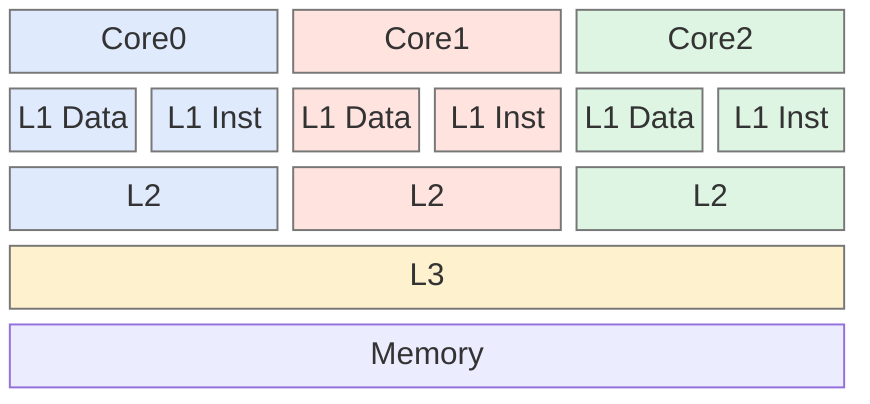
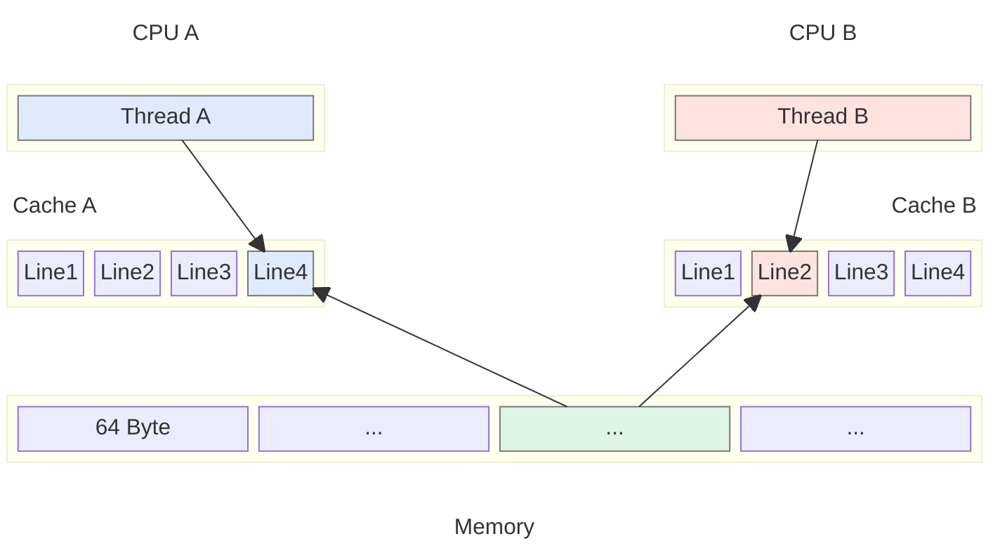
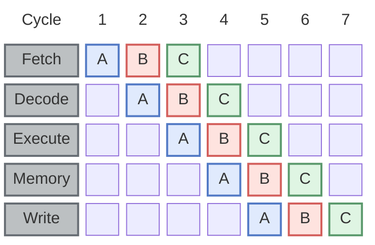
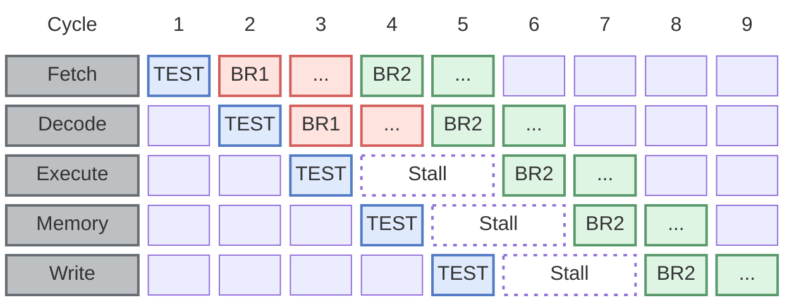
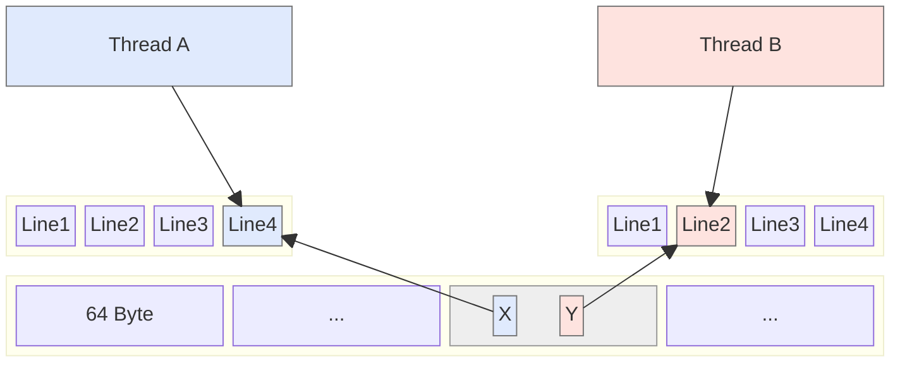

在操作系统与编译器的帮助下，应用开发者可以在不了解硬件细节的情况编写出高效稳定的代码。
但如果要让硬件资源发挥出极致的性能，程序员有必要深入了解一些硬件架构与实现原理。

[comment]:summary

在计算机硬件发展的过程中，[CPU 与 内存](https://www.akkadia.org/drepper/cpumemory.pdf) 朝着两个完全相反的方向狂奔。
前者侧重速度，后者则注重容量，这导致了CPU核心与内存总线的频率差距越来越大。
为了弥合两者间的差距，现代硬件架构进行了几项重要的革新：

**多级缓存**：
位于CPU核心和主内存之间增加多层高速存储器，用于存储了CPU最近访问过的指令和数据副本，以便快速访问。

**非对称多处理 (NUMA)**：
将内存分为多个独立区块并交由不同的 CPU 核心进行管理，避免内存访问总线频率限制 CPU 访问内存的效率。

## 缓存

由于程序代码和数据具有时间和空间局部性，相同的代码或数据在短时间内很有可能被重用。
因此现代硬件架构会在 CPU 与内存间引入一个空间有限的多层高速缓存，越靠近 CPU 的缓存通常速度更快，尺寸也更小。



L1 层缓存由单个 CPU 核心独占，通常会分为相互独立的两部分：
- 代码缓存：缓存解码后的机器指令
- 数据缓存：缓存最近访问过的数据

L2 与 L3 则是统一缓存，没有明确的功能划分。
其中 L3 由多个核心共享，而 L2 是否共享取决于具体的 CPU 架构。

### 缓存一致性

缓存中的最基本的存储单位被称为行，其大小通常为 64 字节：
- 当 CPU 访问某个内存数据时，会将邻近的数据同时加载到缓存中，以提升访问效率
- 当 CPU 修改缓存中的数据时，需要将修改同步会内存，可选的策略有两种：
  - **write-through**：同步更新缓存和内存
  - **write-back**：仅将缓存行标记为脏缓存，当其被逐出时才回写内存



虽然 **write-back** 策略可以有效节省访存带宽，但会引入多副本的并发修改问题：
同一个缓存行在不同 CPU 的独占缓存中对应不同的副本，不同 CPU 可以并发修改这一数据。
因此需要将该缓存行在其他 CPU 缓存中对应的副本也标记为失效，并在稍后重新加载。

为了在多个 CPU 间建立一致的缓存视图，需要引入 **缓存一致性协议(cache coherence protocol)**。
缓存一致性协议会对同一位置的写操作进行排序，保证所有 CPU 按照相同的顺序观察到该位置的状态变化。

一种较为流行的缓存一致性协议是 **MESI**，该协议为将缓存行设置以下 4 个状态之一：
- **Modified**：仅当前 CPU 的缓存加载了该行，且其内容与内存不一致
- **Exclusive**：仅当前 CPU 的缓存加载了该行，且其内容与内存一致
- **Shared**：同时有多个 CPU 的缓存加载了该行，且其内容与内存一致
- **Invalid**：该缓存行已失效

状态转换如图所示：


- 初始状态下所有缓存行的状态均为 **I**
- 加载数据后其状态变为 **S** 或 **E**
- 当本地 CPU 对其进行修改后其状态变为 **M**
- 当其他 CPU 修改其副本后其状态变为 **I**

### RFO 

区分 **S** 和 **E** 主要是出于性能考虑：
- 当修改处于 **E** 状态的缓存行时，可以直接将其状态修改为 **M**
- 当修改处于 **S** 状态的缓存行时，需要向其他 CPU 发送 **RFO (Request For Ownership)** 消息\
通知其他 CPU 将对应的本地副本状态设置为 **I**，并将其内容传回 RFO 的发起者，之后才能将缓存行状态修改为 **M**

下面两种场景会频繁触发 RFO 通信，应该尽可能避免：
- 在两个不同核心的并行运行的线程，需要访问同一个缓存行数据（比如：线程调度未考虑 CPU 亲和性）
- 同一个线程在不同 CPU 核心上交替运行，需要在不同 CPU 的本地缓存间移动数据（比如：线程间发生 Cache 伪共享）

多线程应用的通信需要依赖 RFO 实现内存同步。因此其并发度不仅受限于 CPU 核心数，也受限于内存同步引入的通信延迟。
需要仔细设计程序，以最大程度地减少从不同处理器对同一内存位置的访问。

### 并发修改 

值得注意的是，MSEI 的缓存一致性只是对值进行排序，而不是对写操作本身进行排序。

假设某个值为 1 计数器所在内存处于 **S** 状态，并且两个线程需要同时对其执行递增操作。
CPU 不必等待缓存行变为 **E** 状态后再从缓存中取值相加，而是会直接取当前缓存中的值 1 相加得到新值 2。

新值会基于 MSEI 协议进行排序，一旦缓存行在 **E** 状态下可用，新值 2 就会被写入缓存行。
如果这两个线程中的缓存读取同时发生，其中一次递增修改操作将会丢失：发生了两次递增操作，期望值应该是 3，但实际结果是 2。

**因此，如果多个线程同时修改同一个内存位置，处理器不保证任何特定的结果。**

要解决这一问题，必须依赖 CPU 提供的原子操作指令，这里不展开描述。


### 特殊地址

某些特殊的地址空间没有实际对应的物理内存，无法适用于此前提及的回写策略，这类空间主要分为两类：
- 一类被映射到外设内存（比如：显卡显存地址）
- 一类用于控制外设本身（比如：单片机的LED地址）

前者通常使用 **write-combining** 策略，当多个连续的写操作完成后，再一次性将缓存行写回外设内存。\
后者通常使用 **uncacheable** 策略，这类地址的数据不会经过 CPU 缓存。


### 性能指引

#### 精简指令

代码量越大对 L1 指令缓存的压力越大，因此不要滥用循环展开与内联，除非其对性能有明显提升。

评估一个函数是否应该内联的依据主要有两个，两者相乘可以评估到内联后代码的体积增长量：
  - 函数体的大小
  - 函数调用次数

对于一些调用次数或者代码量较少的函数，内联往往是有优势的。

但对于一些调用频率很高的小体积函数来说，其代码指令大概率会出现在 L1 缓存中，
如果 L1 内容可以重用并且总体占用空间减少，通常可以弥补额外函数调用的引入的性能开销。

此时可以选择禁用内联来提升缓存的命中率，从而提升整体性能。
gcc 提供了 `always_inline` 与 `noinline` 两个编译属性供程序员控制是否内联

```c
void __attribute__((noinline)) my_function(int arg) {
  // Function body
} 

void __attribute__((always_inline)) my_function(int arg) {
  // Function body
}
```


#### 消除分支

为了提升处理效率，现代 CPU 会以 **流水线(pipeline)** 的形式运行：在执行当前指令的同时，预取并解码后续需要执行的指令。




但当代码中出现分支跳转时，但是预取的指令并不一定是实际需要执行的分分支。以下面的代码为例：
```c
if (TEST()) // TEST() == false
  BR1()
  ...
else
  BR2()
  ...
```

分支 `BR1` 的代码紧跟在条件判断 `TEST` 后，因此会被预先取到流水线中，但实际需要执行的分支是 `BR2`。
此时流水线执行会被中断，CPU 只能空转等待 `BR2` 指令完成加载。


为了减少空转时间，现代 CPU 通过 **分支预测 (branch prediction)** 来猜测跳转的目标代码，并预加载相应的指令到缓存中：
- 当分支预测正确时，可以有效提升 CPU 的执行效率
- 当分支预测错误时，会有大量无用的指令被加载到 L1 缓存中，反而会拖慢 CPU 执行速度

尽管无法直接控制 L1 指令缓存，但可以通过减少代码中的分支跳转，提升指令预取的命中率：
```c
// branch
int add_condtional(int a, unsigned int b) {
  if (b < 16) a += b;
  return a;
}

// branchless
int add_condtional(int a, unsigned int b) {
  a += b & 0xf;
  return a;
}
```

#### 代码布局

在指令进入 L1 缓存前，其对应的代码也会被预取至 L2 缓存。
当代码中存在分支时，代码布局可能会影响其在 L2 缓存的命中率。

以下面这段代码为例，该函数中存在 `A` `B` `C` 三个相邻的代码块，这些代码块会以缓存行的形式加载到 L2 缓存中。

并且该函数中的分支判断条件大概率为 **false** ，这意味着`B` 代码块执行的概率远低于 `C` 代码块。
```c
int branch_layout() {
  ... code block A ...
  if (I()) { // I represents conditional jump instruction
    ... code block B ...
  }
  ... code block C ...
}
```

当 `B` 代码块较大时，每次函数调用都会有大量不需要执行的代码被预取到 L2 缓存中。
并且一旦分支预测错误，还会有大量的无用指令被加载到 L1 缓存中。

对于这类触发概率较低的分支代码，可以将其抽离为为一个独立函数并禁止内联。
使其位于一个独立的代码块中，并将低概率分支简化为一个函数调用指令。


程序员可以通过 gcc 提供的两个宏来提示编译器的哪个代码分支的执行概率更高，接着在编译时开启 **-freorder-blocks** 优化选项即可实现自动调整代码布局。
```c
  #define unlikely(expr) __builtin_expect(!!(expr), 0)
  #define likely(expr) __builtin_expect(!!(expr), 1)
```

#### 缓存行对齐

为了保证访问效率，结构体的内存地址默认按照以下规则对齐：
- 当字段类型长度为 n 字节时，其起始地址必须为 n 的整数倍
- 结构体的起始地址，必须是其最长类型字段的整数倍

对于需要频繁频繁改写的共享数据，以上对齐方式仍不能保证访问效率。

假设 A / B 两个线程分别持有一个计数器 X / Y，并且 X / Y 恰好被分配在同一个缓存行中。
此时即便这两个线程修改的数据毫不相关，也会对对方的访问性能产生严重影响。


对于这种情况，可以通过某些手段强制结构体按照缓存行长度进行对齐：
- 保证分配内存块的起始地址是 64 的整数倍
- 通过填充占位字段，保证结构体能够独占一个缓存行

gcc 提供了 `aligned` 编译属性用于控制内存对齐：
```c
struct strtype variable
     __attribute((aligned(64)));

struct strtype {
  ...members...
} __attribute((aligned(64)));
```

对于 Java 这类托管语言，则需要手动填充字段，或通过特殊注解提示 JVM 进行缓存行对齐。


## 虚拟地址

每个进程启动时，操作系统会为其分配一个连续的 **虚拟地址空间 (virtual memory)**：
- 当用户通过 `malloc()` 分配内存时，实际上将该空间的某段地址，映射到具体的物理内存上
- 当用户访问某个未关联物理内存的虚拟地址，则会发生 **segmentation fault** 异常

该设计通过牺牲一定的访问效率，极大提升了机器资源的利用率：
- 每个进程在运行时按需分配物理内存，避免空间的浪费
- 允许通过 **swap** 操作实现内存超用，允许更多进程同时在机器上运行

虚拟空间的大小与虚拟地址的长度直接相关：
- 当虚拟地址长度为 32 位时，可寻址的虚拟内存空间为 4GB
- 当虚拟地址长度为 64 位时，理论可寻址的虚拟内存空间为 16EB


整个虚拟地址被划分为 **内核空间 (kernel space)** 与 **用户空间 (user space)** ，用户空间主要有两部分组成：
- **加载可执行文件**

  这部分布局与编译器生成的可执行文件相关，通常由 3 部分组成：
  - **Code** 中包含编译器生成机器指令，由于可执行文件中的 **.text** 段派生而来
  - **Data** 中包含全局静态变量及其对应的初始值，由于可执行文件中的 **.data** 与 **.rodata** 段派生而来
  - **BSS** 中包含没有设置初始值的全局静态变量，由于可执行文件中的 **.bss** 段派生而来

  区分 **Data** 与 **BSS** 的主要目的是减少可执行文件的体积，避免引入不必要的初始零值。\
  为了保证系统安全，不同的内存段对应的物理内存页会设置不同的权限：
  |section|execute|read|write|
  |:-:|:-:|:-:|:-:|
  |.text|✔|✔|✘|
  |.rodata|✘|✔|✘|
  |.data|✘|✔|✔|
  |.bss|✘|✔|✔|
  
- **运行时动态创建**
  - Stack

    栈用于存储函数中的局部变量，函数调用通过 **栈桢 (stack frame)** 管理内存的生命周期：
    - 函数调用时会在堆上自动申请内存生成栈桢，程序员也可以通过 `alloca()` 在栈桢上分配空间
    - 当函数返回时栈桢会被销毁，其关联的内存空间会被同时回收

  - Heap

    堆用于存储需要动态分配空间的复杂数据结构，比如：链表、二叉查找树...\
    程序员需要通过 `malloc()` 与 `free()` 在堆上动态分配与释放空间，并负责管理其上内存的生命周期。

    出于灵活性原因，在大多数情况下，进程的堆栈和堆区域分配在地址空间的相反的两端。\
    该布局允许其中任意一方尽可能地增长。

  - Shared Memory
  
    两者间的内存地址空间可用于实现共享内存，方便与其他进程共享物理内存页。\
    借助内存共享的特性，可以实现两个常用的功能：
    - 可以通过将不同进程的虚拟地址映射至同一块物理内存，实现进程间通信
    - 子进程的虚拟地址默认共享父进程关联的物理内存，仅当子进程修改数据时才会创建新的副本进行编辑

  

看到这里，不知道你考虑过一个问题：**JIT 编译器生成的代码应该放哪里？**：
- 尝试将其写入 **.text** 所在的区域会导致进程崩溃
- 如果简单将其放在堆上，当指令流跳转至该内存页时进程也会崩溃。

为了解决这一问题，JIT 编译器需要执行以下操作：
- 通过系统调用直接在堆上申请独占的物理内存页，避免 `malloc()` 从将该页面分配内存
- 将改内存页的权限设置为可执行，并将生成的代码复制进改内存页中


### 内存分页

操作系统分配物理内存的最小单位是页。
CPU 通过 **MMU (Memory Management Unit)** 将虚拟地址映射为物理地址。\
该映射过程需要一个被称为页表的结构参与：


一级页表将虚拟内存地址分为两部分：
- **index** 与该虚拟地址关联的 page
- **offset** 该地址对应的物理地址在 page 中的偏移量

内存页大小决定了 offset 部分的长度：
- 当 page 大小为 4MB 时，offset 部分的长度为 22bit
- 当 page 大小为 4KB 时，offset 部分的长度为 12bit

在一个 32 位的系统中使用 4kB 内存页，将有 20bit 将被用于表示 index。\
如果使用一个连续的指针数组来作为页表，则页表占用空间可达 $2^{20} \times 4$ = 4MB。

由于虚拟内存的独立性，操作系统会为每个进程维护独立的页表，这种分配方式无疑会浪费大量的内存空间。\
为了节省空间，通常使用多级页表来维护映射关系，实现按需分配空间。


连续的虚拟地址能够共享高级页表空间，减少不必要的内存分配。\
为了减少页表占用的内存空间，应该尽可能在连续的虚拟地址上分配内存。

但这种多级跳转的访问方式性能较差，为了提升寻址效率，
现代 CPU 引入了一个名为 **TLB (Translation Look-Aside Buffer)** 的硬件缓存，
其中缓存着 index 到 page 的映射关系，避免了多次跳转的性能开销：
- 当查找 index 命中时，会根据 page 与 offset 计算得到物理地址
- 当查找未命中时，则会查询主存中的多级页表，并将结果缓存在 TLB 中


TLB 的命中率高低直接影响到内存访问性能，优化手段可以分为两类：

**减少上下文切换**

运行在同个 CPU 核上的进程共享 TLB 资源。
但由于不同进程间的虚拟地址相互隔离，同个 index 会指向不同的 page。
因此每当发生上下文切换时，都需要清空 TLB 中的缓存记录。


为了提升缓存命中率，部分 CPU 在硬件层面上对缓存的 index 增加了标记位，用于区分不同的虚拟地址空间：
- 区分内核空间与用户空间，发生系统调用时无需清空 TLB
- 区分宿主机空间与虚拟机空间，提升虚拟机的执行效率
- 区分不同进程的地址空间，发生进程切换时无需再清空 TLB

**在连续的虚拟地址上分配内存**

通过在连续的地址上分配内存，可以避免不必要的页表分配，降低页表占用的内存空间。
同时还能保证热点内存页常驻于 TLB 中，减少页表查询。


### 多线程优化

线程的一个特性是它们都共享相同的地址空间。

当线程不共享任何内存数据时，每个不同 CPU 核的 L1 中拥有独立的缓存行。
线程并发修改缓存时，无需发送 RFO 请求，没有额外的通信开销。

当多个线程访问同一内存位置时，不同 CPU 核的 L1 需要互相通信来保证缓存一致性。
线程并发修改缓存时会发送大量的 RFO 请求，这意味着同一时刻只能有一个 CPU 能操作其 L1 中的缓存行副本。
有其他 CPU 核心都会被延迟，无法做任何事情。并发线程越多，同步开销越大，每个额外的处理器只会带来更多的延迟。


为例避免这一问题，需要对于多线程间共享的数据进行读写分离：将常量或者只初始化一次的变量分组到一起。
当这些数据被加载进缓存后，其所在的缓存行将长期处于 **S** 状态，不受修改操作的影响。

一种方式是使用 `const` 修饰全局静态变量，当 gcc 编译生成可执行文件时：
- 有 `const` 修饰的变量会被放入 **.rodata section**
- 没有 `const` 修饰的变量将被放入 **.data section**

程序运行时，同 section 的变量会加载到相邻连续的内存段中。
不同 section 的内存段相互独立，避免相互影响。

当无法使用 `const` 关键字时，可以通过编译属性自定义 section ：
```c
  int foo = 1;
  int bar __attribute__((section(".data.ro"))) = 2;
  int baz = 3;
  int xyzzy __attribute__((section(".data.ro"))) = 4;
```

## NUMA

### 超立方体

在传统的 **一致性内存访问 (Uniform Memory Access)** 架构中，所有 CPU 通过统一的 **前端总线 (Front Side Bus)** 访问内存。
FSB 是 CPU 与北桥芯片之间的连接，北桥芯片再连接到内存控制器，所有的内存访问都通过这条总线进行。
该架构的一致性保证了 CPU 对所有内存的访问时间是一致的。


而在 **非一致性内存访问 (Non-Uniform Memory Access)** 架构中，北桥芯片被的内存控制功能被整合进 CPU。
为了解决多处理器系统中内存访问延迟的问题，NUMA 将内存被划分为多个节点，每个节点通常包含一组 CPU 核心和与之紧密相连的内存。


NUMA 是应用分治法解决复杂问题的一个极佳案例。
该架构下 CPU 可以直接与同节点内存通信，无需再通过统一的内存总线来访问内存。
由于总线带宽不再成为系统扩展瓶颈，使得该架构具备更强的水平扩展性，因此 NUMA 还特别用于大型商用硬件。
为了准确的描述 CPU 与内存间的通信拓扑，需要引入一个被称为 **超立方体 (hypercube)** 的结构：


每个节点包含一组处理器核心以及对应的本地内存，这些节点通过通信网络相互连接，形成了一个高度并行的系统。
假设每个 NUMA 节点具备 $C$ 个互连接口，则超立方体中最多能包含 $2^C$ 个互联节点，此时两两节点间的最长访问距离也恰好是 $C$。

该拓扑具备以下优点：
- 局部性：将处理器核心与本地节点上的内存绑定，可以提高局部性，减少访问远程内存的延迟。
- 易扩展：可以很容易地进行水平扩展，避免单个节点或维度成为系统瓶颈，从而提高系统的整体性能。
- 容错性：拓扑的分布对称性使其易于实现冗余和备份，提高系统的容错性和可靠性。

### 常见问题

在 NUMA 系统中，内存访问的延迟不再是一致的，而是取决于内存所在的节点以及执行访问的 CPU 核心。
每个 CPU 核心可以更快地访问与其在同一节点内的内存，而访问其他节点的内存则会相对较慢。
为了管理这种复杂的内存访问模式，操作系统需要具备 NUMA 感知能力，以便能够优化内存分配和数据布局，从而减少跨节点访问的延迟。


#### 共享内存
对于 `libc.so` 这类常用的共享库，通常只会常驻一组特定的在物理内存页中。
这意味着除了少数处理器之外的所有处理器都必须远程访问该物理内存。
一个对 NUMA 架构友好的操作系统需要为每个节点维护独立的 `libc.so` 副本，从而避免频繁的远程内存访问。

#### 线程调度


当发生线程调度时，需要保证线程与其经常访问的物理内存都常驻于同个 NUMA 节点上。
操作系统不应经常性地将线程从一个节点迁移到另一个节点。

此外线程调度不应仅考虑 CPU 负载，还需要考虑内存负载。
在保证 CPU 资源利用率低情况下，尽可能将需要占用大量占用内存空间的线程分配到不同的节点上，避免特点节点的内存资源耗尽。


### 优化手段

NUMA 架构下的程序员可用的优化手段与 UMA 架构并无区别：
- 大批量连续访问内存，充分利用局部缓存缓解远程访问的性能开销
- 预先配置 CPU 核心与线程的亲和度，避免线程跨 NUMA 节点调度

