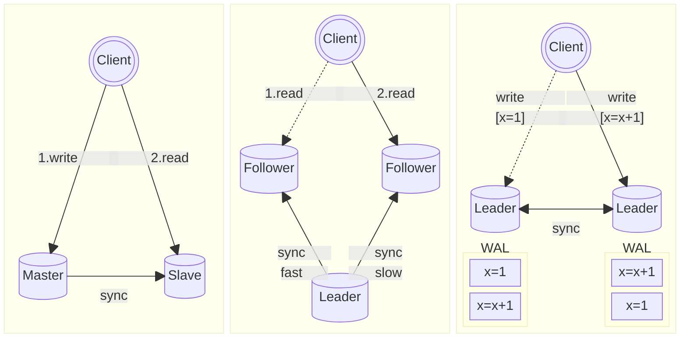

本文是《Designing Data-Intensive Application》一书的读书笔记。

[comment]:summary

## **副本一致性**
现代的数据库系统来说，几乎都具备了**复制机制（replication）**，这种设计方式至少能对系统带来两个好处：
- **多副本容灾**：只要存在一个可用数据副本，数据就能够恢复
- **读性能水平扩展**：通过分布到不同的机器上，同一份数据能够在多个节点上同时供外部访问

保证多副本的 **数据一致性（consistency）** 是一个难题。

最简单的实现方式是使用 **同步复制机制（sync-replication）**：保证写操作在所有副本上执行成功后，再响应客户端。不过这一方式通常意味着糟糕的写性能，因此较少使用。

与之相对的则是 **异步复制机制（async-replication）**：写操作在某些副本上成功后即可响应客户端，数据库会异步将修改同步到剩余副本上。其优势在于较高的写入性能，但是数据副本的一致性无法保证。

以最基础的主从复制架构为例，虽然主库与从库最终都会到达一个一致的状态，但是主从状态同步会存在时间延迟，这类延迟被称为 **复制滞后（replication lag）** 现象。 期间可能同时存在两份相互冲突的数据副本，依赖这些数据的应用如果没有做好预防处理，最终会引发系统行为异常。

在分布式数据库中，维护副本状态的进程分为以下两类：

- **leader / master**： 能够同时处理读写请求的进程
- **follower / slave**： 只能处理读请求的进程

基于以上定义，常见的复制架构又可以分为下图中的 3 类：

不同的架构会面临不一样的一致性问题

> 一主一从 (master-slave) &nbsp;&nbsp;->&nbsp;&nbsp; 写后读一致性 (read-after-write consistency)

- 现象：
  客户端修改数据，变更未同步到从库，此时读取从库数据，得到的是未修改的结果。
- 解决方案：**写操作对之后的读操作立即可见。**
  - 根据应用特点，强制部分功能只访问主库，保证读写顺序一致
  - 维护用户修改时间戳与从库修改的时间戳，根据时间戳选择是否读取从库

> 一主多从 (single-leader) &nbsp;&nbsp;->&nbsp;&nbsp; 单调读一致性 （monotonic read)

- 现象：客户端多次读取同一条记录，但请求路由到不同的从库上面，可能读取到旧版本的数据。

- 解决方案：**之后读取到的数据一定要比之前读取到的数据要新。**\
  保证同个用户的请求只会路由到同个从库，保证读命令顺序一致。

> 多主多从 (multi-leader / leaderless) &nbsp;&nbsp;->&nbsp;&nbsp; 因果一致性（consistent read prefix）

- 现象：客户端多次修改数据路由到不同的主库上，且数据之间有因果关系（例如：问答记录）。\
可能读取到次序混乱的数据，也可能修改一条尚未存在的数据（例如：leader 间的网络延迟）。

- 解决方案：**写操作的结果必须按照其执行的顺序被读取到。**\
  具有因果关系的写操作在同个主库上执行，保证写命令顺序一致。

## **冲突解决**

在大规模互联网应用中，多数据中心正变得越来越流行，其优点如下：
- 地理位置近，访问速度快
- 高可用，单个数据中心宕机或者网络出现问题不会导致不可用的情况

当系统需要部署到多个数据中心的时候，不可避免地会使用到 multi-leader 架构，这带来以下问题：

- 同一份数据可能被两个数据中心并发修改，导致写冲突
- 数据库的某些特性不能很好地支持多 leader 架构，例如：自增主键、触发器

### 写入冲突

single-leader 架构下的写是顺序的，对同一份数据的修改，在每个副本上都能得到最终一致的结果。

multi-leader 架构下每个 leader 中的写也是有序的，但是不同 leader 之间的写操作是无序的，因此对同一份数据的修改也是无序的，最终导致副本的状态可能不一致。

如何保证所有库收敛到同一个状态？—— **解决冲突**
- 每个写操作关联一个唯一 ID，选取优先级最高的操作结果
- 每个副本关联一个唯一ID，选取优先级最高的副本对应的结果
- 将两个冲突的数据合并成同一条数据
- 保存所有冲突数据，由后续的操作来进行解决

解决冲突的时机又可以分为：
- 写时解决：向数据库注入解决冲突的逻辑代码，当发生冲突时由数据库进行调用。\
比如：MySQL MGR 中通过维护全局一致的 Binlog 实现一致性。
- 读时解决：当存在冲突数据时，应用会获取到这些冲突数据，并自动或手动解决这些冲突。\
比如：Dynamo NRW 通过调整读写副本数量来保证读取到最新的数据。

## **一致性模型**

作为一个开发者，我们关心的一个重要问题是：数据库本身究竟为我们提供了哪种等级的一致性保证？

为了支持并发操作，单机数据库引入了事务的概念，从而避免数据不一致导致行为异常。数据库的事务模型有一个重要概念：**事务隔离级别**

|隔离级别|读未提交 `Read Uncommitted`| 读已提交 `Read Committed`|可重复读 `Repeatable Read`|序列化 `Serializable`|
|:-:|:-:|:-:|:-:|:-:|
|脏读 `Dirty Read`|✔|✘|✘|✘|
|不可重复读 `Unrepeatable Read`|✔|✔|✘|✘|
|幻读 `Phantom Read`|✔|✔|✘|✘|
|写偏斜 `Write Skew`|✔|✔|✔|✘|

在不同的事务级别下，开发者能够得到数据库不同程度的一致性保证。越高的隔离级别，提供的一致性更强，也同时意味着更大的性能开销。

这一模型存在的好处，是的我们能够在一致性与性能之间进行权衡，作出适合自己应用场景的选择。在分布式场景中，我们要面对更为复杂的一致性问题。为了方便接下来的讨论，首先简单介绍几种一致性模型。

### 最终一致性
某个特点时间点下，数据库系统中的各个副本间的状态很可能是不一致的。
上面我们看到的几个一致性问题，都是由应用层解决的，数据库本身只提供以下保证：

> 经过一段任意长的时间后，数据库中的所有副本最终都能 **收敛（convergence）** 到相同的状态。\

这种极弱的一致性保证，就是我们常说的 **最终一致性（Eventual Consistency）**：
- **优点**：这种弱一致性保证使得系统设计较为灵活，从而能够达到较高的性能。\
比如：副本间使用异步复制策略、设计专用的对账系统来离线解决数据冲突……

- **缺点**：当系统设计中涉及到最终一致性时，应用层需要十分关注复制滞后对系统的影响。\
并且需要根据业务所需的一致性保证来设计系统，变相增加了应用开发者的工作量。\
此外，某些问题在网络错误或者高并发时才会暴露出来，难以测试。

### 线性一致性
数据库的事务机制本身就是一个容错协议，能够为基于事务运行的应用提供数据安全的保障。

为了向应用层隐藏复杂度，事务为应用提供了以下的抽象保障：
- 原子性：数据库中的数据是完整的，事务执行是完整的（无需担心执行过程中进程崩溃）
- 隔离性：数据库不会被并发修改，事务之间是不会相互影响（无需担心竞态条件影响执行结果）
- 持久性：数据库的存储是可靠的，事务的变更不会丢失（无需担心存储器故障导致数据丢失）

事务机制提供的抽象保证，将应用开发者从繁杂的错误处理中解放出去，使其只需要专注于业务。不但提高了开发效率，也减少了 bug 出现的概率，系统更稳定且易于测试。

理想情况下，我们希望能够分布式数据库能够像事务一样，为我们提供一个更强的一致性保证：
- **全局写后读一致性**：
  - 系统只对外暴露一份数据，不存在同时存在多个版本的数据的问题
  - 所有的修改操作都是原子性的，且每次读取到的数据都是最新的
- **全局单调读一致性**：\
一旦写入操作成功，结果对所有之后的读取操作均可见，并且不会读取到旧版本的数据

这种跨进程的全局强一致性保证，被称为 **线性一致性（Linearizability）**。

下面通过一些具体场景来具体介绍这一模型。

首先，我们假定 **x** 是数据库中的某个条目：
- 在键值数据库中，**x** 就是一个 key
- 在关系数据库中，**x** 就是一行
- 在文档数据库中，**x** 就是一个文档

线性一致性模型定义了 3 种基本操作：
- $\text{read}(x) \Rightarrow v$：客户端从数据库中读取 x 对应的值 v
- $\text{write}(x, v) \Rightarrow r$：客户端向数据库中写入 x 对应的值 v，返回操作结果 r
- $\text{cas}(x, v_1, v_2) \Rightarrow r$：客户端使用 compare-and-set 操作将 x 对应的值从 $v_1$ 修改为 $v_2$ 并返回操作结果 r 

线性一致性是 **跨进程（Cross-Process）** 的，可作为实现以下分布式应用场景的基础：
- **分布式锁与选主**\
用 CAS 操作实现锁，获得锁的节点就是 leader
- **唯一性约束**\
使用 CAS 操作来获取某个值对应的锁，如果获取成功，则这个值是唯一的，否则这个值就不是唯一的
- **多信道间的时序依赖**\
一个进程A修改数据成功后通知进程B，此时线程B一定能够获取到进程A的修改结果

**一个满足线性一致性的场景**

图中有 3 个客户端，其中客户端 A、B 读 x，客户端 C 写 x 。
- 当 B 第一次读 x 时，C 正在进行写操作，此时 B 读到的值是 0（此时 C 写操作未提交）
-  当 A 第二次读 x 时，C 正在进行写操作，此时 A 读到的值是 1（此时 C 写操作已提交）
-  当 B 第二次读 x 时，由于此前 A 读 x 结果为 1，此时 B 读取到的值必然也是 1（全局单调读一致性）

**一个违反线性一致性的场景**

图中有 4 个客户端 A、B、C、D 并发进行读写操作，图中的连线表明了事务提交与读操作实际发生的时间点。图中存在一个违反线性一致性的行为：**在 A 读取到 4 之后 B 读取到了 2**

虽然单从客户端 B 本身来说并没有违反单调读一致性，但是在全局上来说违反了单调读一致性：**后发的 B 读请求的结果，滞后于先发的 A 读请求的结果**

**一个实际应用场景【生成相册缩略图】**
![LinearModel3]
图中的 FileStorage 是个多副本的分布式文件存储，用于存储用户的照片数据，后台需要生成缩略图加快 web 预览：

1. 当用户上传或修改照片时候，WebServer 将原始尺寸的用户图片储于 FileStorage
2. 通过 MQ 将图片 id 异步通知 ImageResizer 
3. ImageResizer 根据 MQ 给出的图片 id 从 FileStorage 读取数据并生成缩略图

在步骤 B 中，MQ 消息传递的同时， FileStorage 内部进行副本复制。如果 FileStorage 不满足线性一致性，ImageResizer 可能读取不到图片（违反全局写后读）或者读取到旧（违反全局单调读）的照片。从而导致处理失败，甚至会生成错误的缩略图，整个系统最终会处于一个不一致的状态。

### **实现方式**
实现线性一致性语义的最简单方式就是只使用一个数据副本，但这种做法会使得系统不具有容错性。
为了提高系统的容错能力，多副本的架构是唯一的选择，下面我们按照不同的多副本架构分情况讨论。

#### Single-leader

  在不使用快照隔离（例如：mysql 的 MVCC）的前提下，同时使用以下两种策略可以满足线性一致性：
- 从 leader 读写取数据（只访问 leader 的数据副本，避免受其他 follower 不一致的数据副本影响）
- 使用同步复制策略（异步复制无法保证 follower 数据副本最终与 leader 一致）

实现的风险点：
- **脑裂(split-brain)** 时可能出现多个 leader （同时对外暴露多个可写的副本数据，并且最终会导致数据不一致），违反线性一致性
- **自动灾备(failover)** 对新 leader 副本的选择（如果选择一个数据不完整的副本作为新 leader，则相当于数据丢失），违反线性一致性

#### Multi-leader

允许多节点同时写，并且需要支持异步复制，可能引起写冲突，因此需要暴露多个副本来解决冲突，因此肯定无法满足线性一致性。

#### Consensus algorithms

共识算法涵盖了 single-leader 的功能，并且同时具备防止脑裂和过期副本的机制，因此天然满足线性一致性。

#### 性能权衡

尽管线性一致性是个强有力的一致性保证，这类强一致模型在实践中的应用并不广泛。

举个例子，现代计算机的内存模型并不能保证线性一致性：

> 为了提升系统性能，现代 CPU 采用了多级缓存的架构。
当 CPU 需要访问修改 RAM 中的数据，首先会修改缓存，然后异步将修改刷新到实际的 RAM 中（多副本 + 异步复制机制）。

牺牲一致性以换取更好的性能，这类权衡在数据库系统中更为常见。
为了保证强一致性，线性一致性模型会带来糟糕的性能，这是不可改变的事实。

### 因果一致性
事件的发生先后顺序包含了**因果关系（Causality）**。

**一个违反因果一致性的场景【医生排班表】**

每个医院都有一个排班表 (on-call shift)，以 保证至少有一个或者以上的值班医生 (on-call docotor) 在场，以应付急诊之类的突发情况。如果值班当天医生身体不适，可以在排班系统申请提前下班，值班系统会检测当前值班医生人数，判断是否允许下班。

某天，医院只有两个值班医生 Alice 和 Bob，但是恰巧两人身体都出现了不适，并且在同一时刻申请了提前下班，此时可能出现以下情况：

1. 系统首先开启了两个并发的事务，分别由 Alice 和 Bob 两人发起
2. 两个事务同时查询了值班人数，并且得到值班人数为 2 (currently_on_call = 2)
3. 两个事务同时更新了值班记录，分别将 Alice 和 Bob 改为非值班状态，并提交事务成功
4. 最终医院的值班人数为 0，急诊病人 R.I.P

上面这个例子违反了因果一致性：**事务中的 write 操作依赖于 read 操作**
> Alice 的 write 事务先提交，从而导致 Bob 事务中 read 的结果失效。\
但是 Bob 的事务没有检测出 read 失效的情况，而是直接提交了事务，最终导致系统违反了排班约束

这种由并发 read-write 事务导致的不一致现象被称为 **写偏斜（Write Skew）**。值得注意的是，这种事务并发的情况不一定是人为引起的，网络延迟拉长事务周期而也可能间接引发这一问题。

## 模型对比

我们先回顾一下两个顺序相关的定义：
- **全序（total order/linear order）** 集合中，任意两个元素之间都是可以比较
- **偏序（partial order）** 集合中，部分元素之间是可以比较的

这两种顺序分别代表了两种一致性模型：

- 线性一致性：系统对外只暴露一份数据，所有操作在唯一一份数据上串行执行（没有并发操作），因此任意操作之间肯定是有先后顺序的
- 因果一致性：有因果关系的操作之间是有序的，但并发操作之间没有因果关系，因此也没有先后顺序

线性一致性模型更简单，容易理解，并且能够处理多信道时序依赖的因果问题。
然而实现线性一致性需要付出较高的性能代价，操作之间需要相互等待，并且在网络延迟较高的环境下，系统不可用的概率会增大。

因果一致性模型比较抽象，难以理解，但是足以应付多数应用场景。
因果一致性模型最终可以达到接近最终一致性模型的标准，并且对网络延迟不敏感，在面临网络故障的情况下仍能保证可用性。

相比线性一致性，因果一致性的一个重大差异是：**允许不相关数据的并发**
- 线性一致性只有一个单一的时间线
- 因果一致性则是一棵具有多个分叉的树（可以参考 Git 的分支模型）

## 序列号生成
> 因果关系本身就是一个先后顺序的问题，因此只要知道了顺序，就能够据此推导出因果关系。

在讨论因果一致性模型前，我们需要找到一种合适的方法来表示因果顺序，从而使得我们能够分析因果依赖。在实际应用中，我们无法记录所有依赖关系，否则将会造成巨大的开销。

一个可行方法是：为每个操作分配一个表示顺序的序列号，序列号本身占用空间少，并且本身具有全序关系。

常见的大规模序列号生成手段有：
- 时间戳：使用高精度的时间戳作为序列号
- 提前规划：使用取模的方式，按照生成器个数来划分可用序列号，部署多个序列号生成服务（例如：两个节点可以分别使用奇偶序列号的生成器）
- 批量生成：生成器以批量分配的方式，每次向节点分配一个连续的区间

问题在于，这些序列号不能保证全局有序：
- 系统时钟会有偏差，多个节点间时钟之间不一定同步，时间戳不一定能表示操作的先后顺序
- 如果服务节点的负载不均，则旧的序列号可能会被应用到新的操作上面，先后顺序也无法保证

为此，我们需要一个能够保证全局顺序的序列号生成机制。

### Lamport timestamps
先介绍一种通过逻辑时钟生成具有因果关系的序列号的方法：**Lamport timestamps**。

每个进程要维护以下两个信息：
- **$\texttt{ID}$**：全局唯一的不可变进程标识
- **$\texttt{Counter}$**：初值为 0 的单调递增的整型计数器

系统的所有交互会被封装为一系列的事件，每个事件都会关联一个全局唯一序列号 $(\texttt{C},\texttt{ID})$，其生成规则如下：
- 进程生成一个事件时，首先递增计数器得到一个局部唯一的序列号 $\texttt{C}^{latest} = \texttt{++Counter}$，然后将其与进程标识组合成 $(\texttt{C}^{latest},\texttt{ID})$ 用于表示这个事件的发生顺序。
- 进程接收一个来自其他进程的事件时，会更新本地计数器 $\texttt{Counter} = \max(\texttt{C}^{other}, \texttt{Counter})+1$

该序列号满足以下全序关系：**C 越大优先级越高；C相同时，ID 越大优先级越高**。通过为每个操作关联上这样一个序列号，间接为所有操作建立起一个全序的顺序关系，此时任意两个操作都是有序的。

不过这一方案也存在缺陷：操作顺序只能在操作发起之后才能得知，无法立刻对数据冲突作出反应。比如：
> 两个客户端分别在两个节点上同时发起了一次有冲突的操作（例如：添加同名账户）。\
当发生冲突时，系统会自动用序列号更大的值来解决冲突，从而导致序列号较小的操作失效，但是在客户端看来自己操作已经成功了。

这类不能实时解决的冲突可能会导致一致性的问题，出现这种问题的主要原因是：
>虽然最终的序列号是全序，但是某个时刻的实时的序列并不完整，后面可能有未知的序列号插入其中。\
例如：进程 A 已生成最大序列号 (A,1)，进程 B 已生成最大序列号是 (B,5)，若 A 此时接收到一个来自进程 C 的事件 (C,2)，则后续可能生成一个序列号为 (A,4) 的事件。

为了保证操作的安全性（不可逆），我们需要保证当前已知的序列是不变的。

## 全序广播

**全序广播（total order broadcast/atomic broadcast）** 通常被描述为一个在节点间交换消息的协议，该协议具有两个特征：
- **可靠传递**：一旦一个节点接收到某条消息，其他节点也一定会收到这个消息。不会出现消息丢失的情况，并且每条消息只会出现一次。
- **全序传递**：所有节点都以相同的顺序接收到消息。

一旦消息发出，此时顺序就确定下来了。节点不允许往已经存在的消息序列中插入消息，只能往后追加，因此可以将全序广播看作是一个记录日志的过程：**所有节点都在异步记录一个全局顺序一致的日志**。
当出现故障时，需要有一个重试机制来保证上面两个约束。

很多一致性服务都实现了全序广播协议，全序广播可以用于实现以下功能：

- **一致的复制机制**\
把对数据库的写操作当作是消息，只要能够保证所有节点以相同的顺序接收到这些消息，则能够保证所有副本的一致性
- **序列化事务**\
把事务操作当作是消息，每个节点以相同的顺序处理事务，那么每个节点都保证具有一致的状态
- **分布式锁**\
每个获取锁的请求被记录在一个有序日志中，可以根据请求的顺序来决定锁的获取顺序
- **CAS 操作**\
以使用 CAS(username, A, B) 修改用户名为例：
  - 发出一条 assert(username = A) 消息
  - 监听 username 的相关日志，在接收到第一条日志之后：
    - 如果是自己发出的 assert 日志，则通过追加一条 commit(username = B) 消息来完成修改，
    - 如果是其他节点的 assert 或 commit 日志，则修改失败
- **全局一致性读**
  - 利用消息在日志中的位置确定读发生的时间，发出一条消息，监听这条消息返回后，再进行读操作（etcd）
  - 如果日志系统能够获取到最新的日志所在的位置，则可以等待日志追加到这一位置之后，再进行读操作（zk）
  - 只在写操作同步更新的副本上读取数据

将最后两个功能合并起来，则相当于实现了线性一致性。

### 实现方式

在 single-leader 架构中，只有一个 leader 能接受写操作，从而能够保证所有写操作都是有序的，进而保证所有副本都是有序的。这意味着：**single-leader 架构本身就具有全序传递的特性，只要在此基础上解决了可靠传输问题，就能实现全序广播**。

常规的 single-leader 架构需要在启动时，人为指定一个 leader 节点，一旦这个节点失效，整个系统将会陷入一个不可用的状态，直到人工介入指定一个新的 leader。这对系统的可用性无疑会造成严重的影响。

为了实现**自动灾备（auto-failover）**，系统本身需要支持 leader 选举功能：
> 当 leader 失效时，从健康的 follower 中选择一个新的 leader，继续对外提供服务。\
> 选举过程中需要防止脑裂的情况发生，避免同时出现多个个 leader，影响系统的一致性。

此类选举场景中，不可避免的会用到分**布式一致性算法（distributed consensus algorithm）** ，后面我们将用独立的篇幅对其进行介绍。