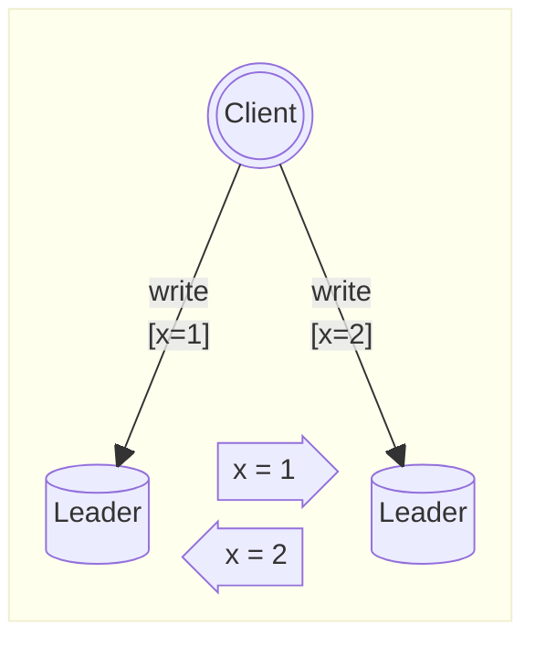
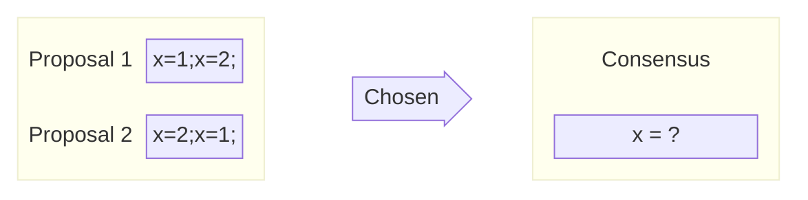
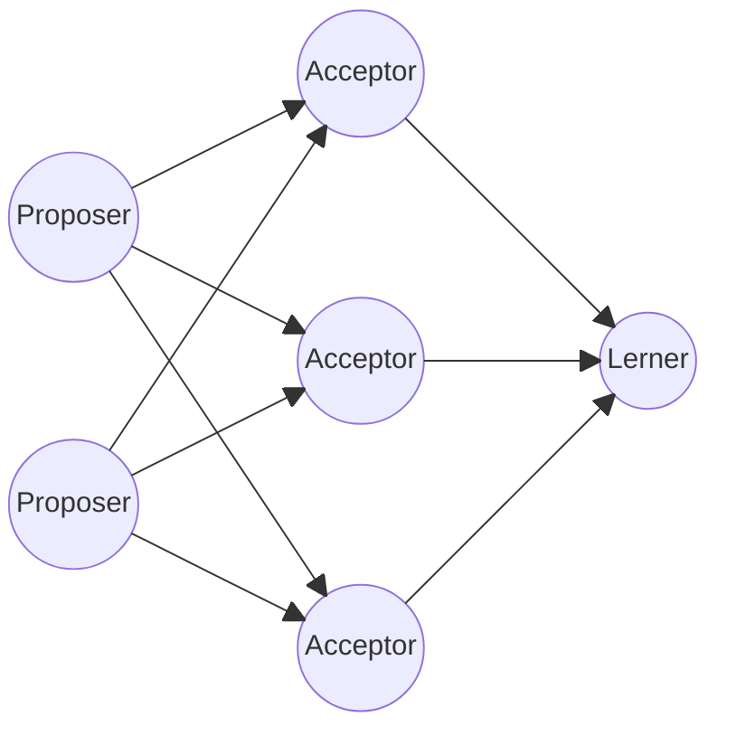
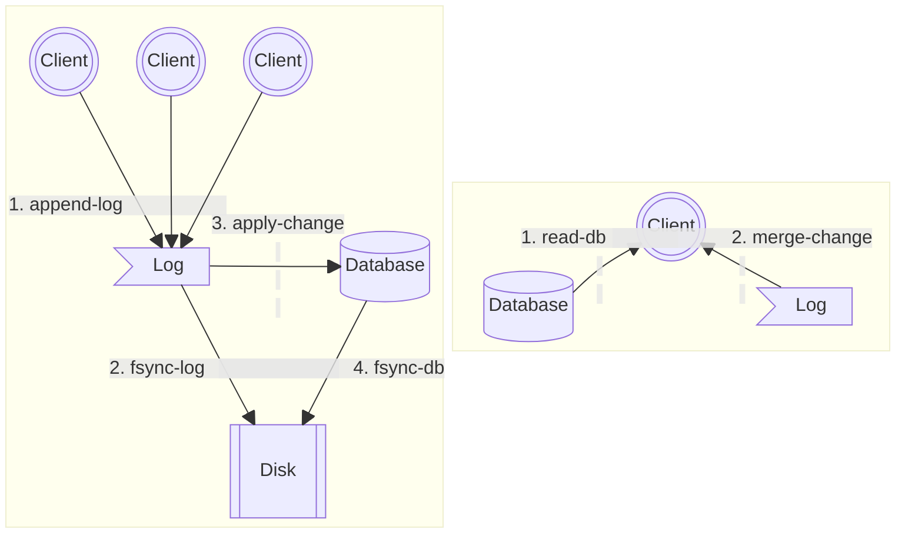
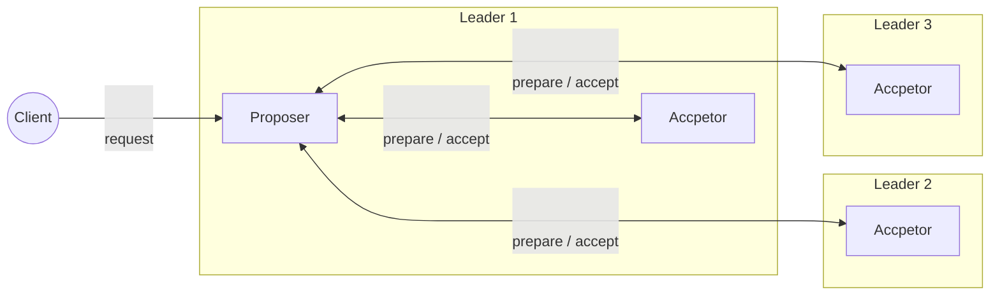
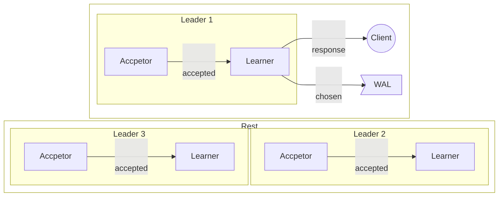
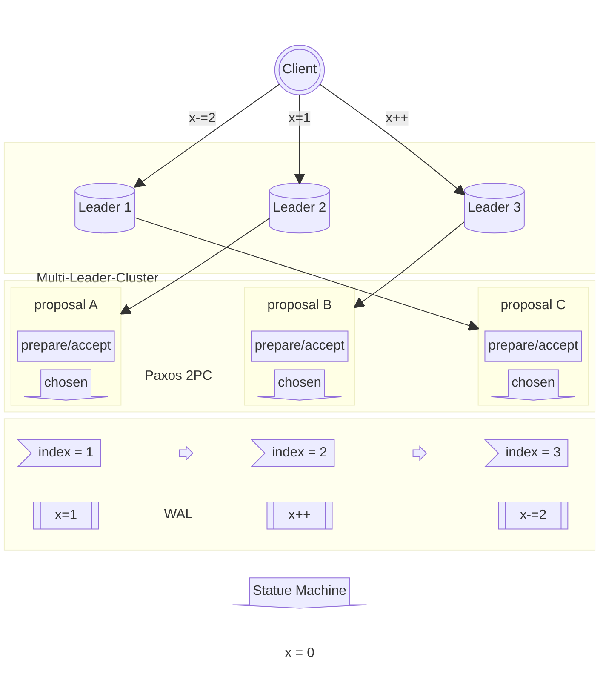

Paxos 是一种分布式一致性算法，用于实现分布式系统中的共识。它通过提供基于消息传递的方式，在面对网络故障和节点故障时保证系统的可靠性和一致性。

[comment]:summary

## 可用性与一致性
为了向用户提供更好的服务体验，现代软件架构越来越注重系统的 **可用性（availability）**。

正是在这种趋势的驱动下，微服务与容器化技术才能在今天大行其道。

而高可用架构的前提是冗余：
> 一个高可用服务必然由多个进程组成，这些进程互为备份，部分进程失效不会导致整个服务不可用。

如果服务是有状态的，那么每个进程都需要维护自己的一个 **状态副本（replica）**。为了保证有状态进程的可替代性，如何维护这些副本的 **一致性（consistency）** 成为了至关重要的问题。

以提供锁服务的分布式协调服务为例，这类服务必须满足一下两个特性：
- 高可用：服务失效会导致下游服务不可用
- 强一致：下游服务观察到不一致的状态会导致锁失效

根据分布式数据库的 **CAP** 理论，同时实现这个以下 3 特性是困难的：
- 在网络通信正常的时候，分布式数据库可以同时保证 C 与 A 
- 在发生 **网络分区**（进程间无法正常通信）的时候，数据库必须在 C 和 A 中做出权衡：
  - AP 系统 —— 保证可用性，牺牲一致性\
  每个节点可以对外服务，但整个数据库会处于不一致的状态
  - CP 系统 —— 保证一致性，牺牲可用性\
  每个节点拒绝对外服务，但整个数据库会始终保持一致的状态

在 CAP 的框架下，我们似乎陷入了一个两难的境地：实现一个 CA 的系统是不可能的吗？
在回答这个问题前，首先要指出 CAP 理论存在的一个问题：
> CAP 理论在权衡时仅考虑了 3 个因素，而忽略了其他的指标，比如：性能、实现复杂度、机器数量...

举个例子：存在一种流行的观点 —— ZooKeeper 是一个 CP 系统。然而，在 ZooKeeper 集群中，只要有半数以上的节点之间能够正常通信，集群仍然能够正常对外提供服务。这意味着：ZooKeepr 在网络发生分区的情况下，依然是可用且一致。

在发生网络分区时，如果要保证系统的可用且一致，需要付出一些额外的代价。以 ZK 为例子，其付出的的代价就是更多的机器资源（必须部署 3 个以上的节点）与更高的系统复杂度（使用一致性算法）。

## 共识问题

所谓**共识（Consensus）**，就是在某件事情上达成一致意见。分布式系统的共识问题可以表述为：
> 系统中有一组可以提出 **提案（Proposal）** 的进程集合，其中一个或多个进程提出一个提案，然后通过 **共识算法（Consensus Algorithm）** 从中 **选定（Chosen）** 一个提案作为最终结果。

以上图中的场景为例：图中是一个多主的分布式数据库，同时允许多个节点接收写操作请求，并且两者会彼此交换修改指令以保证数据的一致性。

刚好在某个时刻，两个客户端同时发起对同个记录的变更操作，因此可能同时存在两种不同的更新顺序（提案）。为了保证数据副本的一致性，两个数据库必须在更新顺序上达成一致（共识）。

### 容错
由于运行环境的不确定性，系统故障总是是不可避免的，这些故障大致可以分为两类：
- **非拜占庭故障（Byzantine fault）**
  进程间通过不可靠的网络来传输消息
  - 进程在运行过程中可能出现卡顿、宕机、重启，但是不会发送错误的消息
  - 消息在传输过程中可能丢失、重复、失序，但是不会损坏或被篡改
- **拜占庭故障（Non-Byzantine fault）**
  系统中可能出现恶意的进程，故意向其他进程发出错误的讯息
  引发其他进程出现异常的行为，导致整个系统失效

因此共识算法又可以分为 **拜占庭容错** 与 **非拜占庭容错** 两类：
- 前者主要是应用于区块链领域，通过高昂的计算开销来杜绝进程作恶的可能性，功能强大但不适合用于提供高性能的一致性保障
- 后者主要是为数据管理服务，通过额外的安全性假设，减少容错开销，从而能够提供高性能的一致性保障

接下来要解析的分布式一致性协议都属于非拜占庭容错的共识算法。这类算法能够在不确定的环境中，为系统提供以下保证：
- 合法：提案必须由某个进程提出，不能凭空出现
- 完整：每个进程只能表决一次，不能改变结果
- 一致：所有进程的最终决策必须一致

容错共识算法的核心可以概括为以下两点：
- **安全性（Safety）**：所有进程收敛到一致的合法状态
- **容错性（Fault-tolerance）**：少量进程崩溃，系统可持续运行

## Paxos 算法

最经典的一致性协议莫过于 Paxos 算法，下面对其进行简单的分析。

### 基本概念
- 提案：每个提案 **[n,v]** 由两部分组成
  - *n* : 提案被提出的顺序
  - *v* : 提案的值

- 角色：每个进程都能够同时担任以下角色中的一个或多个
  - **提议者（Proposer）**：主动发起提案
  - **决策者（Acceptor）**：对提案进行表决
  - **提议者（Learner）**：被动接受表决结果

- 提案状态：每个提案可能处于以下 3 个状态之一
  - **提出（prepare）**：被某个 Proposer 提出
  - **通过（accept）**：被某个 Acceptor 通过
  - **选定（chosen）**：被半数以上 Acceptor 通过

- 通信模型：进程之间的通信是通过消息传递进行的，并且消息是单向传递的，消息接收进程可以选择拒绝响应。网络是不可靠的，进程需要自行处理消息丢失，乱序的情况。

### 表决
Paxos 的基本思想很简单：通过对多个提案进行表决，从中选定一个提案作为最终的共识，并且一旦这个提案被选定之后，结果不会再发生改变。参与表决的角色有 **Proposer**（主动发起请求）与 **Acceptor**（被动响应请求），而 **Learner** 只关注表决结果，本身并不参与表决过程。

Paxos 的每轮表决分为两阶段：**生成提案（Prepare）** -> **表决提案（Accept）**\
为了支持表决过程，Acceptor 进程需要在本地维护以下两个状态：
- $n^{\text{max\_prepare}}$ ：已响应 Prepare 请求的最大的提案编号
- $[n^{\text{max\_accept}}, v']$ ：已通过 Accept 请求的最大编号的提案

为了更好地理解表决过程，下面结合一个具体的场景进行描述：

> 集群启动时需要选举出一个 Leader 进程，其中两个名为 Alice 与 Bob 的进程参选\
两者分别以 **Proposer A / B** 的身份提出了选举自己为 Leader 的提案\
并向集群中的 3 个 **Acceptor X / Y / Z** 发起表决流程

##### **Prepare 阶段**

> Proposer 在提出提案 **[n,v]** 前，要保证编号 **n** 是未被其他提案占用的\
因此 Proposer 向多个 Acceptor 发送编号为 **n** 的 prepare 请求，锁定这个编号

首先两个 Proposer 先通过某些方式（比如：维护一个全局计数器、询问所有Acceptor……）获取到可用的提案编号，A、B 分别得知的可用的编号为 2、3。然后使用这个编号向 Acceptor 集群发出 prepare 请求。

> Acceptor 在接收到编号 n 的 prepare 请求后
>  - 如果 $n > n^{\text{max\_prepare}}$，返回已知编号的最大的提案$[n^{\text{max\_accept}}, v']$
>  - 否则，拒绝响应这个请求

X、Y 先后接收到 A、B 的请求，并且 B 的编号要比 A 大，因此 A、B 都接收到了响应。

而 Z 则是先接收到了 B 的请求，后接收到 A 的请求，因此只响应了 B 的请求，忽略了 A 的请求。

> 只有当 Proposer 在 prepare 阶段接收到半数以上的 Acceptor 响应时，才能发起 accept 请求

在 prepare 阶段中，A、B 都接收到了半数以上的响应，因此两者都能够进入 accept 阶段。

##### **Accept 阶段**

在锁定编号 **n** 后，Proposer 需要在发起 accept 请求前生成一个新提案 $[n, v^{\text{new}}]$。其中，提案值 $v^{\text{new}}$ 的生成需要遵循以下规则：
> Acceptor 返回的所有已知提案形成一个集合 $S^{\text{accept}}$
> - 如果 $S^{\text{accept}}=\emptyset$（不存在任何已知提案），$v^{\text{new}}$ 可以指定为任意值
> - 如果 $S^{\text{accept}}\ne\emptyset$ 则找到编号最大的已知提案 $[n^{\text{max}}, v'] \in S^{\text{accept}}$ 并令 $v^{\text{new}}= v'$

在 prepare 阶段的响应中，A、B 没有接收到任何已知的提案，因此都将自己的进程 ID 作为 $v^{\text{new}}$ 并生成新的提案，并发起 accept 请求。

> 当 Acceptor 接受到提案为 $[n^{\text{new}},v^{\text{new}}]$ 的 accept 请求之后
> - 如果 $n^{\text{new}} \ge n^{\text{max\_prepare}}]$，通过提案并更新 $[n^{\text{max\_accept}},v']=[n^{\text{new}},v^{\text{new}}]$
> - 否则，拒绝通过该提议

由于 X、Y 已经响应了 B 的 prepare 请求，于是认为 A 的提案已经过期，拒绝通过其 accept 请求。

而 X、Y、Z 已知编号的最大的 prepare 请求均由 B 所发出，因此 B 的 accept 请求顺利通过。

最终，进程 Alice 落选，进程 Bob 当选为新的 Leader。

> Learner 如何得知表决结果？

- 每次通过一个提案后，Acceptor 主动通知 Learner
  - 优点：实时性高，在 Learner 数量少时效率高
  - 缺点：网络复杂度高，并且 Acceptor 的通知消息也可能丢失，需要重试机制

- Learner 主动向 Acceptor 轮询通过的提案信息
  - 优点：可靠性高，能够处理 Acceptor 崩溃或者消息丢失的情况
  - 缺点：实时性较差，需要控制好轮询频率在

### 安全性
> 一旦半数以上的 Acceptor 通过了某个提案后，意味着该提案被选定了\
并且这个被选定的提案值 $v^{\text{chosen}}$ 今后不会再发生改变

由于此前 A 的 accept 请求并未通过，因此发起了新的一轮表决。

尽管此次 A 的 accept 请求被通过了，但是被选定的提案值是此前已经被选定的 Bob。

### 容错性
> 只要半数以上的 Acceptor 存活，系统的表决机制依然能够正常运作，此时系统仍然是可用的

假设在此前的 accpet 阶段，其中一个 Acceptor 崩溃了，系统中剩下两个 Acceptor 仍然能够继续进行后续的表决流程，系统依然是可用的。

### 边界情况

在 accept 阶段，X、Y 通过并选定了提案值 Bob，由于消息丢失，Z 并未通过该提案。\
后来 X、Y 进程崩溃了，系统中只剩下 Z 正常运作，此时 A 发起新的一轮表决。\
由于过半数的限制，A 无法生成值为 Alice 的提案，系统的状态不会被改变。

在 accept 阶段，X 通过了提案值 Bob，由于消息丢失，Y、Z 并未通过该提案。\
后来 X 进程崩溃了，系统中剩下 Y、Z 正常运作，此时 A 发起新的一轮表决。\
由于过半数的限制，此前的提案值 Bob 未被选定，系统选定了 A 提出的值 Alice。

### 安全性证明
Paxos 算法的安全性保证：
- 合法：参与决策的提案必定来源于某个 Proposer
- 完整：编号为 n 的提案只能被某个 Proposer 提出一次，也只能被同一个 Acceptor 表决一次
- 一致：一旦提议 $[n,v^{\text{chosen}}]$ 被选定，之后所有的提案都会包含 $v^{\text{chosen}}$ 

Paxos 的一致性是通过约束提案的生成来实现的，下面进行简单的证明：

**假设：**

- 第一个被选定的提案是 $[m^0,v^0]$，那么必然存在一个多数 **Acceptor** 集合 $S^0$ 通过了编号 $m^0$ 的 accept 请求。
- 下一个被提出的提案是 $[m^1,v^1]$，那么必然存在一个多数 **Acceptor**  集合 $S^1$ 响应了编号 $m^1$ 的 prepare 请求。

**证明：$v^1=v^0$**

根据过半数原则，$S_{0}$ 与 $S_{1}$ 的交集必然非空，$S_{1}$ 中必然至少存在一个通过了提案 $[n_{0},v_{0}]$ 的 Acceptor，
因此 $S_{0}$ 与 $S_{1}$ 的交集中的所有 Acceptor 最大的 $n^{\text{max\_accept}}$ 只能是 $m_{0}$。

根据 prepare 成功的条件，$S_{1}$ 中所有 Acceptor 通过的提案中，最大的 $n^{\text{max\_accept}}$ 必然小于 $m_{1}$。

假设 $S_{1}$ 中所有 Acceptor 通过的所有提案中编号最大为 $x$，显然有 $m_{0} \le  x < m_{1}$，由于序号 $x$ 必须是由 $m_{1}$ 前某个提案提出的，此时 $x$ 必定是 $m_{0}$。

因此 prepare 的响应中，必定至少有一个通过了 $m_{0}$ 提案的 Acceptor 返回提案 $[n_{0},v_{0}]$，
因此 $v0 = v1$ 成立。

根据数学归纳法，$v_{n+1} = v_{n}$ 亦可得证。

### 应用构想
在实际工程应用中，并不会直接使用原始的 Paxos 算法，但是这并不妨碍我们用这个算法实现一个强一致的分布式数据库。

在数据库领域，**预写日志（WAL）** 是一种常见的提高数据库性能的手段：
- 任何修改数据库状态的命令在执行之前，都会先写入一个顺序日志并落盘，然后通过异步线程按照命令的写入顺序将其应用到数据库中
- 读取数据时，会将数据库中的状态与 WAL 中的状态进行合并，保证返回给客户端的数据是最新的

这一机制能在提供较高写入性能的同时，保证了数据的安全性：即便机器断电，数据也不会丢失。

WAL 中的条目是有序的，每个条目包含一个或一组原子性的变更命令。根据[上一篇文章](/zh/posts/consistency-in-distributed-systems)的结论：只要所有数据库按照相同的顺序执行相同的命令，则这两个数据库的状态就能保持一致。换而言之，**通过使用 Paxos 算法，保证多个数据库本地的 WAL 副本中的内容完全一致，那么数据库最终肯定能收敛到一致的状态**。

假设存在一个类似 Redis 的 KV 数据库，用户可以向数据库发送指令存取键值对。该数据库支持多主架构，并通过使用 Paxos + WAL 保证数据的一致性：

当某个数据库 X 接收到请求时：

1. 作为 Proposer 提出提案（向 WAL 中的特定位置中写入一条记录)，并且交由 X、Y、Z 组成的 Acceptor 集群进行表决
2. 每个 Acceptor 通过提案后，会将结果告知由 X、Y、Z 组成的 Learner 集群
3. 当 Learner 感知到某个提案被选定了（该 WAL 位置尚未被占用，允许写入），就会往本地的 WAL 追加命令（图中省略了 Y、Z 节点的 WAL）并返回响应
4. 如果提案没有被选定（该 WAL 位置已经被占用，拒绝写入），则发起下一轮表决，直到提案被通过或客户端请求超时

从 WAL 的角度来观察，上述过程如下图所示：

